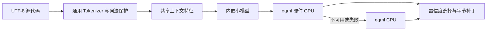

# gpu-code-spacer

**代码如诗，不仅要好读，还要好看。**

用 Zig 编写、内嵌小模型的代码留白工具。训练与推理统一使用 **ggml**，默认推理优先硬件 GPU，不可用或执行不兼容时使用 ggml CPU。

训练使用 **ggml-opt** 的自动微分和 AdamW（关闭权重衰减），默认使用 CPU，可显式选择 GPU。训练与推理共享同一份 ggml 前向图和权重转换。

模型使用共享的通用 Tokenizer，没有语言名称、文件扩展名或仓库白名单。当前版本处理**已有代码行之间的空行**，保留非空行内容和缩进；长行折行尚不属于这个版本。

## 手动校正数据

```text
dataset/
  <language>/<name>.<ext>
  metadata.json

evaluation/
  cases/<case-name>/
    input.<ext>
    output.<ext>
    metadata.json
  validation/<case-name>/
    input.<ext>
    output.<ext>
    metadata.json
  artifacts/
```

训练样本按完整源文件从已筛选、去重的 raw 代码中抽取，目前 2,171 个文件直接按语言放在 `dataset/` 下。直接修改源码样本即可校正布局；已有文件不会被重新采样覆盖，准备数据时修改过的样本布局优先于自动标注。

旧 `dataset/validation` 已从活动数据集中移除，478 个文件及来源记录归档在 `artifacts/dataset-validation-archive/`，不会被重新采样生成，也不会并入独立验证集。新的 `evaluation/validation` 已有 30 个 GitHub 来源案例：PHP、Lua、Dart、Scala、Go、OCaml 各 5 个；Go 按用户指定作为已见语言的新仓库验证，其余五种语言不在旧语料语言清单中。源码仓库以固定提交 ZIP 解压在 `data/validation/`。

`evaluation/cases` 是固定的验收资料，60 个案例直接放在该目录下。每例仅保留 `input.<ext>`（dense 输入）、一份期望 `output` 和元数据；修改 output 会被后续验收读取。模型预测不会回填期望文件，运行报告与预测写到 `evaluation/artifacts`。历史分组仅保留在元数据中，不再用额外目录区分。

`evaluation/validation` 的路径保留，但本轮已按用户授权调整源码并缩小语法覆盖，现作为开发回归集，不再提供独立泛化分数。原始来源与前后结果分开保留，见 [评估集说明](evaluation/validation/说明.md)。

共享 `output` 可直接校正，导入工具跳过所有已存在案例，不覆盖用户修改。若同时修改代码内容而非仅空行，应同步 dense 输入。2026-09-15 按用户要求移除 spaced，完整验收目标为 cases 60/60、validation 30/30；修改后的样例仍待用户审核。

2026-09-11：按用户要求完成目录整理后暂停模型迭代，等待人工校正数据；尚未宣称所有验收通过。后文训练与历史指标记录对应各自版本。

## 使用

需要 Zig 0.16.0、Git、CMake 和系统 C/C++ 编译器。先运行一次 `zig build bootstrap -- --ggml` 构建固定依赖，再构建应用。ggml 静态链接，模型、校准配置和 Metal 内核源均编入可执行文件，运行时无需旁置模型、ggml 动态库或着色器文件。

当前冻结的 `models/config.zig` 仍是特征 v5，源码是 v6；默认应用会报告 `FeatureVersionMismatch`。本次后端迁移没有调整冻结配置或重新训练。可通过 `-Dmodel=<权重路径> -Dmodel-config=<配置路径>` 同时指定匹配的临时文件验证应用，两个选项均支持绝对路径；正式模型应在数据校准完成后再更新。

```sh
zig build -Doptimize=ReleaseSmall

./zig-out/bin/gpu-code-spacer source.ts

cat source.any-language | ./zig-out/bin/gpu-code-spacer

./zig-out/bin/gpu-code-spacer --stats source.py

./zig-out/bin/gpu-code-spacer --check source.zig

./zig-out/bin/gpu-code-spacer --write source.rs
```

默认输出改写结果到 stdout。`--write` 才修改文件；`--check` 在存在修改建议时返回 1。`--stats` 向 stderr 输出实际后端、GPU/CPU 批次和放弃数量。`--model-info` 显示模型哈希、默认置信度和设备。

`--confidence 0..1` 可覆盖内嵌校准阈值。低置信度保留当前布局。没有可预测边界时不会产生推理批次。

## 核心结构



- `src/tokenizer.zig`：词片段、数字、符号、空白和换行，保留完整字节位置。
- `src/layout.zig`：公共定界符保护与可编辑空白区域。
- `src/features.zig`：不含语言身份或原始空行数的共享特征。
- `src/roles.zig`：通用词元形状的粗粒度角色，仅作为模型输入，不直接决定留白。
- `src/model.zig`：两层 MLP 的参数布局、初始化与原生前向计算。
- `tools/learning/ggml.zig`：共享前向图上的类别加权交叉熵、自动微分与 Adam。
- `src/ggml.zig`：共享的 ggml 设备、权重转置和 MLP 前向图。
- `src/inference.zig`：GPU 优先与 CPU 回退。
- `models/`：已选定的内嵌权重、校准配置与训练记录。

GPU 的平台适配来自 ggml。当前默认构建 CPU 与 macOS Metal，并实测 macOS / Apple M5；上游 CUDA/Vulkan 等后端的支持不等于本项目已经完成相应工具链接入和实机验证。

当前静态链接方案以 macOS 为验证范围。Linux 引导使用 `zig cc` / `zig c++`，使 ggml 与应用的 C++ runtime ABI 一致，但尚未实机验证；Windows 分发也尚未验证。

## 数据与风格

首批 18 个开源项目提供跨语言结构样本。另有六种未参与训练的语言用于泛化评估。`openages/if` 的手写代码是个人审美参考，`MatrixAges/polywise` 中筛选的局部范围作为风格候选；后者不以空行密度推断作者身份。

数据按来源、完整文件、近重复簇和重复上下文隔离。语言字段只用于采样和统计，不进入模型。原作者布局属于弱监督，不能直接等同于唯一正确或最好看的答案。

通用语料用于预训练。个人风格微调先均匀选择文件，再选择文件内边界，避免大型数据表占据训练样本。最终选模依据个人风格验证集；其他项目的原始排版一致性只作诊断。当前权重由 100% 个人风格微调候选选出，特征 v4、10,499 个参数、约 41.1 KiB。

校准精度与召回率模拟紧凑输入：低置信度保留零空行。它们不是任意输入布局的保证，因此验收同时包含紧凑和过度留白两个变体。

## 复现训练

应用与训练工具共用固定的 ggml 静态库。只有离线数据检查需要额外的 Tree-sitter 源码；它不进入产品。

ggml 源码、构建缓存和安装后的静态库分别位于 `.deps/ggml`、`.deps/ggml-build`、`.deps/ggml-install`，均不进入 Git。引导命令关闭动态后端插件、启用 Metal 源内嵌，并关闭宿主专用指令优化；普通应用无需携带这些开发目录。

**数据集与评估集仍待人工校准。下面的合成探针可验证实现可用性；正式数据训练命令留作校准完成后使用。**

```sh
zig build bootstrap -Dgpu=false -Doptimize=ReleaseSafe -- --ggml

zig build train-probe verify-probe -Dgpu=false -Doptimize=ReleaseSafe

zig build bootstrap -Dgpu=false -Doptimize=ReleaseSafe

zig build collect -Dgpu=false -Doptimize=ReleaseSafe

zig build collect -Dgpu=false -Doptimize=ReleaseSafe -- --evaluation

zig build bootstrap -Dgpu=false -Doptimize=ReleaseSafe -- --style

zig build prepare -Dgpu=false -Doptimize=ReleaseFast
```

风格来源使用 `gh` 获取，需要可用的 GitHub CLI 登录状态。源码归档、解压目录、中间数据和实验检查点均不进入 Git。

`verify-gpu` 使用固定种子的合成权重和 1,025 个随机输入检查分批推理，不读取模型或数据集；输出在 `runs/`。`train-probe` 只生成合成数据，检查 ggml 类别加权梯度、收敛和原生权重导出；`verify-probe` 对比 ggml 生成的参考 logits 与 Zig 前向输出，产物在构建缓存和 `zig-out/probe/`。

正式训练支持 `--backend cpu|gpu`、`--threads N`，默认 `cpu`、1 线程。`-Dgpu=false` 表示产品与评估工具只使用 ggml CPU，不改变静态库集合，也不影响训练的 `--backend` 选择。训练 GPU 模式通过 ggml 调度器将不支持的算子交给 CPU；没有 GPU 后端时显式报错。产品推理则在整个前向图可以由 GPU 执行时计为 GPU 批次，否则整体使用 ggml CPU。其他平台的默认引导仅提供 CPU；CUDA/Vulkan 等还需配置上游 CMake 及对应静态链接项，当前构建未提供跨架构编译方案。

当前小模型及 batch=64 下，CPU 启动与调度开销较低；GPU 首次启动还需编译 Metal 内核，不能把“使用 GPU”直接视为加速。原来的种子、采样、类别权重、验证选模和 `.weights` 格式保持兼容。

若本机 Xcode 与 Command Line Tools SDK 不匹配导致 `libSystem.tbd` 链接失败，可在引导命令前指定与编译器匹配的 `SDKROOT`；本轮使用 Xcode 内的 macOS SDK，未修改系统配置。

```sh
for seed in 73 111 2026; do
  zig build train -Dgpu=false -Doptimize=ReleaseFast -- \
    --seed "$seed" --epochs 20 --steps 256 \
    --output-prefix "artifacts/v4-$seed-base"

  for share in 0.5 0.8 1.0; do
    zig build train -Dgpu=false -Doptimize=ReleaseFast -- \
      --seed "$seed" --epochs 24 --steps 256 \
      --style --style-share "$share" \
      --init "artifacts/v4-$seed-base.weights" \
      --output-prefix "artifacts/style-objective-$seed-$share"
  done
done

zig build select-model -Dgpu=false -Doptimize=ReleaseSafe -- \
  artifacts/style-objective-*.json

zig build -Doptimize=ReleaseSmall
```

训练和选模只读取开发及个人风格验证集。`models/metadata.json` 记录校准规则；不要用最终测试语言调节阈值。

## 当前评估集验收

使用 Python 3 标准库运行完整文件比较，报告目录必须是新目录：

```sh
python3 tools/evaluate_dataset.py /path/to/version-matched-binary evaluation/artifacts/current-dense
```

两组都达到 100%、非空行保持和幂等全部通过时命令返回 0；未达标返回 1。工具冻结二进制，记录模型、源码和结果哈希，预测不会写回期望。

恢复后的默认模型为 v5、源码特征为 v6，直接运行会报 `FeatureVersionMismatch`。本轮保持模型文件不变，使用已有 v6 候选隔离构建和评分；具体复现方式及覆盖调整见 [评估代码调整计划](docs/2026-09-15/评估代码调整计划.md) 和 [执行记录](docs/2026-09-15/评估代码调整执行记录.md)。

## 验证

```sh
zig build verify-guards -Dgpu=false -Doptimize=ReleaseSafe

zig build verify-gpu -Doptimize=ReleaseSafe

zig build verify-gpu -Dgpu=false -Doptimize=ReleaseSafe

zig build evaluate -Doptimize=ReleaseFast -- models/spacer.weights 0.80

zig build evaluate-style -Dgpu=false -Doptimize=ReleaseSafe -- \
  zig-out/bin/gpu-code-spacer evaluation/artifacts/style-regression

zig build evaluate-style -Dgpu=false -Doptimize=ReleaseSafe -- \
  zig-out/bin/gpu-code-spacer evaluation/artifacts/style-reference \
  config/style-benchmark-holdout.json regression
```

额外的留一语言实验：

```sh
zig build train -Dgpu=false -Doptimize=ReleaseFast -- \
  --seed 73 --epochs 20 --steps 256 --holdout-language zig

zig build evaluate-transfer -Doptimize=ReleaseFast -- \
  artifacts/seed-73-zig.weights zig
```

`evaluate` 命令中的置信度应与 `models/config.zig` 一致。它生成 20 组测试与报告，保存在 `evaluation/artifacts/corpus/`，按案例输出完整源码与元数据，不再生成 JSONL。评分区域不重叠，但可共享完整文件上下文；这不等同于 600 个独立项目或独立人工评分，也不作为个人审美真值。

`evaluate-style` 当前使用标准 v2：多行完整表达式外侧留空行；两侧均为单行时，同类连写、异类留空行。完整表达式内部、注释贴附、块边缘作为独立结构检查，不混入风格得分。当前每个案例只测试 dense 输入，按当前 output 完整布局评分；不再测试过疏输入。历史报告保留原有口径。

两套案例都已被观察，当前只作回归；`style-benchmark-holdout.json` 保留原路径名称，不再代表新的独立测试。原 v1 标注位于 `config/benchmarks/archive/v1/`。按新标准，36 案例集风格通过 118/144，24 案例集通过 174/192；结构检查分别通过 84/84 和 46/46。本次仅修订验收项，没有调整模型，不能将评分口径变化称作模型提升。

通用词法保护不是所有语言的形式化语义证明。当前版本会保留已识别的字符串、注释、续行和数据区域，对不确定区域放弃修改；未知语法仍可能超出保护范围。报告分别列出布局一致性、实际修改覆盖率、幂等性与已完成的语法检查。

详细目标、证据、边界与验收采用 IDEA 框架，见 [训练与测试结果](docs/2026-09-10/训练与测试结果.md)、[执行计划](docs/2026-09-10/执行计划.md)、[审美与泛化原则](docs/2026-09-10/审美与泛化原则.md) 和 [执行记录](docs/2026-09-10/执行记录.md)。

本轮更新见 [语句分组完善](docs/2026-09-10/语句分组完善.md)、[泛化验收集设计](docs/2026-09-10/泛化验收集设计.md) 和 [泛化质量结果](docs/2026-09-10/泛化质量结果.md)。旧报告记录的是当时版本，当前结果以本轮报告及模型元数据为准。

本轮训练后端迁移采用 IDEA 框架，详见 [迁移计划](docs/2026-09-11/训练后端迁移计划.md) 与 [迁移执行记录](docs/2026-09-11/训练后端迁移执行记录.md)。

统一训练与推理后的最新结构见 [统一计算后端计划](docs/2026-09-11/统一计算后端计划.md) 和 [移除旧后端执行记录](docs/2026-09-11/移除旧后端执行记录.md)。
