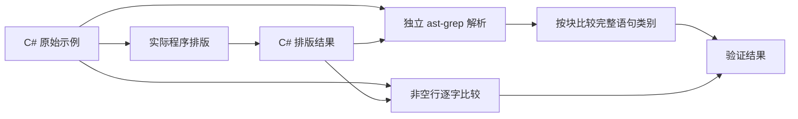
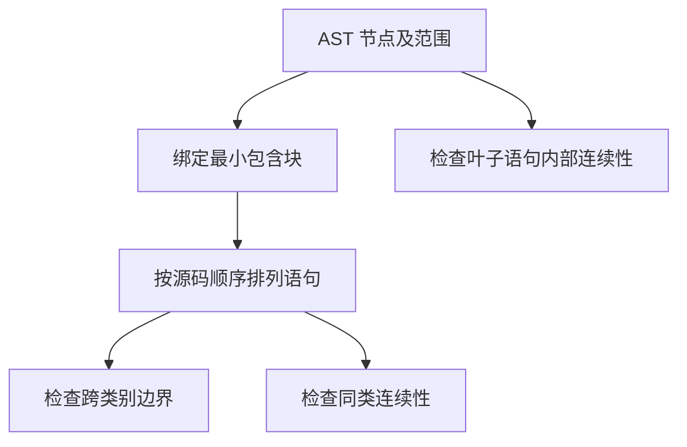

# C# 语句分组验证记录

> 本文保留原标准 v1 的验证记录。当前标准以《泛化验收集设计.md》为准：同类单行必须连写，多行完整表达式外侧需要空行。下文历史分数不适用于修订后的标注。

## Intent：最终目标

验证不同类别的完整语句之间保留一行空行，重点覆盖声明到条件判断、声明到调用、返回语句之前。连续同类声明、调用、赋值保持紧凑；同一条多行语句内部不插入空行。

## Data：可用证据

- 输入：`examples/OrderSummary.before.cs`，83 行、没有空行。
- 场景：订单去重、金额校验、缓存写入、客户汇总和排序。
- 结构：Allman 花括号、泛型、对象初始化、多行调用、LINQ 链、插值字符串，以及包含伪代码的普通字符串。
- 独立语法证据使用已安装的 ast-grep CSharp 解析器；不会借用产品内部的语句分类器作为验收判据。

## Edges：边界与限制

- 本次验证排版和解析结构，不安装 .NET SDK，不声称执行过业务程序或 C# 编译器。
- 对完整语句的检查依据 AST 范围和最小包含块；不使用变量名称判断排版。
- 块内第一条 `return` 前不要求空行，避免在左花括号之后制造空白。
- 不改写代码、缩进、字符串或多行表达式，只允许在完整语句之间插入空行。
- 示例已冻结，SHA-256 为 `80f62e9babfcb18a6c1b6e543d7c4e90077c81d255f6cf8e6eecd8b97f384122`；不根据该示例调整特征、训练权重或阈值，不把硬编码规则作为后处理加入产品。

## Answer：交付格式与成功标准

输出为 `examples/OrderSummary.after.cs`。成功要求：输入输出解析无 `ERROR`；非空行逐字相同；块内相邻语句跨类别边界恰好一行空行；同类别连续语句无额外空行；叶子语句内部无空行。

## 执行记录

- 初始输入检查：`ast-grep run --lang csharp --kind ERROR --json=compact examples/OrderSummary.before.cs` 返回 `[]`。
- AST 提取到 3 个返回语句，其中一个是条件块首条语句。
- AST 提取到 4 个独立赋值语句和 7 个独立调用语句；嵌套在参数中的 `string.Format` / `string.Join` 不计作额外语句。
- 新模型输出已经生成，实际输出位于 `examples/OrderSummary.after.cs`，不做人工修饰。

## 结果复核（IDEA）

### Intent：核对实际展示结果

检查 C# 示例中的三个主要问题是否改善，同时保留对过度留白的批评。此文件是展示材料，最终泛化结论见 `泛化验收集设计.md`。

### Data：实际证据

- 输入 83 个非空行与输出逐字相同，输出含 29 个空行。
- ast-grep CSharp 对输出的 `ERROR` 查询返回 `[]`。
- 以 AST 的完整语句范围和最小包含块独立检查，共提取 8 个声明到 `if`、声明到独立调用、前面有语句的 `return` 边界，全部恰好一行空行。
- 条件块首条 `return customer!;` 之前没有强制空行。
- 多行调用、对象初始化和 LINQ 链保持连续。
- 新冻结泛化集里的 C# 结果为 22/22，来自两个独立案例及其无空行、多空行两个变体。

### Edges：仍有不足

展示结果仍在三个 `using` 之间、两条连续 `log` 调用之间插入了空行，部分属性声明之间也有过多留白。因而这份展示不能宣称全部符合原始的同类连写要求。语法解析成功也不等于经过 C# 编译、类型检查或业务执行。

### Answer：当前交付

三个用户明确指出的问题在本展示的 8 个已识别边界上得到修正；剩余主要审美问题是同类操作分组还不稳定。保留真实输出及局限，不修改示例、模型或期望来制造全通过结果。
