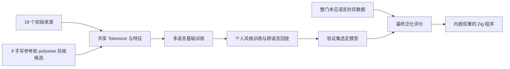

# 审美与泛化原则

## Intent：最终目标

**代码如诗，不仅要好读，还要好看。**

用户偏好疏朗的视觉节奏：几行相关代码构成一个段落，逻辑转折、执行阶段和独立动作之间留出空间。短小的 guard、continue 或 return 也可以自成一段。评价对象是留白的位置与节奏，不是空行数量。

最终产物为 Zig 单文件程序，内嵌模型和 WGSL；ONNX 不再是强制格式。采用用户选定的 zgpu 默认执行 GPU 推理，不适配才回退 CPU。核心模型必须跨语言泛化，六种语言仅是首批来源，不构成产品白名单。

## Data：可用证据

### 用户指定的审美参考

- `openages/if`：用户明确说明为手写代码；通过 `gh repo clone` 获取，固定提交 `4595025f0b6dd5c7825255edb04966a5612e0cbe`。首轮取 `packages/app` 的纯 TypeScript 逻辑文件；不展开 Git 子模块，不将子模块记作已采集内容。
- `MatrixAges/polywise`：通过 `gh repo clone` 获取，固定提交 `f8d2320f84fe07da327c5e2e690e50061ea4e599`。用户授权自行判断 `packages` 的风格；以 AST 定位和代码阅读筛选 12 个局部范围，作者身份记为未知。
- 来源与局部范围记录在 `config/style-sources.lock.json`。空行少不能证明 AI 作者，空行多也不能证明手写。

### 从 if 中观察到的节奏

- `Editor/hooks/useTextChange.ts`：取得 editor、空值检查、序列化与比较、解析与校验、更新、结果返回各自成段；相关的局部变量仍成组。
- `Editor/utils/indexBy.ts`：初始化容器、遍历、得到 key、更新桶、返回结果的分段简洁。
- `Editor/utils/markdownImport.ts`：多项初始化成组，每种块处理形成重复但有层次的段落；部分 continue 单独留白，与用户偏好一致。

这些是模型辅助阅读，不等同于独立人工盲评，也不为业务实现正确性背书。

## Edges：边界与限制

### 泛化边界

- Tokenizer 只输出词片段、数字、符号、水平空白、换行和字节位置。
- 模型输入不含语言名、扩展名、仓库名、原始空行数或绝对位置。
- 上下文按非空行索引，保证输入布局变化不会泄漏标签或导致重复执行漂移。
- 通用词法保护使用共同的引号、注释、原始定界符和续行形态，不按语言名分派。
- Tree-sitter 只在离线数据检查中使用；不链接到最终程序，不决定未知扩展名能否预测。
- 通用 Tokenizer 不等于对所有未知语法的形式化安全证明。未知字面量形式、语法歧义和模型错误必须如实记录，不能宣称已支持 90 种语言的精确改写。

### 审美边界

- 不给每行机械加空行，不把固定“每 N 行一段”作为标签。
- 不重命名、不排序、不调整已有非空行的空格和缩进。
- 不通过改写测试答案来让模型看上去更好。
- 外部仓库恢复分数衡量与作者布局的一致性；它不能完全衡量用户偏好的疏朗审美。
- 个人参考主要来自 TypeScript，因此要保留跨语言训练回放，并单列整门未见语言表现。

## Answer：交付与成功标准

训练分为两步：先以多语言弱监督学习共同结构，再混入个人风格参考继续训练。使用独立的个人风格验证集选择模型，同时观察基础结构指标；最终测试语言不参与任何选择。

最终报告分别列出：个人风格一致性、已见语言的新项目迁移、未见语言迁移、保护区域不变、幂等性、模型体积和程序体积。任何一项未验证，都不能由另一项的高分代替。

## 自我审查

仅靠紧凑模型和局部上下文，未必能判断长距离语义阶段。首版的跨语言能力必须由保留测试证明；“代码如诗”是明确的目标，不能包装成已经被 accuracy 完整量化的事实。
