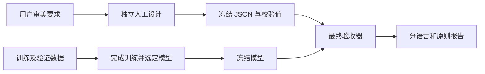
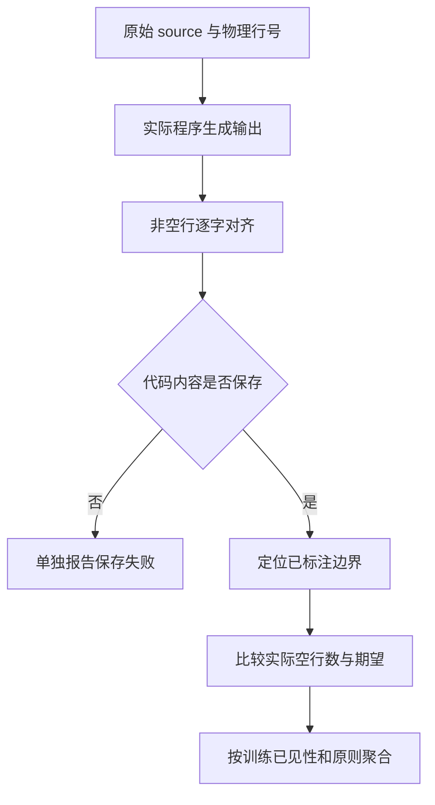

# 泛化验收集设计

## Intent：最终目标

用独立冻结的人工验收集检验模型是否学会用户偏好的语义分组：不同类型的完整表达之间留白，紧密相关的同类操作保持一组，阶段变化仍然可以分段。

重点检验声明到控制语句、声明到调用、有前驱语句的返回之前三类边界，同时防止为提高空行命中率而到处插入空行。C# 是跨语言验收的一部分；此前的 `OrderSummary.before.cs` 只保留为独立展示材料，不作为唯一验收标准。

### 当前阶段划分

| 阶段 | 数据或文件 | 用途与状态 |
| --- | --- | --- |
| 原始预训练 | 基础仓库语料 | 学习代码结构，并提供诊断证据 |
| 风格选择 | 个人风格训练集、个人风格验证集 | 比较受控训练配比，依据个人验证集选择模型 |
| 第一轮冻结验收 | `config/style-benchmark.json` | 当时独立冻结；结果已被观察，目前仅作为公开回归集 |
| 新一轮最终验收 | `config/style-benchmark-holdout.json` | 重新独立设计，选模之前仅公开校验值和分布统计 |

不能在本轮调参后继续宣称第一轮文件是独立最终测试。旧文件保持字节不变，以便比较回归；新文件承担本轮最终验收职责。两个 JSON 的 `version: 1` 是结构版本，数据集身份由文件名和 SHA-256 区分。

## Data：可用证据

依据用户对返回、声明后条件判断、声明后函数调用的反馈，以及其明确提出的“不同类型表达方式之间，需要有空行”。同类表达是否紧密相关仍需考虑上下文，不能机械地理解为同类永远连写。

交付文件为 `config/style-benchmark.json`，采用如下结构：

```json
{
  "version": 1,
  "cases": [
    {
      "id": "稳定标识",
      "language": "语言名称",
      "training_language": false,
      "scenario": "业务场景说明",
      "source": "没有空行的完整函数或片段",
      "expectations": [
        {
          "after_line": 1,
          "blank_lines": 1,
          "principle": "declaration_to_control"
        }
      ]
    }
  ]
}
```

`after_line` 是原始 `source` 的一基物理行号，表示这一行之后、下一原始行之前的边界。`blank_lines` 只允许 0 或 1。没有标注的边界不参与审美评分，不应自动视为无需空行。

### 第一轮公开回归集覆盖统计

| 范围 | 语言 | 案例数 |
| --- | --- | ---: |
| 训练已见语言 | TypeScript、JavaScript、Python、Java、Rust、Zig | 18 |
| 训练未见语言 | Go、C++、C#、Ruby、Kotlin、Swift | 18 |
| 总计 | 每语言 3 个案例，共 12 种语言 | 36 |

共有 262 行输入、113 个明确标注边界，其中 50 个期望一行空行，63 个期望连写。

| 原则 | 含义 | 边界数 |
| --- | --- | ---: |
| `declaration_to_control` | 声明或首次绑定之后进入控制流 | 12 |
| `declaration_to_call` | 准备数据之后执行独立调用 | 13 |
| `before_return` | 有前驱语句的显式返回之前 | 21 |
| `related_same_kind` | 明显相关的连续同类操作 | 21 |
| `same_kind_phase_change` | 同为调用但进入新的业务阶段 | 2 |
| `multiline_integrity` | 参数、字面量、链式或字符串内部完整性 | 31 |
| `block_edge` | 块边缘或 Allman 头部与花括号贴合 | 9 |
| `comment_attachment` | 注释随其解释的语句保持归属 | 4 |

每种语言均覆盖三个主要留白原则及连写负例。场景使用库存、汇总、审计、容器、分页、消息、额度等业务；控制结构包含条件、循环与提前退出，表达结构包含泛型、聚合初始化、多行调用、匿名函数、隐式返回和多行字符串。

## Edges：边界与限制

1. 新一轮 holdout 只用于最终冻结验收，不能用来训练、挑模型、选阈值或修改特征。创建过程中未查看任何模型输出或第一轮失败个例；实现侧只收到文件校验值与设计统计。第一轮文件已转为公开回归集。
2. 修改输入、期望或评估语义时必须产生新版本和新校验值。冻结验收后的失败应如实报告；若用这些失败指导下一轮开发，下一轮必须另建独立验收集，旧集只能用于回归。
3. “声明”跨语言并非完全相同。Python、Ruby 的初次赋值视为局部绑定准备阶段；已有变量或对象成员的赋值不是声明，不套用 `declaration_to_call`。
4. Rust 的尾表达式不是显式 `return`。多行链式调用不因跨行而成为多条语句，不能把其内部标成 `before_return`。
5. 块内首条返回没有前驱语句，不强制在左花括号后插空行。Allman 风格的控制头与左花括号仍是一个整体。
6. `related_same_kind` 只描述确定属于同组的操作；`same_kind_phase_change` 保留了同类调用跨阶段的少量判断，防止把语句类别作为唯一审美因素。
7. 注释要贴附被解释的语句，多行字符串中的伪代码属于文本内容，不能触发语句留白。
8. 33 个案例通过 ast-grep 对应语言解析，未出现 `ERROR` 节点。当前 ast-grep 不支持 Zig，另外 3 个案例通过 `zig ast-check`。这些检查不等于各语言的类型检查、编译或业务运行。
9. 这是有限的人工设计集，不是泛化能力证明。每语言只有 3 个短案例，对大型类、模块、异常处理、复杂声明和真实仓库分布覆盖有限；跨语言具有可比较主题，也会降低统计独立性。

## Answer：交付格式与成功标准

第一轮文件 SHA-256（保持不变，当前用于公开回归）：

```text
c93f60a14897bc598c7e0908a483ed513bcb3d1d2ccd7b0b105680d2f6440049
```

验收应先检查输入输出非空行逐字相同，再按照原始行定位已标注边界。不得让插入空行导致行号漂移，也不得把未标注边界纳入分母。语法、字面量和代码保存失败应单独报告，不能被审美命中率掩盖。

应报告总体、已见语言、未见语言、各语言、各原则的命中数与分母，并分开呈现期望空行和期望连写的结果；不只报告一个平均准确率。数据准备已经完成，模型验收结果不在本文中预填。





## 自我批判

本设计以明确局部边界为主，容易测出用户指出的缺口，但不足以评估长函数整体节奏。两个同类阶段切换标注包含人工解释，应单独展示结果。成功通过这 113 个边界可以说明这组冻结要求得到满足，不能据此声称任意语言、任意代码都符合用户审美。

## 新一轮独立最终验收集

### Intent：本轮用途

为受控风格训练配比比较后的最终选定模型提供新的独立验收。出题者未读取第一轮失败个例或任何模型输出，不根据旧模型的具体弱点补题；仍以用户三项核心留白要求和必要负例作为设计依据。

### Data：冻结统计

文件 `config/style-benchmark-holdout.json` 延续同一结构，共 24 个案例、272 行输入，12 种语言各 2 个案例，已见和未见语言各 12 个案例。共有 98 个标注边界，其中一行空行 65 个、连写 33 个。

| 原则 | 边界数 |
| --- | ---: |
| `declaration_to_control` | 26 |
| `declaration_to_call` | 14 |
| `before_return` | 19 |
| `related_same_kind` | 10 |
| `same_kind_phase_change` | 2 |
| `multiline_integrity` | 15 |
| `comment_attachment` | 8 |
| `block_edge` | 4 |

三个主要原则合计 59 个边界；另外 39 个边界检查同组连续性、阶段转换、表达完整性和贴附关系。22 个非 Zig 案例通过 ast-grep 解析，未发现 `ERROR` 节点；2 个 Zig 案例通过 `zig ast-check`。输入均无空行，期望行号合法且不重复。

### Edges：独立性与评估限制

- 本轮独立性从新集冻结开始计算，不能抹去上一轮已经观察测试结果的事实。
- 新案例使用新的业务和语法组合，未逐字复用第一轮函数；仍共享同一人工审美依据，因此不能视为完全独立的真实仓库抽样。
- 验收器可基于同一案例生成无空行和可编辑边界多空行两个输入变体，以分别检验插入与删除。两个变体是相关测量，不能算作新增独立案例。
- 插入测试空行时必须遵守保护区域，不能改动字符串或多行表达式；未标注边界不纳入评分。
- 报告应包括非空行保存和幂等性。第二次排版变化即为幂等性失败，不因第一次审美评分较高而忽略。
- 同类阶段切换存在人工判断成分，相关结果应单独呈现。短片段仍无法替代真实仓库验证。

### Answer：交付与冻结标识

SHA-256：

```text
884f1798b57ce0fe412752fc75721f457a69a05fd7a3821a22cc9e69f593c87b
```

在模型配置冻结前只传递文件校验值与汇总统计。模型冻结后运行一次最终验收并如实记录结果，不修改该文件迎合输出。第一轮 JSON 校验值仍为 `c93f60a14897bc598c7e0908a483ed513bcb3d1d2ccd7b0b105680d2f6440049`。

## 最终结果独立审查

### Intent：核实结果与限制

模型冻结后独立读取 `artifacts/style-holdout-final/report.json` 和 48 个实际输出，核对评分、语法和代码保存。此次审查没有修改模型或冻结验收集。

### Data：结果证据

冻结模型为特征版本 4、风格配比 1.0、种子 111、置信阈值 0.80，模型 SHA-256 为 `f51f69b7bf65c9c75eb53a7697e474c8cfc21ae4f21c810b01290c152c892287`。实际推理后端是 Apple M5 / Metal。

| 指标 | 基线 | 最终模型 |
| --- | ---: | ---: |
| 总体边界命中 | 116/196（59.18%） | 179/196（91.33%） |
| 应留一行空行 | 52/130 | 122/130 |
| 应保持连写 | 64/66 | 57/66 |

最终模型已见语言为 90/100，未见语言为 89/96；无空行输入为 92/98，多空行输入为 87/98。三个核心原则合计 112/118（94.92%）。C# 为 22/22，代表两个案例的两个输入变体，不是 22 个独立 C# 案例。

| 原则 | 命中 | 剩余失败 |
| --- | ---: | ---: |
| 声明到控制流 | 50/52 | 2 |
| 声明到调用 | 26/28 | 2 |
| 返回之前 | 36/38 | 2 |
| 相关同类操作连写 | 11/20 | 9 |
| 同类操作跨阶段 | 2/4 | 2 |
| 多行表达完整性 | 30/30 | 0 |
| 注释归属 | 16/16 | 0 |
| 块边缘 | 8/8 | 0 |

17 个失败集中在以下情况：

- TypeScript、Python、Go 的部分相关声明或调用保留了输入中的两行空行，共 5 个边界。
- Java 的两次连续写入和 Rust 的两次相关累积被拆开，共 4 个边界。
- Java 写入完成后到刷新阶段未规范成一行空行，共 2 个边界。
- Go 分组循环之前未规范成一行空行，共 2 个边界。
- Ruby 带块调用之前，以及带块调用结束后返回之前未规范成一行空行，共 4 个边界。

上述失败中的 8 个期望一行空行：无空行变体保持了 0，多空行变体保持了 2。它们不应笼统描述为“全部漏插空行”，因为还包含未删除过多空行。

### Edges：独立校验与解释边界

独立脚本按原始非空行的位置重新计算全部 196 个边界，实际空行数和通过状态与报告逐条一致。48 个输出的非空行逐字节等于对应输入及冻结 source。44 个非 Zig 输出经 ast-grep 检查均无 `ERROR`；4 个 Zig 输出通过 `zig ast-check`。

审查了验收器：它对第二次输出执行完整字节相等比较，对初次输入输出逐非空行比较字节。因此报告字段 `nonblank_byte_preservation_and_idempotence_checks: 48` 准确描述了 48 组检查；不能简称为“全部输入字节不变”，空行本来就是被修改的内容。非空行保存本身也不能证明任意多行字符串的空行都保持原意，保护区域仍需专门验证。

未发现期望存在明显语法或语义错标。Java 刷新之前的阶段分隔属于人工审美判断，同类语句是否成组也不能只靠类别决定；相关失败保留在原始评分中，没有通过修改标注提高成绩。

### Answer：审查结论

主原则和跨语言结果明显改善，但仍有 17/196 边界未达到冻结要求，且同类连写命中从 64/66 降到 57/66。应同时交付改善和退步，不把 C# 的局部全通过扩大为全部语言、全部审美要求全通过。该最终集现已被观察；如继续据其失败开发，应将其转为回归并另建新的独立最终测试。
