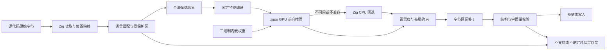
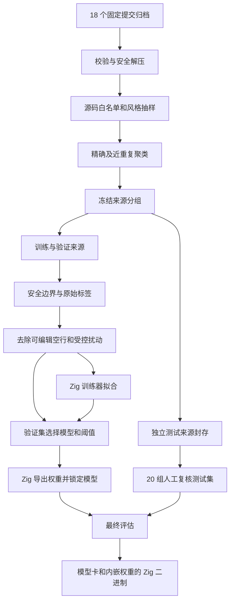

# gpu-code-spacer 执行计划

日期：2026-09-10。状态：已进入执行，先做 Zig 训练与内嵌推理验证。本文采用 IDEA 框架。

当前实证与进度见[执行记录](./执行记录.md)。本文描述目标流程，不将未完成阶段写成已完成。

配套文件：[数据集与验收执行细节](./数据集与验收执行细节.md)。

用户最新约束及审美标准见[审美与泛化原则](./审美与泛化原则.md)：跨语言共享 Tokenizer、无语言白名单、以 if 手写参考和 polywise 风格候选确定疏朗审美。

## 一、Intent：最终目标

使用 Zig 构建原生工具 gpu-code-spacer，借鉴 gpu-lexer 的小模型分类思路，学习跨语言的垂直分段。TypeScript、JavaScript、Python、Java、Rust、Zig 只是首批来源；未知语言和未知扩展名也走同一个 Tokenizer 与模型，不以来源名单限制能力。

用户最新要求：使用 Zig，不使用 Node；最终交付内嵌模型的原生可执行文件，不强求 ONNX。数据采集、清洗、训练、模型导出和产品逻辑由 Zig 实现；推理采用用户选定的 zgpu，WGSL 表达固定 MLP，GPU 不适配才回退 Zig CPU。ONNX 导出保留为可选互通实验。

职责限定为换行与空行：不改变量名，不重排语句，不调整运算符空格，不重建整个文件，不承担完整 formatter 的工作。

先用 18 个 GitHub 项目构建可追溯数据集，再搭建基础设施、清洗、训练和交付 20 组多语言场景测试集。项目数用于控制首轮工作量，不代表语料质量或模型能力已经足够。

### 1.1 必须先区分两种任务

| 任务 | 修改位置 | 首轮实现范围 |
| --- | --- | --- |
| A：空行分段 | 原本已经存在的物理行边界 | 预测边界应有 0、1、2 个空白行；保留非空行原有内容与缩进 |
| B：行内断行 | 同一物理行内，两个词法单元之间 | 只在语言适配器确认合法、且不需要重新设计缩进的位置建议或插入换行 |

A 中“0 个空白行”仍保留相邻代码行之间的一个行结束符；绝不等同于把两行代码拼接起来。

B 不是 A 的简单扩展。若新行需要补缩进，则与“不负责缩进”的边界发生冲突。默认先提供预览建议；只有能够直接复用既有同级缩进的明确结构才进入实验性写入范围。全面长行折行、重新缩进、移除已有必要换行暂不承诺。

## 二、Data：可用证据

### 2.1 当前项目

只读检查发现当前仓库只有 Git 元数据、忽略配置和 LICENSE，没有已有 Zig 工程或训练管线。这是从零规划，不需要兼容既有接口。

当前方案固定为：本机执行 Zig 数据及训练工具，导出带版本、维度和校验和的权重，最终由 Zig 单文件程序从内存加载并优先在 GPU 推理。实际主机已核实为 Apple M5、32 GiB；附件中的 M4 描述只作为最初规划背景。

### 2.2 gpu-lexer 可借鉴与不可直接推导的内容

[官方演示](https://gpu-lexer.vercel.app/)描述了共享 tokenizer、小分类器、局部与全文件上下文的设计。其页面明确指出高亮结果是概率预测，不等同语法解析器。

本次读取的页面显示 41,321 个参数；约 27.4 KB 指浏览器压缩包测量口径，不应当解释为 Zig 可执行文件体积。搜索缓存与实时页面数值存在版本差异，因此实施时必须固定参考版本。

可借鉴：将布局改写转换成边界分类、紧凑特征、批量推理、测量真实端到端耗时。不能推导：同等体积即可理解多语言语义、任意换行都安全、GPU 对小文件一定更快。

官方页面未提供本次能确认的源码入口；尝试的两个 GitHub 仓库路径返回 404。npm 可读到 `gpu-lexer` 的版本元数据，但未返回 repository 字段。现阶段按公开设计独立实现；找到并核实源码及许可证后，才决定是否复用具体实现。

### 2.3 纠正附件中的技术假设

| 附件中的设想 | 修正及计划影响 |
| --- | --- |
| 删除所有空格和换行后让模型还原 | 不可作为多语言通用清洗；只扰动已认证的可编辑边界，字符串、注释、缩进和必要换行保留 |
| 不需要任何语法知识也能安全改写 | 分类器可共享，但可编辑区域需要语言知识；模型判断偏好，确定性约束限制修改 |
| 把模型嵌入程序就能独立运行 | 还必须链接推理运行时及依赖，并验证不需要旁置动态库 |
| 30 KB 模型能得到不到 1 MB 的独立程序 | 还要计入解析器、推理运行时和链接库，必须实际构建测量 |
| M4 上训练只要几秒 | 尚无本任务实测；先采集固定样本的吞吐，再估算完整运行时间 |

依据：[ONNX Runtime C API](https://onnxruntime.ai/docs/api/c/struct_ort_api.html)、[自定义构建说明](https://onnxruntime.ai/docs/build/custom.html)、[Python 词法规则](https://docs.python.org/3/reference/lexical_analysis.html)。

## 三、Edges：边界与限制

### 3.1 正确性边界

1. 用原始字节区间生成补丁，不从 AST 重新打印代码。
2. A 阶段只编辑被确认位于语法内容之外的空白行；字符串内部看似空白的行不属于空白布局。
3. 注释、文档字符串、模板字符串、正则字面量、指令和注释与声明的归属关系都要保留。
4. JS/TS 的自动分号插入敏感位置、Python 显式续行、Rust 宏体、Zig 多行字符串默认保护；后续逐类验证后开放。
5. 未闭合或无法可靠识别的词法区域保留原文并报告；未知扩展名本身不构成拒绝条件。
6. 产品核对非空行字节不变；离线对有语法解析器的来源额外比较忽略位置的结构树和字面量内容。没有解析器的语言单独标注语法未验证，不能把它们算成语法验证通过。
7. 结构一致不能证明所有行为一致。例如 Python 的行号、traceback、调试位置可能变化。承诺保持代码结构与字面量，不承诺行号相关可观察行为完全不变。
8. 低置信度保持当前布局；记录放弃比例，避免通过全部不改来假装安全又有效。
9. 相同版本、配置、输入必须给出确定结果，并满足重复执行不再变化。

### 3.2 技术栈建议

| 部分 | 首选 | 理由与退出条件 |
| --- | --- | --- |
| CLI、字节映射、补丁、推理 | Zig | 产品核心保持原生；锁定一个实际验证过的稳定工具链版本 |
| 模型输入 | 共享通用 Tokenizer | 只识别表面词片段、数字、符号、空白和换行，不选择语言专用 tokenizer |
| 可编辑边界 | 通用词法保护与原始字节位置 | 不把语言识别结果作为预测白名单；保护常见字面量、注释、续行形态 |
| 离线验证 | 固定版本 Tree-sitter 与初始语法 | 仅用于数据检查和额外验证，不链接进最终程序 |
| 数据整理与训练编排 | Zig 离线工具 | 与 CLI 共用特征编码、语言适配和数据协议 |
| 首轮训练 | Zig 固定结构 MLP 训练器，CPU | 只实现该模型的前向、解析梯度、交叉熵和 Adam；不开发通用自动微分框架 |
| 模型导出 | Zig 二进制权重 | 版本、网络维度、FP32 权重与 SHA-256 校验；只支持本模型结构 |
| 产品推理 | zgpu / Dawn + WGSL | 默认硬件 GPU；设备或执行不兼容时回退 Zig CPU，并报告原因 |
| 最终交付 | Zig 二进制内嵌权重 | 编译期嵌入，运行时从内存读取，无需旁置模型或推理运行时 |
| ONNX 导出 | 可选 Zig ModelProto 编码 | 已有轻量导出实验，不作为主流程和发布验收依赖 |
| GPU 验证 | CPU 数值参考、实际执行计数与回退检查 | 不以小文件或性能启发式切换 CPU |

Tree-sitter 需要独立语法，因此将它放在离线检查工具中。产品本身采用“通用 Tokenizer + 共享模型 + 通用词法保护”，不加载这些语法。[Tree-sitter 集成说明](https://tree-sitter.github.io/tree-sitter/using-parsers/1-getting-started.html)

GPU 训练不等于 GPU 推理。首轮不同时引入 Metal、WebGPU、CoreML 三条路线。保留项目名，但发布说明如实标注已实现后端。

项目自有代码统一为 Zig；只有离线检查工具链接 Tree-sitter。最终程序不需要解析器、ONNX Runtime、Node 或 Python。

### 3.3 内嵌模型的交付约束

1. 通过 Zig `@embedFile` 嵌入模型权重，明确标注原生格式，不能把它改名为 `.onnx`。
2. 读取时校验 magic/version、维度、长度、有限浮点数和 SHA-256，执行实际训练所得权重的前向计算。
3. 程序包含共享 Tokenizer、模型和保护逻辑，无须安装第三方推理库或解析器。
4. 默认硬件 GPU 推理；训练器不编入程序，Dawn、WGSL、权重和布局处理代码随单文件交付。
5. 单文件指每个目标平台各一个可执行文件；可依赖操作系统自带系统库，不承诺同一文件跨 macOS/Linux/Windows 运行。
6. 在不提供外部模型和开发依赖的独立目录验证运行；检查程序无联网行为，动态链接清单仅含约定的系统依赖。
7. 内嵌特征版本、模型哈希与必要的第三方许可说明，提供版本/许可查询；更新模型需要重新构建程序。

这些约束在 P2 用极小模型先验证。合成实验的可用性不代表真实布局效果；ONNX 的生成与第三方运行时验收分别记录，不混为一谈。

### 3.4 规模与来源边界

首批六种语言各三个仓库，共 18 个。另设 Go/C++/C#/Ruby/Kotlin/Swift 六种完整未见语言的评估来源，并增加用户指定的个人审美来源；评估语言不参与训练或阈值选择。数据集统计中的语言字段只用于分组、均衡采样和报告。

“优雅”是需要抽样评审的判断，而不是 GitHub 元数据。仓库及样例已核实，完整风格评审和固定提交仍待实施。

数据集发布不自动跟随本项目 LICENSE；保留每个来源的许可证和归属信息。JUnit 的 EPL-2.0、ripgrep 的多许可证情况需要逐文件记录，不能用 GitHub 顶层 SPDX 字段替代完整清单。此处不预判衍生产物的法律结论。

## 四、Answer：交付格式与成功标准

### 4.1 执行顺序

| 阶段 | 主要动作 | 可评审交付物 | 进入下一阶段的条件 |
| --- | --- | --- | --- |
| P0：冻结问题定义 | 固定 A/B 范围、六语言、风格评审准则和参考资料 | 范围说明、版本决策表 | 空行与断行含义无歧义 |
| P1：采集 18 项目 | 固定完整 commit SHA，下载源码归档并安全解压，保留原件 | 来源锁文件、归档、校验和、解压目录、许可证清单 | 18 个来源可追溯；异常来源明确隔离 |
| P2：基础设施 | Zig CLI、语法适配、共享特征、固定模型训练器与权重导出 | 极小模型的训练→导出→嵌入→内存推理闭环 | 单文件运行成立；梯度与导出数值检查通过 |
| P3：清洗与冻结 | 文件筛选、质量抽样、去重、来源隔离、监督标签、受控扰动 | 数据卡、拒绝清单、训练/验证/测试锁文件 | 无已知跨集合重复；标签能无损重建原始布局 |
| P4：训练与选择 | Zig 训练基线与紧凑模型，验证集调参，权重导出和数值对照 | model.weights、训练记录、验证报告 | 优于基线且达到编辑精度与覆盖率要求 |
| P5：20 组测试交付 | 对冻结来源生成测试输入，人工复核答案，锁定评估 | 20 组数据、运行报告、失败样本分类 | 各语言单独达标；语法/字节保护无已知失败 |
| P6：Zig 发布验证 | 嵌入权重、独立运行、体积/耗时统计 | 内嵌模型的 macOS arm64 单文件程序、模型卡 | 无旁置模型及第三方动态库，结果一致且幂等 |
| P7：扩展 | 受限 B 阶段写入、量化、ONNX 互通、其他平台实机验证 | 分别验收的原生版本 | 每项独立证明收益与正确性，不改变单文件交付约束 |

P5 是正式交付测试集，不是第一次决定测试来源。P3 必须提前冻结测试仓库和场景规范；P4 无权用测试样本选模型或阈值。

### 4.2 架构图

### 4.3 数据流图

### 4.4 模型路线

先比较不修改基线、固定语法边界规则基线、逻辑回归基线，再训练一个紧凑 MLP。输入为候选边界两侧的定长上下文特征，输出 A 阶段 0/1/2 个空白行概率。

首轮特征包含词片段哈希、邻近行形态、缩进差、括号层级与非空行上下文。没有语法节点类别、语言标记、大词表、仓库名、路径或测试场景编号。源码文字可自然携带语言特征，但输入协议不硬编码语言身份。

特征中的当前空行数量、绝对行号和原始字节偏移不能泄露目标标签。模型端使用移除安全空白布局后的坐标，原始 offset 仅交给补丁层。保护区域中的空白按原样保留。

先尝试约 2 万至 6 万参数，FP32 权重预算约 256 KiB，不包含解析器；这是工程预算，不是效果承诺。先保持固定 MLP，按验证结果调整窗口或隐藏层宽度。更复杂序列模型会增加 Zig 梯度和导出工作，另行评估，不直接构建通用训练框架。

初始训练设置：3 个随机种子，Adam，学习率从 1e-3 起，batch 从 256 起，最多 30 epoch、连续 5 次验证无改善提前停止。仅在验证集比较少量学习率、窗口和权重配置。具体 batch 由本机内存实测调整。

训练输入同时覆盖原始密度、移除安全空行和少量随机增删安全空行。所有扰动只能发生在候选区域；多个扰动版本必须跟随原文件进入同一集合。原始源码提供弱监督，人工复核子集提供风格评价依据。

Zig 训练器使用固定两层 MLP，显式实现对应梯度。先用有限差分验证少量参数梯度，再确认小批样本损失下降；这些检查用于验证训练数学正确性，不作为模型质量成绩。

主导出器写出固定二进制权重，推理程序从内存解码后运行同一模型。独立编译的程序使用未参与训练的输入，核对 logits、分类结果、版本和校验和处理。

可选 ONNX 导出器按 schema 写固定 MatMul/Add/Relu 图，生成文件不代表已经通过第三方运行时校验。只有未来实际完成 ONNX Runtime 数值对照后，才标注互通支持。[ONNX 格式定义](https://github.com/onnx/onnx/blob/main/onnx/onnx.proto)

FP32 是首轮交付。int8 放在后续优化，训练集做校准、验证集选择方案，确认数值回归再考虑采用，不为了压体积先增加量化工具链。

B 阶段使用独立标签定义（保持/断行），共享特征不代表共享 A 标签。完整 B 训练和验收另开阶段，不让 A 的三分类含义混淆到 token 断行。

### 4.5 成功标准

以下是拟定的验收门槛，尚无实测结果。数据不足时报告证据不足，不放宽指标包装成成功。

| 维度 | 暂定门槛 |
| --- | --- |
| 来源 | 18 个固定提交记录完整，文件可追溯至仓库、SHA、路径、许可证 |
| 数据完整性 | 标签还原检查通过；训练/验证/测试无已知精确或近重复泄漏 |
| 安全性 | 最终集非允许字节变化、字面量变化、结构变化均为 0；所有已知风险场景正确保护 |
| 个人风格校准 | 在隔离的个人参考验证集上，新增空行 precision ≥95%、recall ≥60%；这是操作阈值选择，不是未知语言质量承诺 |
| 泛化证据 | 单列已见语言新项目、整门未见语言和留一语言实验；与固定基线比较，并如实报告退化 |
| 幂等性 | 可写入样本第二次执行输出完全一致 |
| 导出一致性 | Zig 训练前向与独立程序 logits 最大绝对误差 ≤1e-4，最终编辑一致 |
| 二进制交付 | 权重、Tokenizer 和推理均内嵌；无旁置模型或解析器，独立环境可用 |
| 可读性 | 每语言至少 30 对盲评，优于基线的非平局比例 ≥60%；同时报告平局与意见分歧 |
| 性能 | 记录冷启动和稳态的 p50/p95、峰值内存与端到端耗时；先测量再承诺 SLA |
| 测试规模 | 20 组，各不少于 30 个独立片段，总计至少 600 个；变体不计入独立片段数 |

precision 的分子只计正确编辑；错误新增、错误删除、空行数量不正确均计失败。对“不改”样本另报误改率。按语言、场景和原始/扰动输入分别报告，不用高比例的零空行样本掩盖错误。

验收门槛需在 P3 冻结。每项指标附样本量和区间估计；小样本通过不能证明任意真实项目均安全。

### 4.6 工作量与资源

模型格式放宽后，不再投入 ONNX Runtime 的静态构建。工作量仍主要集中在语言边界、语料审计与质量验收；按实际阶段结果滚动估算，不将合成模型训练耗时等同于整个项目耗时。

本机最初按 20–40 GB 预留预算，实际用量与性能以执行记录和最终报告为准。实际硬件为 Apple M5、32 GiB，不以附件的 M4 描述代替测量环境。

### 4.7 自我审查

- 18 个项目偏向基础库、网络和工具链，不能代表所有业务代码；首版明确这项分布限制。
- 已观察到的空行仅是作者选择，不是唯一正确答案；通过人工复核、允许多个合理答案和保留低置信度处理减轻噪声。
- 极简模型可能无法识别深层语义分段；若规则基线已经更好，应报告实验结果并停止扩张，而不是为了“AI”强行发布。
- 最终程序已经移除语法依赖，但通用词法保护无法代替所有语言的形式化语义证明；不能由 Tokenizer 的通用性推出任意输入的改写正确性。
- 全 Zig 训练比调用成熟训练框架需要更多数学与导出验证；先证明 Zig 训练→权重→内嵌程序闭环，避免全量数据处理完成后才发现部署不可行。
- 只负责换行却希望任意折行，同时禁止缩进调整，存在真实边界冲突；默认通过受限 B 和预览表达能力，不暗中扩大 formatter 职责。
