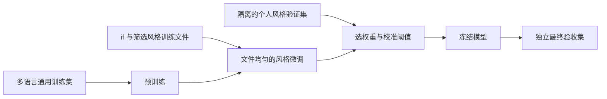
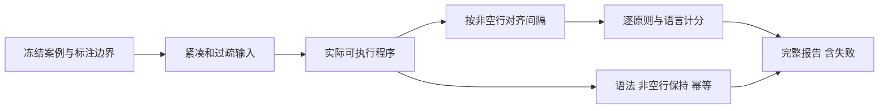

# 泛化质量结果

> 本文记录原验收标准 v1 的历史结果。用户随后明确了“同类单行连写，多行完整表达式前后留白”，当前标准和重新计分见《泛化验收集设计.md》。原标注已归档至 `config/benchmarks/archive/v1/`，本文分数不与 v2 直接比较。

## Intent：最终目标

从用户指定的 `if` 参考风格学习语句分组，并迁移到不同语言和写法。验收依据明确的个人风格要求，而不是测试仓库原作者的空行。C# 只是覆盖语言之一。

## Data：可用证据

### 最终模型与选模

- 模型：`spacer-poetic-v2`，特征版本 4，160 个输入、10,499 个参数。
- 权重：42,052 字节，SHA-256 `f51f69b7bf65c9c75eb53a7697e474c8cfc21ae4f21c810b01290c152c892287`。
- 最终候选：seed 111，通用预训练后 100% 个人风格采样微调；按文件均匀，再按文件内边界均匀。
- 候选空间预先限定为 3 种子 × 3 种风格比例。最终权重与阈值只依个人风格验证集确定，不读取最终验收集。
- 个人验证 macro-F1 0.94945。置信度 0.80 时紧凑输入校准精度 95.49%、召回 89.54%。这些校准数值不代表任意原始留白下的保证。
- 单文件 macOS 程序 10,299,040 字节，默认 zgpu / Metal，硬件不适配时 CPU 回退。

### 独立最终验收

`config/style-benchmark-holdout.json`：12 种语言、24 个源案例、98 个明确边界，每个案例采用紧凑和过疏两个输入变体，共 196 项断言。两种变体相关，不能当作 48 个独立业务任务。

验收集 SHA-256：`884f1798b57ce0fe412752fc75721f457a69a05fd7a3821a22cc9e69f593c87b`。

| 范围 | 原 v3 模型 | 最终模型 |
|---|---:|---:|
| 全部明确边界 | 116/196（59.2%） | 179/196（91.3%） |
| 训练已见语言 | 51/100（51.0%） | 90/100（90.0%） |
| 训练未见语言 | 65/96（67.7%） | 89/96（92.7%） |
| 应留一个空行 | 52/130（40.0%） | 122/130（93.8%） |
| 应保持连写 | 64/66（97.0%） | 57/66（86.4%） |

| 原则 | 原 v3 模型 | 最终模型 |
|---|---:|---:|
| 声明 → 控制流程 | 26/52 | 50/52 |
| 有前驱的 return | 16/38 | 36/38 |
| 声明 → 调用 | 2/28 | 26/28 |
| 同类且属于同组的连续语句 | 19/20 | 11/20 |
| 同类但发生阶段变化 | 0/4 | 2/4 |
| 多行表达式内部完整性 | 29/30 | 30/30 |
| 注释贴附及归属 | 16/16 | 16/16 |
| 块首、块尾边界 | 8/8 | 8/8 |

用户最初指出的三个主要原则合计：44/118 → 112/118（94.9%）。但同类相关语句的连续性退步明显，不能以总体提升掩盖。

| 语言 | 最终通过数 |
|---|---:|
| TypeScript | 16/18 |
| JavaScript | 14/14 |
| Python | 16/18 |
| Java | 12/16 |
| Rust | 18/20 |
| Zig | 14/14 |
| Go（未见） | 11/14 |
| C++（未见） | 14/14 |
| C#（未见） | 22/22 |
| Ruby（未见） | 8/12 |
| Kotlin（未见） | 14/14 |
| Swift（未见） | 20/20 |

C# 此处的 22/22 仅覆盖这两个源案例的明确标注边界，不能解释成所有 C# 代码都已符合要求。

### 独立正确性检查

- 48 个最终输出逐非空行保持原字节；再次处理后完整输出不再变化。
- 44 个输出经 ast-grep 解析无 ERROR；4 个 Zig 输出经 `zig ast-check` 通过。这是语法检查，不是完整应用构建或业务语义证明。
- 既有 20 组、600 个评分区域重新跑通非空行保持与幂等，309 个完成语法树/字面量对照。执行后端为 Metal，GPU 批次 5,561，CPU 批次 0。
- 词法保护 20 类、60 个变体通过，特征不受原空行变化影响。
- 最终权重的 1,025 个 GPU / CPU 输入分类全部一致，最大绝对误差约 3.81e-6。

### 回归与最终测试的区分

第一套 `style-benchmark.json` 已经产生开发反馈，只作为回归集：原模型 156/226，中间模型 181/226，最终模型 203/226。它没有进入梯度或自动选模，但不能再算最终独立证据。

第二套最终验收集由独立步骤创建，未查看第一套失败个例，也未查看模型输出；模型冻结后才运行。最终结果出现后只核验计分和报告，没有继续修改模型、特征、阈值或基准答案。





## Edges：边界与自我批判

1. 17 项失败包括同类相关语句 9 项、阶段切换 2 项、声明到控制流程 2 项、声明到调用 2 项、return 前 2 项。同类相关语句是当前最明显的退步。
2. 对于不确定边界，原置信机制会保留现有间隔。同一个未学好的边界可能在紧凑输入保留零空行，在过疏输入保留两空行；不能把它们都简称“漏插”。本轮保持该机制，没有利用测试修改阈值。
3. 最终紧凑输入 92/98，过疏输入 87/98。新增空行的能力改善大于清除多余空行的能力。
4. 部分阶段划分依赖语义，粗粒度角色和短上下文不能完整表达。角色特征仅输入模型，不是语法解析器，也没有强制留白后处理。
5. 验收集规模有限、人工设计，多个边界共享案例，不能外推为真实世界所有代码的成功概率。未标注的边界没有评分；通过测试仍可能在别处插入多余空行。
6. 原仓库一致性评估保留为诊断，不再被当成个人审美验收。模型训练仍使用基础阶段计算的类别权重，不应将 100% 个人风格采样解释成所有训练超参数也源于个人数据。

## Answer：交付与复现

- `src/roles.zig`、`src/features.zig`：共享结构特征。
- `tools/train.zig`、`tools/select_model.zig`：文件均衡采样、独立风格目标与校准口径。
- `tools/evaluate_style.zig`：实际程序、两种留白变体、逐边界计分及回归/最终测试用途声明。
- `config/style-benchmark*.json`：可复核的源码与期望，不是测试仓库原排版的自动复制。
- `models/`：最终内嵌模型与选模记录；`examples/`：实际新输出。

```sh
zig build -Doptimize=ReleaseSmall

zig build evaluate-style -Dgpu=false -Doptimize=ReleaseSafe -- \
  zig-out/bin/gpu-code-spacer artifacts/style-holdout \
  config/benchmarks/archive/v1/style-benchmark-holdout.json regression
```

完整当前报告：`artifacts/style-holdout-final/report.json`。历史对照：`artifacts/style-holdout-baseline/report.json`。逐例输入输出与报告同目录。训练复现命令见 README。
