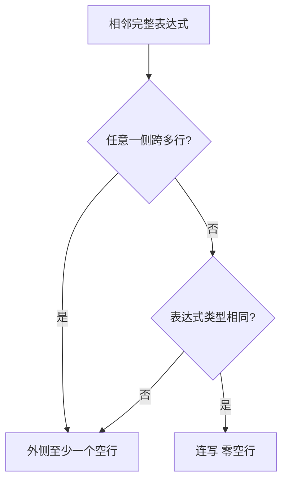
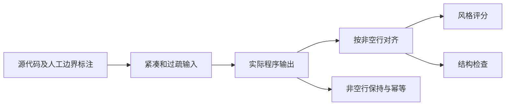

# 泛化验收集设计

## Intent：最终目标

按用户明确的表达式分组标准验收，当前标准版本为 2。

用户进一步明确：同类表达式必须连写，前提是两侧都不是跨多行的大块表达式；多行表达式前后都要有空行。这条补充优先于之前对“同类阶段变化”的自行推断。

### 风格验收优先级

| 优先级 | 相邻完整表达式的情况 | 期望 |
|---|---|---|
| 1 | 任意一侧是跨多行的完整表达式或控制语句块 | 至少一个空行 |
| 2 | 两侧都是单行，类型不同 | 至少一个空行 |
| 3 | 两侧都是单行，类型相同 | 零空行，必须连写 |

多行表达式在本集中的可操作定义是：一个完整语法单位跨越多条非空代码行，如多行调用、链式表达式、对象或数组初始化、回调声明、控制语句块。不额外设定字符数或行数阈值。

- 判断外层完整语句。`const value = fetch()` 仍是声明，不能因内部包含调用而归为独立调用。
- 多行表达式的空行在整个表达式外侧，不能插入它的参数、属性、链式调用或字符串内部。
- 块首尾不存在相邻完整语句时，不机械在花括号内添加空行。
- 注释随被解释的语句一组处理。例如注释解释 return，分段在注释前，注释和 return 之间保持贴附。
- 不再用“业务阶段发生变化”要求两个单行同类调用分段。

## Data：可用证据

保留原有 60 个案例的源代码，只修订期望和补标明确遗漏的边界，没有读取模型输出后删除失败项。

| 验收文件 | 案例数 | 风格边界 | 独立结构边界 |
|---|---:|---:|---:|
| `config/style-benchmark.json` | 36 | 72 | 42 |
| `config/style-benchmark-holdout.json` | 24 | 96 | 23 |

覆盖 12 种语言：TypeScript、JavaScript、Python、Java、Rust、Zig，以及训练未见的 Go、C++、C#、Ruby、Kotlin、Swift。

每个案例有紧凑与过疏两个输入变体，两者相关。正式风格评分只统计 `scope: style`；多行内部、块边缘与注释贴附等检查统计到 `scope: structure`。非空行保持、幂等也独立检查，不与风格分数相加。

### 具体修订

1. `related_same_kind` 与原有阶段切换项统一按实际表达式跨度判断；单行同类改为 `same_kind_single_line`，零空行。
2. `holdout-ts-buffer` 的单行 header 声明后接 3–5 行的 payload 声明，改为 `multiline_expression_boundary`，至少一个空行。
3. 补齐两处同类多行控制块之间的边界及十三处控制块外侧边界；新增标注附完整表达式起止行，便于复核。
4. 补齐声明到赋值、控制块到声明/赋值、控制块到隐式返回、赋值到 break 等明确异类边界。验收不限于最初三个例子。
5. 将解释 return 的注释前分隔归入返回语句组的风格验收；注释贴附保留为结构检查。
6. “有空行”按至少一个空行验证；用户未给出最大空行数，不把恰好一行扩充为硬标准。

### 标注结构

```json
{
  "after_line": 2,
  "blank_lines": 1,
  "principle": "multiline_expression_boundary",
  "scope": "style",
  "comparison": "at_least",
  "left_expression_lines": [2, 2],
  "right_expression_lines": [3, 5]
}
```

`after_line` 是原始源码的一基物理行号。`comparison` 为 `exact` 或 `at_least`；同类单行使用 `exact: 0`，需要留白的边界使用 `at_least: 1`。表达式范围用于人工复核，期望不由产品模型或产品角色特征生成。

## Edges：边界与限制

- 本次修改验收标准及评估器，不修改训练、特征、模型权重或置信阈值。新旧分数不可直接比较成模型质量提升。
- 两套案例都已被观察，当前 `status` 均为 `regression`。旧文件名中的 holdout 仅保留路径兼容，不代表它仍是独立最终测试；评估器拒绝把已观察的数据标为 heldout。
- 原始 v1 标注归档在 `config/benchmarks/archive/v1/`，原设计归档在 `docs/2026-09-10/归档/验收设计-v1.md`；旧报告依原标准解释。
- “一大坨”没有用户指定的数值阈值，本轮只按完整单位跨多行判断。没有把任意相邻物理行当作两个表达式，也没有修改原源码来制造多行例外。
- 该集合是有限人工标注，不是所有代码的形式化语义证明。未标注边界不进入风格评分。

## Answer：交付与成功标准

新的评估报告分别给出风格、结构、语言、原则和输入变体结果。风格全部满足才算风格验收通过，结构及非空行保存、幂等不能抵消任何风格失败。

当前模型实际结果：

| 集合 | 风格 | 结构 | 非空行保持与幂等 |
|---|---:|---:|---:|
| 36 案例回归集 | 118/144 | 84/84 | 72 组通过 |
| 24 案例原 holdout 集 | 174/192 | 46/46 | 48 组通过 |

这是同一模型按修订标准重新验收的结果，仍有未通过项。本次没有为通过新标准调整模型。

```sh
zig build evaluate-style -Dgpu=false -Doptimize=ReleaseSafe -- \
  zig-out/bin/gpu-code-spacer artifacts/criteria-v2-regression

zig build evaluate-style -Dgpu=false -Doptimize=ReleaseSafe -- \
  zig-out/bin/gpu-code-spacer artifacts/criteria-v2-former-holdout \
  config/style-benchmark-holdout.json regression
```





### 自我批判

此前把“同类相关性”和“业务阶段”变成硬性答案，偏离了用户明确标准。本次以完整表达式类型和是否跨多行为准，保留原标注历史，分别报告风格及结构结果。规则仍需要通过具体语法单位标注来落地，不应把有限案例的通过率说成通用代码排版保证。
