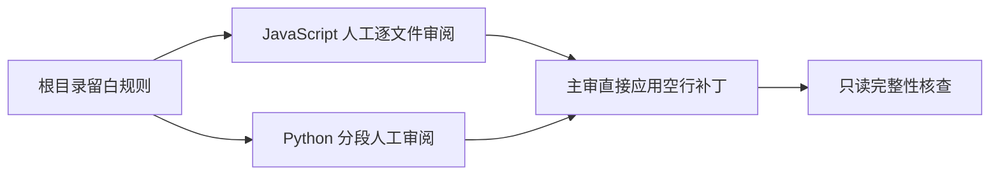
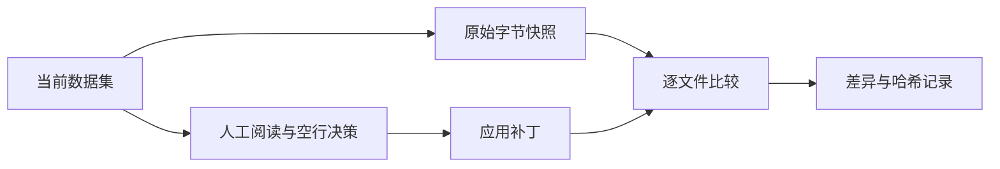

# JavaScript 与 Python 逐文件预处理

## Intent：最终目标

按文件名顺序人工阅读 JavaScript 全部 35 个文件及 Python 全部 36 个文件，依据根目录 rules.md 调整完整相邻语句之间的空行。

## Data：可用证据

- JavaScript 原始 6048 行，Python 原始 13470 行。
- 本轮原始快照及文件顺序保存在 artifacts/js-python-preprocess。
- 以当前工作区为基线，保留此前的用户修改。

## Edges：边界与限制

只增删空行，不改非空行、缩进、注释或字符串内部，不拆开表达式。不调用格式化器或产品模型代替人工判断，不启动训练，不生成测试，不调用浏览器。

Python 的缩进、装饰器与定义之间关系，以及多行字符串和文档示例保持原样；JavaScript 模板字符串和表达式内部保持原样。相似单行语句保持连续，多行完整语句外侧及不同形式语句之间留白。

## Answer：交付格式与成功标准

交付 71 个文件的审阅结果、空行差异和核查记录。非空行字节序列及受保护的字符串、注释内容必须保持一致。完成后记录修改数量和自我审查结果。

当前状态：71 个文件全部完成，未处理范围为零。

| 语言 | 已审阅 | 修改空行 | 保持原样 | 新增空行 | 删除空行 |
| --- | ---: | ---: | ---: | ---: | ---: |
| JavaScript | 35 | 28 | 7 | 340 | 1 |
| Python | 36 | 32 | 4 | 687 | 9 |
| 合计 | 71 | 60 | 11 | 1027 | 10 |

### 执行与核查

JavaScript 由主审逐文件全文阅读并手工应用补丁；Python 按 01–12、13–25、26–36 三段分别全文人工审阅并提交手写补丁，主审阅读补丁后统一应用。

- 全部 71 个文件非空行字节序列及其行尾与本轮快照一致。
- Python 全部词法 token 的类型和内容保持一致，比较时仅忽略换行 token，不忽略缩进、字符串、注释或操作符。
- Python 2751 个字符串和注释 token、JavaScript 1316 个注释、字符串、模板字符串和正则 AST 节点文本保持一致。
- 标准差异的所有增删行均为空行，并通过基于原始快照的 `git apply --check`。
- 生成逐文件前后 SHA-256、修改数量及交付哈希。
- 未启动训练、修改产品代码、生成测试或使用浏览器。

### 自我审查

独立复核了 JavaScript 全部修改差异，发现 response 中三处新增空行把连续同形的单行 `if (...) return ...;` 分开。已撤回三处空行，纠正将控制语句一概分段的倾向。

保留同形单行声明和调用的连续性；完整多行语句在外侧留白，配置对象、参数、续行以及文档示例内部不拆分。原样文件也已全文审阅，不以必须产生差异作为处理标准。

字节和词法核查证明内容保护，不等于视觉判断绝对正确。本轮仍以 rules.md 中已确认的例子为依据，后续人工校正可继续校准边界。

### 交付索引

- [本批修改差异](../../artifacts/js-python-preprocess/本批修改.diff)
- [核查结果及完整文件清单](../../artifacts/js-python-preprocess/核查结果.json)
- [交付哈希](../../artifacts/js-python-preprocess/交付哈希.sha256)
- [JavaScript 主审文件记录](../../artifacts/js-python-preprocess/主审JavaScript.json)
- [Python 01–12 审阅说明](../../artifacts/js-python-preprocess/审阅Python01-12.md)
- [Python 13–25 审阅说明](../../artifacts/js-python-preprocess/审阅Python13-25.md)
- [Python 26–36 审阅说明](../../artifacts/js-python-preprocess/审阅Python26-36.md)

原始快照保存在 `artifacts/js-python-preprocess/原始快照/`。全部 71 个文件均已交付，可进行用户审核。
