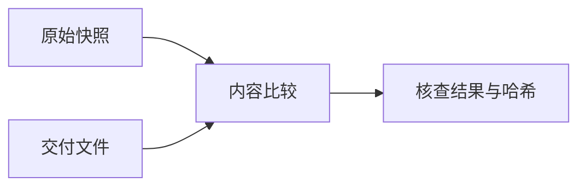

# Java剩余全部处理清单

## Intent：最终目标

完整记录第100–654个文件的人工审阅结果。

## Data：可用证据

以本批原始快照、逐文件审阅记录及核查结果.json为依据。555个文件均已完整阅读，386个修改，169个保持原样。

## Edges：边界与限制

只调整空行。保持原样表示完整审阅后无需修改。新增和删除数仅记录差异，不是质量指标。

## Answer：交付与成功标准

全部完成，无待处理文件。非空行字节、注释及字面量原文核查通过。主执行文档为[Java剩余全部预处理](Java剩余全部预处理.md)。

| 序号 | 文件 | 结果 | 新增空行 | 删除空行 |
| --- | --- | --- | ---: | ---: |
| 100 | CacheLoader--7dd58c4ce8277712.java | 调整空行 | 5 | 0 |
| 101 | Callables--b288b9f04f94b958.java | 调整空行 | 8 | 0 |
| 102 | CartesianList--7a385c6cf884a95f.java | 调整空行 | 36 | 2 |
| 103 | CaseFormat--38dd4c715abe2a45.java | 调整空行 | 15 | 1 |
| 104 | CharEscaper--382ecb6ce8de3a3f.java | 调整空行 | 17 | 3 |
| 105 | CharMatcher--cc2a736d0adbcea2.java | 调整空行 | 98 | 26 |
| 106 | CharSequenceReader--c0a11d1b04c5883b.java | 调整空行 | 17 | 1 |
| 107 | CharSink--667f01a79c42cc90.java | 调整空行 | 1 | 1 |
| 108 | CharSource--d969089bd328966.java | 调整空行 | 44 | 5 |
| 109 | CharStreams--b36f3aeaa3eabb58.java | 调整空行 | 33 | 2 |
| 110 | Charsets--107ffd635877677f.java | 调整空行 | 0 | 1 |
| 111 | ChecksumHashFunction--e0a7de05d83f89c4.java | 调整空行 | 8 | 0 |
| 112 | ClassDescriptor--47c92fffc7e5f300.java | 调整空行 | 0 | 2 |
| 113 | ClassFilter--1e9000182926e019.java | 调整空行 | 1 | 2 |
| 114 | ClassNamePatternFilterUtils--2429107889a75b80.java | 调整空行 | 2 | 3 |
| 115 | ClassOrderer--9ef2122569c8d944.java | 调整空行 | 0 | 7 |
| 116 | ClassPath--c1292dca04383441.java | 调整空行 | 62 | 0 |
| 117 | ClassSupport--683daabfaa86092.java | 调整空行 | 0 | 2 |
| 118 | ClassTemplate--477629c0a0f34161.java | 审阅后保持原样 | 0 | 0 |
| 119 | ClassTemplateInvocationContextProvider--83e55e2f2a1aadfd.java | 调整空行 | 0 | 2 |
| 120 | ClassTemplateInvocationLifecycleMethod--69e2b104822f8d20.java | 调整空行 | 0 | 2 |
| 121 | ClassToInstanceMap--abb844bac8a1152f.java | 审阅后保持原样 | 0 | 0 |
| 122 | ClasspathFileVisitor--71fbf655a9c436a9.java | 调整空行 | 4 | 2 |
| 123 | ClasspathScanner--fe66dd56e6a5e8dc.java | 调整空行 | 0 | 2 |
| 124 | ClasspathScannerLoader--31477512f087e786.java | 调整空行 | 0 | 2 |
| 125 | CleanupMode--ba1b90ce95f46b65.java | 调整空行 | 0 | 2 |
| 126 | ClearSystemProperty--2d94cfed21a29ca3.java | 调整空行 | 0 | 4 |
| 127 | CloseablePath--9f2a6a992ca08857.java | 调整空行 | 12 | 2 |
| 128 | Closeables--811400e5e3cb5282.java | 调整空行 | 1 | 0 |
| 129 | ClosingFuture--c20bb18ee5562ac7.java | 调整空行 | 90 | 8 |
| 130 | CollectCollectors--810f5b8261784623.java | 调整空行 | 30 | 1 |
| 131 | CollectPreconditions--eb48f1b05d1ce7f8.java | 调整空行 | 3 | 1 |
| 132 | CollectionFuture--e483d96732574e1c.java | 调整空行 | 6 | 0 |
| 133 | Collections2--669b9e839a7594ec.java | 调整空行 | 69 | 0 |
| 134 | CombinedFuture--963ef1da32e6294d.java | 调整空行 | 10 | 0 |
| 135 | CommonMatcher--a15f7e535016aad3.java | 审阅后保持原样 | 0 | 0 |
| 136 | CompactHashMap--d64e8f8858e5fe80.java | 调整空行 | 151 | 0 |
| 137 | CompactHashSet--a354a36455dd4dc2.java | 调整空行 | 100 | 0 |
| 138 | CompactHashing--12ed7eacb352a6ea.java | 调整空行 | 9 | 1 |
| 139 | CompactLinkedHashMap--55ccb40fa7ca029d.java | 调整空行 | 19 | 0 |
| 140 | ComparatorOrdering--72cfa0cf7e9e7d93.java | 调整空行 | 3 | 0 |
| 141 | Comparators--c0cf208a9f4e84e.java | 调整空行 | 15 | 0 |
| 142 | ComparisonChain--71bf28eac2eaa63f.java | 调整空行 | 0 | 1 |
| 143 | ComputationException--7b56e235cbbd103b.java | 审阅后保持原样 | 0 | 0 |
| 144 | ConcurrentHashMultiset--e8533cd7fbc91749.java | 调整空行 | 55 | 1 |
| 145 | ConditionEvaluationResult--8356a7595b7c117.java | 调整空行 | 3 | 2 |
| 146 | Constants--a5de7e39bbe99eac.java | 调整空行 | 0 | 2 |
| 147 | ConsumingQueueIterator--ec92fe779c0a831.java | 调整空行 | 1 | 0 |
| 148 | ContiguousSet--101e2a956ac64799.java | 调整空行 | 8 | 0 |
| 149 | Converter--e609459b98f46e38.java | 调整空行 | 9 | 0 |
| 150 | Count--dfdd5362baaf64e8.java | 调整空行 | 2 | 0 |
| 151 | CountingInputStream--7bfff3dc6de2137e.java | 调整空行 | 9 | 1 |
| 152 | CountingOutputStream--c3eb9d96e27ed051.java | 调整空行 | 2 | 1 |
| 153 | Crc32cHashFunction--1240d809b5d2deb9.java | 调整空行 | 8 | 1 |
| 154 | DeadEvent--64f0ee84681c6fcb.java | 调整空行 | 0 | 1 |
| 155 | DefaultClasspathScanner--8956f496bc43b490.java | 调整空行 | 28 | 3 |
| 156 | DefaultDeletionResult--30022ec8b2902962.java | 调整空行 | 7 | 3 |
| 157 | DefaultLocale--85e2a2b52a46f7cd.java | 调整空行 | 0 | 2 |
| 158 | DefaultLocaleExtension--e2a41a883fe05f20.java | 调整空行 | 10 | 2 |
| 159 | DefaultResource--24f0960a642e9f02.java | 调整空行 | 2 | 2 |
| 160 | DefaultResource--66cee590bc244da5.java | 调整空行 | 2 | 2 |
| 161 | DefaultTimeZone--9f4d5196c569667a.java | 调整空行 | 0 | 2 |
| 162 | DefaultTimeZoneExtension--fa646dd33dc8aed1.java | 调整空行 | 5 | 2 |
| 163 | Defaults--969ca68d94a04212.java | 调整空行 | 2 | 0 |
| 164 | DenseImmutableTable--b0440327c2fc2288.java | 调整空行 | 24 | 0 |
| 165 | DescendingImmutableSortedMultiset--d87f28132a4aec45.java | 审阅后保持原样 | 0 | 0 |
| 166 | DescendingImmutableSortedSet--f877536e1ad2bcd4.java | 调整空行 | 2 | 0 |
| 167 | DirectExecutor--8119188ae9d3f545.java | 审阅后保持原样 | 0 | 0 |
| 168 | DirectExecutorService--a024f607b8449162.java | 调整空行 | 8 | 1 |
| 169 | DirectedGraphConnections--7e2c6c665e8b9d2.java | 调整空行 | 54 | 3 |
| 170 | DirectedMultiNetworkConnections--c78fbc15b9be0951.java | 调整空行 | 14 | 1 |
| 171 | DirectedNetworkConnections--1d45584a7933043c.java | 调整空行 | 0 | 1 |
| 172 | Disabled--f2ebece2cb891db9.java | 调整空行 | 0 | 2 |
| 173 | DisabledForJreRange--90aec99af8bf238c.java | 调整空行 | 0 | 2 |
| 174 | DisabledForJreRangeCondition--1057c0cd6fd5a193.java | 调整空行 | 0 | 2 |
| 175 | DisabledIf--d640cc5c13a75802.java | 调整空行 | 0 | 2 |
| 176 | DisabledIfCondition--875783fee4bba641.java | 调整空行 | 0 | 1 |
| 177 | DisabledIfEnvironmentVariableCondition--6cb60796e29cb15c.java | 调整空行 | 3 | 2 |
| 178 | DisabledIfEnvironmentVariables--3f838d10741f85d8.java | 调整空行 | 0 | 2 |
| 179 | DisabledIfSystemPropertyCondition--ea6a9da2c4f5fc7d.java | 调整空行 | 3 | 2 |
| 180 | DisabledInNativeImage--ae3cbd9df1847b1a.java | 审阅后保持原样 | 0 | 0 |
| 181 | DisabledOnJre--e0d60dfbfcbd5631.java | 调整空行 | 0 | 2 |
| 182 | DisabledOnJreCondition--625f111337e78798.java | 调整空行 | 0 | 2 |
| 183 | DisabledOnOs--ee14eab7d5f288fa.java | 调整空行 | 0 | 2 |
| 184 | DisabledOnOsCondition--e644abab393119c9.java | 调整空行 | 6 | 2 |
| 185 | DiscreteDomain--49278362fc873c66.java | 调整空行 | 16 | 1 |
| 186 | Dispatcher--cbb8da66e979e1dc.java | 调整空行 | 8 | 3 |
| 187 | DisplayNameGenerator--3422486f4f9d974f.java | 调整空行 | 19 | 12 |
| 188 | DoubleMath--b478842164b7ad6e.java | 调整空行 | 49 | 0 |
| 189 | DoubleUtils--6895191a54f01517.java | 调整空行 | 12 | 1 |
| 190 | Doubles--31bcf5035effdbd3.java | 调整空行 | 65 | 0 |
| 191 | DynamicContainer--c6ae7d810fb675a1.java | 调整空行 | 10 | 5 |
| 192 | DynamicTestInvocationContext--5ac7a270130f267d.java | 调整空行 | 0 | 2 |
| 193 | EdgesConnecting--353a95191d7724e7.java | 调整空行 | 3 | 1 |
| 194 | ElementOrder--3bcbab9c116478c1.java | 调整空行 | 8 | 0 |
| 195 | EmptyContiguousSet--52edd41b90b80a7e.java | 调整空行 | 3 | 0 |
| 196 | EmptyImmutableListMultimap--a08386e07fe25ca5.java | 审阅后保持原样 | 0 | 0 |
| 197 | EnabledForJreRangeCondition--ac6769ae4112f9fe.java | 调整空行 | 0 | 2 |
| 198 | EnabledIfCondition--9a1b45ab62137ab2.java | 调整空行 | 0 | 2 |
| 199 | EnabledIfEnvironmentVariableCondition--6909c76bd367b0d1.java | 调整空行 | 4 | 3 |
| 200 | EnabledIfSystemPropertyCondition--9bfeff499ad9c60e.java | 调整空行 | 4 | 3 |
| 201 | EnabledOnJreCondition--c2f9df8fc4595f1d.java | 调整空行 | 0 | 2 |
| 202 | EnabledOnOsCondition--d929b4e1eb74c0de.java | 调整空行 | 6 | 2 |
| 203 | EndpointPairIterator--2fcd86cdf6bb3f20.java | 调整空行 | 11 | 0 |
| 204 | EnumBiMap--49a046e73ea3661b.java | 调整空行 | 11 | 0 |
| 205 | EnumHashBiMap--e4cec1eef820ebc7.java | 调整空行 | 6 | 0 |
| 206 | Enums--9be65d27fae651e.java | 调整空行 | 9 | 2 |
| 207 | Equivalence--108b6398fa2333c8.java | 调整空行 | 12 | 3 |
| 208 | Escaper--2700315560f529c3.java | 审阅后保持原样 | 0 | 0 |
| 209 | Escapers--3abd0ce1efa24fde.java | 调整空行 | 6 | 0 |
| 210 | EventBus--1903ba11608546f9.java | 调整空行 | 5 | 1 |
| 211 | EvictingQueue--8b4c1a4ca3774f7.java | 调整空行 | 9 | 1 |
| 212 | ExceptionUtils--eb6c1282132bdf3c.java | 调整空行 | 12 | 3 |
| 213 | ExecutableInvoker--4e72cab76612a823.java | 调整空行 | 0 | 2 |
| 214 | Execution--728cd0442b7239ab.java | 调整空行 | 0 | 2 |
| 215 | ExecutionCondition--c126b482ce10761a.java | 调整空行 | 0 | 2 |
| 216 | ExecutionList--4cfc9f08703ecd95.java | 调整空行 | 10 | 0 |
| 217 | ExecutionMode--43f54299aee65b52.java | 调整空行 | 0 | 2 |
| 218 | ExecutionSequencer--467b67e308bec3a8.java | 调整空行 | 32 | 4 |
| 219 | ExplicitOrdering--69f9a4b765cf33db.java | 调整空行 | 4 | 0 |
| 220 | Extension--8acaea4d742c77e2.java | 审阅后保持原样 | 0 | 0 |
| 221 | ExtensionContext--c3457cd6e92c6fcf.java | 调整空行 | 10 | 9 |
| 222 | ExtensionContextException--bbd3819f7070ccd6.java | 调整空行 | 0 | 2 |
| 223 | Extensions--d97c9f41f66f6bdd.java | 调整空行 | 0 | 2 |
| 224 | FakeTimeLimiter--1e788bcd356c4bcf.java | 调整空行 | 4 | 0 |
| 225 | FarmHashFingerprint64--bb3c5b8a48430385.java | 调整空行 | 35 | 0 |
| 226 | FileBackedOutputStream--f897279a84e94512.java | 调整空行 | 23 | 0 |
| 227 | FileWriteMode--680d04590f07c9d.java | 审阅后保持原样 | 0 | 0 |
| 228 | Files--cf782df8516c976e.java | 调整空行 | 36 | 3 |
| 229 | FilteredEntrySetMultimap--517013bac962fda9.java | 调整空行 | 0 | 1 |
| 230 | FilteredKeyListMultimap--184ff3e297526ca8.java | 审阅后保持原样 | 0 | 0 |
| 231 | FilteredKeyMultimap--6b716de85ea68450.java | 调整空行 | 11 | 0 |
| 232 | FilteredKeySetMultimap--ad6909b23b6637fe.java | 调整空行 | 0 | 1 |
| 233 | FilteredMultimap--39f242267ca81c7d.java | 审阅后保持原样 | 0 | 0 |
| 234 | FilteredMultimapValues--165048f17410aaa3.java | 调整空行 | 4 | 0 |
| 235 | FilteredSetMultimap--8eb9a198ca3cfc6d.java | 审阅后保持原样 | 0 | 0 |
| 236 | FinalizablePhantomReference--9224d468ed3b2367.java | 调整空行 | 1 | 0 |
| 237 | FinalizableReferenceQueue--699338f7a9201e95.java | 调整空行 | 20 | 2 |
| 238 | Finalizer--23ad26bd51dc716e.java | 调整空行 | 15 | 2 |
| 239 | Floats--3b6288eb75e3640e.java | 调整空行 | 63 | 0 |
| 240 | FluentFuture--7450c912a65f5526.java | 调整空行 | 0 | 1 |
| 241 | FluentIterable--47606dc72f4a17c7.java | 调整空行 | 13 | 0 |
| 242 | Flushables--a3f2880a8d6c56a0.java | 审阅后保持原样 | 0 | 0 |
| 243 | ForwardingBlockingQueue--3a4890f6d4daf0aa.java | 调整空行 | 0 | 1 |
| 244 | ForwardingCache--3f6084f4dfddc460.java | 调整空行 | 0 | 1 |
| 245 | ForwardingCollection--3df42a8c77a07dca.java | 调整空行 | 4 | 0 |
| 246 | ForwardingConcurrentMap--c48ca2a4586bef95.java | 调整空行 | 0 | 1 |
| 247 | ForwardingCondition--bedd784a847644ff.java | 审阅后保持原样 | 0 | 0 |
| 248 | ForwardingDeque--490b3c619c10c4ea.java | 调整空行 | 0 | 1 |
| 249 | ForwardingFluentFuture--7f5b2a6bb871d3e3.java | 审阅后保持原样 | 0 | 0 |
| 250 | ForwardingFuture--96eefc72a0472079.java | 审阅后保持原样 | 0 | 0 |
| 251 | ForwardingGraph--39554f36fcd4bbec.java | 调整空行 | 0 | 1 |
| 252 | ForwardingImmutableList--92fe3aece0d247a2.java | 审阅后保持原样 | 0 | 0 |
| 253 | ForwardingIterator--ba1ac8cc42b63ba8.java | 调整空行 | 0 | 1 |
| 254 | ForwardingList--35f3c445ab0e8856.java | 调整空行 | 1 | 0 |
| 255 | ForwardingListIterator--36630c96d9358dc0.java | 调整空行 | 0 | 1 |
| 256 | ForwardingListMultimap--a5d5a7e4dcee8be1.java | 调整空行 | 0 | 1 |
| 257 | ForwardingListeningExecutorService--2a76fc7053c373d.java | 审阅后保持原样 | 0 | 0 |
| 258 | ForwardingLoadingCache--cf9b29f03f9be04.java | 调整空行 | 0 | 1 |
| 259 | ForwardingLock--7978ad0bd51be405.java | 审阅后保持原样 | 0 | 0 |
| 260 | ForwardingMap--95b9b772cd61721c.java | 调整空行 | 5 | 0 |
| 261 | ForwardingMultimap--d5cf10ef7fbc6949.java | 调整空行 | 0 | 1 |
| 262 | ForwardingNavigableMap--83022713791d28ed.java | 调整空行 | 7 | 1 |
| 263 | ForwardingNavigableSet--6288e236afa100c7.java | 调整空行 | 0 | 1 |
| 264 | ForwardingNetwork--2e30962bf35fe092.java | 调整空行 | 0 | 1 |
| 265 | ForwardingQueue--ae4943353151f277.java | 调整空行 | 0 | 1 |
| 266 | ForwardingSet--5ccf6e182a9c0b66.java | 审阅后保持原样 | 0 | 0 |
| 267 | ForwardingSetMultimap--fe16692ea5cbd291.java | 审阅后保持原样 | 0 | 0 |
| 268 | ForwardingSortedMap--317172f18f021229.java | 调整空行 | 3 | 0 |
| 269 | ForwardingSortedMultiset--6c5388a4b7340a88.java | 调整空行 | 16 | 0 |
| 270 | ForwardingSortedSet--8d68b0d656c170b.java | 调整空行 | 7 | 1 |
| 271 | ForwardingSortedSetMultimap--eb2a1d8bc1ca32d0.java | 调整空行 | 0 | 1 |
| 272 | ForwardingTable--a5131db4a7bf253a.java | 审阅后保持原样 | 0 | 0 |
| 273 | ForwardingValueGraph--71c08920c490afcd.java | 调整空行 | 0 | 1 |
| 274 | Function--a372b0b0f0c87f94.java | 审阅后保持原样 | 0 | 0 |
| 275 | FunctionUtils--1c816766ad129701.java | 调整空行 | 1 | 2 |
| 276 | FunctionalEquivalence--a1e98f716def450d.java | 调整空行 | 4 | 1 |
| 277 | Functions--9d7932ee6df5d52f.java | 调整空行 | 18 | 1 |
| 278 | Funnels--61badfada99aef00.java | 调整空行 | 4 | 0 |
| 279 | FuturesGetChecked--f87e7bc8a8c4e5dc.java | 调整空行 | 21 | 0 |
| 280 | GeneralRange--19627189095890ac.java | 调整空行 | 31 | 1 |
| 281 | Graph--a75d0a427a126e7f.java | 审阅后保持原样 | 0 | 0 |
| 282 | GraphBuilder--24e71ec9fd7cdb44.java | 调整空行 | 10 | 1 |
| 283 | GraphConnections--73c73d2c07f731f2.java | 调整空行 | 0 | 1 |
| 284 | GraphConstants--779682d4f151ad16.java | 调整空行 | 10 | 2 |
| 285 | Graphs--b974c986a01e3182.java | 调整空行 | 49 | 1 |
| 286 | GraphsBridgeMethods--6c48e401b338258d.java | 调整空行 | 0 | 1 |
| 287 | GwtCompatible--8c5dfd17ba8c89d9.java | 调整空行 | 0 | 1 |
| 288 | GwtIncompatible--2a0fe9f186a97138.java | 审阅后保持原样 | 0 | 0 |
| 289 | HashBasedTable--8e20278db8249658.java | 调整空行 | 4 | 0 |
| 290 | HashBiMap--a2b2144e240d946.java | 调整空行 | 102 | 2 |
| 291 | HashCode--69e9863a611dcd2.java | 调整空行 | 25 | 0 |
| 292 | HashFunction--b4fcdacd7df81b99.java | 审阅后保持原样 | 0 | 0 |
| 293 | HashMultimap--e503dd7892b0b0b0.java | 调整空行 | 8 | 0 |
| 294 | Hasher--f154b8e5f3ab9e94.java | 审阅后保持原样 | 0 | 0 |
| 295 | Hashing--5a73a03ce36a2305.java | 调整空行 | 4 | 0 |
| 296 | Hashing--f3ac53992a2a549b.java | 调整空行 | 42 | 1 |
| 297 | HashingOutputStream--1f98fa6230790484.java | 调整空行 | 1 | 0 |
| 298 | HttpHeaders--44ff65571cd6beb8.java | 审阅后保持原样 | 0 | 0 |
| 299 | ImmutableAsList--32d33200c06260d9.java | 审阅后保持原样 | 0 | 0 |
| 300 | ImmutableBiMap--8e4ada36f9c62358.java | 调整空行 | 25 | 2 |
| 301 | ImmutableCollection--eea6f26c332a4559.java | 调整空行 | 15 | 0 |
| 302 | ImmutableEnumMap--6dfcaec5eb29bec.java | 调整空行 | 6 | 0 |
| 303 | ImmutableEnumSet--ea526b15124de616.java | 调整空行 | 7 | 0 |
| 304 | ImmutableGraph--cff3fc9a7bc0f695.java | 调整空行 | 6 | 1 |
| 305 | ImmutableListMultimap--8ba8a868784cc376.java | 调整空行 | 50 | 0 |
| 306 | ImmutableMap--17cc997a19ef4d91.java | 调整空行 | 67 | 3 |
| 307 | ImmutableMapEntry--d8ad0a9638e7b38f.java | 调整空行 | 3 | 0 |
| 308 | ImmutableMapEntrySet--bff4d632a792c655.java | 调整空行 | 3 | 0 |
| 309 | ImmutableMapKeySet--44cb52961ee32cde.java | 调整空行 | 1 | 0 |
| 310 | ImmutableMapValues--e00e16cf658b79c7.java | 调整空行 | 2 | 0 |
| 311 | ImmutableMultimap--5ff84316068f1a2a.java | 调整空行 | 45 | 1 |
| 312 | ImmutableMultiset--f57fd62b67806fe0.java | 调整空行 | 32 | 1 |
| 313 | ImmutableRangeMap--a70fdd2d4bcdad02.java | 调整空行 | 36 | 2 |
| 314 | ImmutableRangeSet--341cf076144fe548.java | 调整空行 | 65 | 3 |
| 315 | ImmutableSet--cc6193c94327b7a3.java | 调整空行 | 96 | 0 |
| 316 | ImmutableSetMultimap--a10e8172e69244a8.java | 调整空行 | 59 | 0 |
| 317 | ImmutableSortedAsList--265572e579d4d29e.java | 调整空行 | 1 | 0 |
| 318 | ImmutableSortedMultiset--fcbada8d7355d403.java | 调整空行 | 40 | 0 |
| 319 | ImmutableSortedSet--bd88c0f444e1c11e.java | 调整空行 | 50 | 0 |
| 320 | ImmutableSupplier--4eed0bb8b3e7bee7.java | 审阅后保持原样 | 0 | 0 |
| 321 | ImmutableTable--304ce6e71abbcacf.java | 调整空行 | 21 | 2 |
| 322 | ImmutableValueGraph--cb39856ddf42fb9e.java | 调整空行 | 6 | 2 |
| 323 | IncidentEdgeSet--49e68f3d9360c198.java | 调整空行 | 2 | 0 |
| 324 | IndexedImmutableSet--fa564c0f6d79d63a.java | 调整空行 | 2 | 0 |
| 325 | IndicativeSentencesGeneration--667fdc020ca8b535.java | 调整空行 | 0 | 2 |
| 326 | InetAddresses--cff128b68acff91c.java | 调整空行 | 127 | 4 |
| 327 | IntMath--7148eacac8c1108c.java | 调整空行 | 95 | 1 |
| 328 | Internal--6ac7977e5566db9f.java | 调整空行 | 0 | 1 |
| 329 | Internal--715151b68da44298.java | 调整空行 | 0 | 1 |
| 330 | Interner--b76a01d35b0d572.java | 审阅后保持原样 | 0 | 0 |
| 331 | Interners--71055f196c7e5b2d.java | 调整空行 | 10 | 1 |
| 332 | InternetDomainName--32b5eace965a2c50.java | 调整空行 | 17 | 4 |
| 333 | Ints--fcb8f2982ea7be91.java | 调整空行 | 68 | 0 |
| 334 | InvalidatableSet--428679fd6393c29b.java | 调整空行 | 1 | 0 |
| 335 | InvocationInterceptor--6e147e7adb28f056.java | 调整空行 | 0 | 3 |
| 336 | Invokable--19bba05e14446657.java | 调整空行 | 27 | 5 |
| 337 | Isolated--b101fee66b2c536e.java | 调整空行 | 0 | 2 |
| 338 | Iterables--43fa720a026fb56c.java | 调整空行 | 46 | 0 |
| 339 | Iterators--ede6a92139ffe5ac.java | 调整空行 | 123 | 2 |
| 340 | J2ktIncompatible--60f7638a4ca4603d.java | 审阅后保持原样 | 0 | 0 |
| 341 | JUnitException--4a578abe15bdba7c.java | 调整空行 | 0 | 2 |
| 342 | JdkBackedImmutableBiMap--9dc4e89e8897d0d.java | 调整空行 | 14 | 0 |
| 343 | JdkBackedImmutableMultiset--35817768f483062f.java | 调整空行 | 10 | 0 |
| 344 | JdkBackedImmutableSet--3aa4b43d51d8fdb2.java | 审阅后保持原样 | 0 | 0 |
| 345 | JdkFutureAdapters--abb45b7c7ea11e23.java | 调整空行 | 6 | 1 |
| 346 | JupiterLocaleUtils--f1e3318d959ec44c.java | 调整空行 | 0 | 2 |
| 347 | JupiterPropertyUtils--ee7b99779a237a47.java | 调整空行 | 3 | 2 |
| 348 | LazyLogger--f3fb510e8ced2c53.java | 调整空行 | 6 | 0 |
| 349 | LexicographicalOrdering--68f1d0b3d00abd18.java | 调整空行 | 8 | 0 |
| 350 | LifecycleMethodExecutionExceptionHandler--9892241c2abadf51.java | 调整空行 | 0 | 6 |
| 351 | LineBuffer--96dc76c9e15f077d.java | 调整空行 | 14 | 0 |
| 352 | LineProcessor--74fdcdb606a82171.java | 调整空行 | 0 | 1 |
| 353 | LineReader--5f92efd9035a45e6.java | 调整空行 | 8 | 0 |
| 354 | LinearTransformation--f7adaf2a03b0a1fb.java | 调整空行 | 14 | 4 |
| 355 | LinkedHashMultimap--43f65f132a03604b.java | 调整空行 | 68 | 2 |
| 356 | LinkedHashMultiset--c6ed04ef0312a829.java | 调整空行 | 5 | 1 |
| 357 | LinkedListMultimap--f1a3efe92535fd03.java | 调整空行 | 106 | 0 |
| 358 | ListMultimap--743ea4e4e435b458.java | 审阅后保持原样 | 0 | 0 |
| 359 | ListenableFuture--666fa18c2c21460d.java | 审阅后保持原样 | 0 | 0 |
| 360 | ListenableScheduledFuture--c12520232fec544c.java | 审阅后保持原样 | 0 | 0 |
| 361 | ListenerCallQueue--3d5031201f9cf27a.java | 调整空行 | 11 | 0 |
| 362 | ListeningExecutorService--73388cb6e24e3368.java | 审阅后保持原样 | 0 | 0 |
| 363 | ListeningScheduledExecutorService--829063ade8de92af.java | 调整空行 | 0 | 1 |
| 364 | LoadingCache--61ee62baceae7c15.java | 调整空行 | 0 | 1 |
| 365 | LocalCache--2d3e65c663bf7356.java | 调整空行 | 512 | 34 |
| 366 | LocaleProvider--4aaa203aa0c74add.java | 审阅后保持原样 | 0 | 0 |
| 367 | LogRecordListener--5546eeea3855161e.java | 调整空行 | 0 | 2 |
| 368 | LoggerFactory--37b499e6f73e59a5.java | 调整空行 | 10 | 4 |
| 369 | LongAddable--a5edd5a9ec12e55a.java | 审阅后保持原样 | 0 | 0 |
| 370 | LongMath--120d7b9e0c41147b.java | 调整空行 | 160 | 1 |
| 371 | Longs--177c77c79fedc584.java | 调整空行 | 80 | 1 |
| 372 | LruCache--4b82e5d93de56351.java | 调整空行 | 1 | 2 |
| 373 | MacHashFunction--d21f8f6051b532aa.java | 调整空行 | 12 | 1 |
| 374 | MapDifference--f14d8a9124915bea.java | 审阅后保持原样 | 0 | 0 |
| 375 | MapIteratorCache--c936bf8042125dc7.java | 调整空行 | 9 | 0 |
| 376 | MapMaker--2ee4f8748880eb11.java | 调整空行 | 22 | 0 |
| 377 | MapMakerInternalMap--8f584d8f035b8e30.java | 调整空行 | 265 | 12 |
| 378 | MapRetrievalCache--3e5dca262dd9b41b.java | 调整空行 | 11 | 0 |
| 379 | Maps--b94d5636b4f9bd66.java | 调整空行 | 166 | 6 |
| 380 | MathPreconditions--e1247c21eb101062.java | 调整空行 | 7 | 0 |
| 381 | MediaType--7fa4bf8b1f4b29aa.java | 调整空行 | 82 | 0 |
| 382 | MediaType--832354b3adebae7f.java | 调整空行 | 5 | 0 |
| 383 | MediaType--9c1ed0007dbb65b5.java | 调整空行 | 1 | 0 |
| 384 | MethodBasedCondition--2598214f8265354c.java | 调整空行 | 15 | 0 |
| 385 | MethodDescriptor--76fd3403437d6c3d.java | 审阅后保持原样 | 0 | 0 |
| 386 | MethodOrderer--5086710618864f7b.java | 审阅后保持原样 | 0 | 0 |
| 387 | ModifierSupport--c34262de1f388f3d.java | 审阅后保持原样 | 0 | 0 |
| 388 | ModuleUtils--2e080c44cc58a611.java | 调整空行 | 28 | 0 |
| 389 | Monitor--2d858679edfaf59d.java | 调整空行 | 92 | 0 |
| 390 | MoreCollectors--1f75f25ffa935c28.java | 调整空行 | 16 | 0 |
| 391 | MoreExecutors--198f4d69e21b0fec.java | 调整空行 | 52 | 0 |
| 392 | MoreFiles--49a8238709b96517.java | 调整空行 | 45 | 0 |
| 393 | MoreObjects--d45a391f16db9a89.java | 调整空行 | 31 | 0 |
| 394 | MultiEdgesConnecting--619f75c980acd6f0.java | 调整空行 | 4 | 0 |
| 395 | MultiInputStream--b1d25c7463cba74c.java | 调整空行 | 15 | 0 |
| 396 | Multimap--39bad4d344017e40.java | 调整空行 | 1 | 0 |
| 397 | MultimapBuilder--2bb08a0a5f6b73cd.java | 调整空行 | 13 | 0 |
| 398 | Multimaps--70ceaaabd776f8d3.java | 调整空行 | 71 | 0 |
| 399 | Multisets--3e93ee21ab5af7fd.java | 调整空行 | 97 | 1 |
| 400 | Murmur3_32HashFunction--c593ce36fe571548.java | 调整空行 | 65 | 0 |
| 401 | MutableClassToInstanceMap--65767701d69dd7b.java | 调整空行 | 5 | 0 |
| 402 | MutableNetwork--df80edaa2cafb051.java | 审阅后保持原样 | 0 | 0 |
| 403 | MutableTypeToInstanceMap--530f3375e7a1b9d2.java | 调整空行 | 1 | 0 |
| 404 | Named--8856338e768b9e8.java | 审阅后保持原样 | 0 | 0 |
| 405 | NamedExecutable--a95011f9285b5d88.java | 审阅后保持原样 | 0 | 0 |
| 406 | NaturalOrdering--a6702155bf65227e.java | 调整空行 | 5 | 0 |
| 407 | Nested--7e7ea5684066c44.java | 审阅后保持原样 | 0 | 0 |
| 408 | Network--14556ebadaac1015.java | 审阅后保持原样 | 0 | 0 |
| 409 | NetworkBuilder--b64710d04f3941ee.java | 调整空行 | 11 | 0 |
| 410 | NetworkConnections--8567766dd5bdb05c.java | 审阅后保持原样 | 0 | 0 |
| 411 | NullLocaleProvider--d94a225c27cd49ae.java | 审阅后保持原样 | 0 | 0 |
| 412 | NullnessCasts--4a218b66edb77cfe.java | 审阅后保持原样 | 0 | 0 |
| 413 | NullnessCasts--b5bf14de6c6b223d.java | 审阅后保持原样 | 0 | 0 |
| 414 | NullsFirstOrdering--14b8a9c335ae7113.java | 调整空行 | 6 | 0 |
| 415 | NullsLastOrdering--2a342df8e8f96e0f.java | 调整空行 | 6 | 0 |
| 416 | Optional--4ffbf5c1ee508078.java | 调整空行 | 3 | 0 |
| 417 | Order--17219ceb853a2da3.java | 审阅后保持原样 | 0 | 0 |
| 418 | Ordering--4b3db83116f12f0b.java | 调整空行 | 33 | 0 |
| 419 | OverflowAvoidingLockSupport--b934a2f647d9a2cc.java | 审阅后保持原样 | 0 | 0 |
| 420 | PackageUtils--7943292c42aa5269.java | 调整空行 | 6 | 0 |
| 421 | PairedStats--8f1fe0cb61a037b5.java | 调整空行 | 24 | 0 |
| 422 | PairedStatsAccumulator--f9705108ba451149.java | 调整空行 | 16 | 0 |
| 423 | ParameterContext--28c3151c3b98c895.java | 审阅后保持原样 | 0 | 0 |
| 424 | ParameterResolutionException--bfd852865fe63a81.java | 调整空行 | 2 | 0 |
| 425 | ParameterResolver--f7396be43c16cbf6.java | 审阅后保持原样 | 0 | 0 |
| 426 | ParseRequest--bcb14de2c33d7c9f.java | 调整空行 | 7 | 0 |
| 427 | PatternCompiler--877d46e81d86bb85.java | 审阅后保持原样 | 0 | 0 |
| 428 | PeekingIterator--eea422712a724030.java | 审阅后保持原样 | 0 | 0 |
| 429 | PercentEscaper--55ea7e554981c2c6.java | 调整空行 | 55 | 0 |
| 430 | Platform--5ae5b3df4050ced4.java | 调整空行 | 2 | 0 |
| 431 | Platform--f3583e5fab6711a.java | 审阅后保持原样 | 0 | 0 |
| 432 | Platform--ff614bd34ca01dec.java | 审阅后保持原样 | 0 | 0 |
| 433 | PreInterruptCallback--d71e6b129f299126.java | 审阅后保持原样 | 0 | 0 |
| 434 | PreInterruptContext--5b483c8ce605074c.java | 审阅后保持原样 | 0 | 0 |
| 435 | PreconditionViolationException--4eb332ffd74cc4d9.java | 审阅后保持原样 | 0 | 0 |
| 436 | Preconditions--cc222536d9749667.java | 调整空行 | 15 | 0 |
| 437 | Predicate--8affc0a84ea4732f.java | 审阅后保持原样 | 0 | 0 |
| 438 | Predicates--6c7839ae8a451132.java | 调整空行 | 31 | 0 |
| 439 | PreemptiveTimeoutUtils--67a0307c1f6570a4.java | 调整空行 | 5 | 0 |
| 440 | Present--6d0ea9e65a13b155.java | 调整空行 | 5 | 0 |
| 441 | PublicSuffixTrie--8724167e43b0a37.java | 调整空行 | 16 | 0 |
| 442 | Quantiles--e2a8d6b2e5989af3.java | 调整空行 | 52 | 0 |
| 443 | Queues--641ae7e1edb8265b.java | 调整空行 | 34 | 0 |
| 444 | RandomOrdererUtils--5f64240fdcd3cf08.java | 调整空行 | 2 | 0 |
| 445 | RangeMap--ef67b7aeb44c6bb4.java | 审阅后保持原样 | 0 | 0 |
| 446 | RangeSet--3ad86ec6f24aa88e.java | 调整空行 | 1 | 0 |
| 447 | RateLimiter--6b97a1fe149b45a1.java | 调整空行 | 19 | 0 |
| 448 | ReaderInputStream--ca868d5cad3b4480.java | 调整空行 | 20 | 0 |
| 449 | ReadsDefaultLocale--bbe4635c0400688.java | 审阅后保持原样 | 0 | 0 |
| 450 | ReadsDefaultTimeZone--4a744a1ed9c766eb.java | 审阅后保持原样 | 0 | 0 |
| 451 | ReadsSystemProperty--c1b023261c3eaf53.java | 审阅后保持原样 | 0 | 0 |
| 452 | RecursiveDeleteOption--4db500de71ae7c7d.java | 审阅后保持原样 | 0 | 0 |
| 453 | ReferenceEntry--1eb93b88e3fc5f32.java | 审阅后保持原样 | 0 | 0 |
| 454 | Reflection--57bdde9a25ec631b.java | 调整空行 | 3 | 0 |
| 455 | ReflectionSupport--5b61bdd9623eaa29.java | 调整空行 | 1 | 0 |
| 456 | ReflectiveInvocationContext--e71d03826dd1fbbf.java | 审阅后保持原样 | 0 | 0 |
| 457 | RegisterExtension--8b55c5bda93680e7.java | 审阅后保持原样 | 0 | 0 |
| 458 | RegularContiguousSet--e1c6bd47993acb13.java | 调整空行 | 12 | 0 |
| 459 | RegularImmutableBiMap--12adcafbc526bb1a.java | 调整空行 | 24 | 0 |
| 460 | RegularImmutableList--23b4a092d4f47307.java | 调整空行 | 1 | 0 |
| 461 | RegularImmutableMap--3b45cdc4bf4627bf.java | 调整空行 | 38 | 0 |
| 462 | RegularImmutableMultiset--84054bd602f45c46.java | 调整空行 | 22 | 0 |
| 463 | RegularImmutableSet--d02834f3615cb415.java | 调整空行 | 9 | 0 |
| 464 | RegularImmutableSortedMultiset--175e58670d23133d.java | 调整空行 | 9 | 0 |
| 465 | RegularImmutableSortedSet--af6c3ff65c74438c.java | 调整空行 | 24 | 2 |
| 466 | RegularImmutableTable--7d9c9fe50e6afcd1.java | 调整空行 | 10 | 0 |
| 467 | RemovalCause--cea78cb5f3f24426.java | 审阅后保持原样 | 0 | 0 |
| 468 | RemovalNotification--a85428ce341764b4.java | 调整空行 | 1 | 0 |
| 469 | RepeatedTest--e9b9934ed64c606b.java | 审阅后保持原样 | 0 | 0 |
| 470 | RepetitionInfo--de2112b4d8483ff4.java | 审阅后保持原样 | 0 | 0 |
| 471 | Resource--40e3dd9cdc46909b.java | 调整空行 | 1 | 0 |
| 472 | ResourceAccessMode--fc5f319e88263e28.java | 审阅后保持原样 | 0 | 0 |
| 473 | ResourceFilter--4d4825645666d164.java | 调整空行 | 1 | 0 |
| 474 | ResourceLockTarget--abb2614947c624d9.java | 审阅后保持原样 | 0 | 0 |
| 475 | ResourceLocks--5b315530937f0861.java | 审阅后保持原样 | 0 | 0 |
| 476 | ResourceLocksProvider--1e09a11f05a6dfb6.java | 调整空行 | 3 | 0 |
| 477 | ResourceSupport--d149b7fb23f7d714.java | 审阅后保持原样 | 0 | 0 |
| 478 | ResourceUtils--fff7784d86e04f25.java | 调整空行 | 1 | 0 |
| 479 | Resources--191d69304580123a.java | 审阅后保持原样 | 0 | 0 |
| 480 | Resources--cfbe7a1988a7cb58.java | 调整空行 | 6 | 0 |
| 481 | RestoreSystemProperties--16a419f59128beba.java | 审阅后保持原样 | 0 | 0 |
| 482 | ReverseNaturalOrdering--bb39969219455742.java | 调整空行 | 1 | 0 |
| 483 | ReverseOrdering--97de2f982f69b1e7.java | 调整空行 | 3 | 0 |
| 484 | RowSortedTable--6fb3321606cb2246.java | 审阅后保持原样 | 0 | 0 |
| 485 | Runnables--c68a040df1f076a1.java | 审阅后保持原样 | 0 | 0 |
| 486 | RuntimeUtils--dfba41d70d06eaf5.java | 调整空行 | 4 | 0 |
| 487 | SearchOption--7dcdc344b7489808.java | 审阅后保持原样 | 0 | 0 |
| 488 | SearchPathUtils--e6ead02af4ffe83e.java | 调整空行 | 7 | 1 |
| 489 | SequentialExecutor--38c2e7ef6862793b.java | 调整空行 | 20 | 0 |
| 490 | Serialization--1afd34f8a7fba975.java | 调整空行 | 16 | 0 |
| 491 | ServiceManager--411561f552aa6857.java | 调整空行 | 59 | 0 |
| 492 | ServiceManagerBridge--75989d92c5299614.java | 审阅后保持原样 | 0 | 0 |
| 493 | SetMultimap--828cd5455af3024e.java | 审阅后保持原样 | 0 | 0 |
| 494 | SetSystemProperty--248a276c524285c.java | 审阅后保持原样 | 0 | 0 |
| 495 | Sets--d6aa46c38b66978c.java | 调整空行 | 130 | 0 |
| 496 | SettableFuture--f4705e49d9b936b0.java | 审阅后保持原样 | 0 | 0 |
| 497 | Shorts--67e35a3b80a8c1da.java | 调整空行 | 67 | 0 |
| 498 | SimpleTimeLimiter--c5c3d91dd150ae8.java | 调整空行 | 22 | 0 |
| 499 | SingletonImmutableBiMap--a2517492c2d1219d.java | 调整空行 | 1 | 0 |
| 500 | SingletonImmutableList--3b8287d68ad3705a.java | 调整空行 | 2 | 0 |
| 501 | SingletonImmutableSet--b566b714e10db922.java | 调整空行 | 1 | 0 |
| 502 | SingletonImmutableTable--db3b663ec603446e.java | 调整空行 | 1 | 0 |
| 503 | SipHashFunction--b30a0c2acacd1397.java | 调整空行 | 20 | 0 |
| 504 | SmallCharMatcher--a2c513381f33d845.java | 调整空行 | 19 | 0 |
| 505 | SmoothRateLimiter--aba65068dd3c67bf.java | 调整空行 | 25 | 0 |
| 506 | SneakyThrows--6e1238b32d78c9be.java | 审阅后保持原样 | 0 | 0 |
| 507 | SortedIterable--822888eb4351a12a.java | 审阅后保持原样 | 0 | 0 |
| 508 | SortedIterables--6a666cbbe8f8e695.java | 调整空行 | 5 | 0 |
| 509 | SortedLists--168b6584ef5a4b97.java | 调整空行 | 17 | 0 |
| 510 | SortedMapDifference--9bbf10c2c4a35177.java | 审阅后保持原样 | 0 | 0 |
| 511 | SortedMultiset--be8d575bb86f8479.java | 审阅后保持原样 | 0 | 0 |
| 512 | SortedMultisetBridge--889689adcb345caa.java | 审阅后保持原样 | 0 | 0 |
| 513 | SortedMultisets--dc1cc056fb33f46c.java | 调整空行 | 1 | 0 |
| 514 | SortedSetMultimap--5c5580210438403.java | 审阅后保持原样 | 0 | 0 |
| 515 | SparseImmutableTable--fc51d91a3a5a8203.java | 调整空行 | 28 | 0 |
| 516 | Splitter--8975d59b8f6e5bd5.java | 调整空行 | 32 | 2 |
| 517 | StandardMutableNetwork--cf8eb72ff1a8f666.java | 调整空行 | 21 | 0 |
| 518 | StandardMutableValueGraph--416303e60a39c5e9.java | 调整空行 | 26 | 0 |
| 519 | StandardNetwork--3748310bd3ada3ac.java | 调整空行 | 17 | 0 |
| 520 | StandardRowSortedTable--bb5cc3eb0b4b1509.java | 调整空行 | 3 | 0 |
| 521 | StandardSystemProperty--ccf4034488a424c7.java | 审阅后保持原样 | 0 | 0 |
| 522 | StandardTable--10c3fef4f58f612c.java | 调整空行 | 108 | 0 |
| 523 | StandardValueGraph--7b883874e7cd0993.java | 调整空行 | 15 | 0 |
| 524 | Stats--8604b8c60b94c1d8.java | 调整空行 | 47 | 0 |
| 525 | StatsAccumulator--84679b64af611f6a.java | 调整空行 | 20 | 0 |
| 526 | Streams--f430fb2f3f5ce5e6.java | 调整空行 | 90 | 0 |
| 527 | StringToBooleanConverter--ab2e1f4921811146.java | 调整空行 | 2 | 0 |
| 528 | StringToCharacterConverter--aa35a6e0fdb4b7cd.java | 调整空行 | 1 | 0 |
| 529 | StringToClassConverter--64a3404173ec1ca2.java | 审阅后保持原样 | 0 | 0 |
| 530 | StringToCommonJavaTypesConverter--54a70816bddd446c.java | 调整空行 | 1 | 0 |
| 531 | StringToEnumConverter--64ebc1bc2eba017.java | 审阅后保持原样 | 0 | 0 |
| 532 | StringToJavaTimeConverter--2c377a505199c7f3.java | 调整空行 | 1 | 0 |
| 533 | StringToNumberConverter--797a7ac8be25ffbb.java | 调整空行 | 1 | 0 |
| 534 | StringToObjectConverter--7bac541bfbcd8435.java | 审阅后保持原样 | 0 | 0 |
| 535 | StringUtils--144453c9b8ad7184.java | 调整空行 | 15 | 0 |
| 536 | Striped--d786a10f7261a85a.java | 调整空行 | 43 | 0 |
| 537 | Subscribe--b96b70a5f6c37361.java | 审阅后保持原样 | 0 | 0 |
| 538 | Subscriber--fe0a05a8b264f2e1.java | 调整空行 | 6 | 0 |
| 539 | SubscriberExceptionContext--43a7ab434da34e85.java | 审阅后保持原样 | 0 | 0 |
| 540 | SubscriberExceptionHandler--d02b503963254580.java | 审阅后保持原样 | 0 | 0 |
| 541 | SubscriberRegistry--d286ca38f80219a8.java | 调整空行 | 15 | 0 |
| 542 | Synchronized--b52cff826899fd45.java | 调整空行 | 42 | 0 |
| 543 | SystemPropertiesExtension--535b9e919d447557.java | 调整空行 | 9 | 0 |
| 544 | SystemPropertiesModification--f1b39f3f66f6db84.java | 调整空行 | 12 | 0 |
| 545 | Table--4a6d6e14c17ca75d.java | 审阅后保持原样 | 0 | 0 |
| 546 | TableCollectors--5340493521023231.java | 调整空行 | 12 | 0 |
| 547 | Tables--9a721fda49e29248.java | 调整空行 | 5 | 0 |
| 548 | Tag--4d7ed6011f67c947.java | 审阅后保持原样 | 0 | 0 |
| 549 | Tags--1cbfef8a76ffc1da.java | 审阅后保持原样 | 0 | 0 |
| 550 | TempDir--87a2ba6fbc266b23.java | 审阅后保持原样 | 0 | 0 |
| 551 | TempDirFactory--34e8f6ae8a6af4e7.java | 审阅后保持原样 | 0 | 0 |
| 552 | TempFileCreator--ba96f0d5af23d413.java | 调整空行 | 12 | 0 |
| 553 | TemplateInvocationValidationException--5e7f062f7c353661.java | 审阅后保持原样 | 0 | 0 |
| 554 | Test--1f19daf90759f9b9.java | 审阅后保持原样 | 0 | 0 |
| 555 | TestClassOrder--ccac6e532e8649d.java | 审阅后保持原样 | 0 | 0 |
| 556 | TestExecutionExceptionHandler--8a914397daf8342.java | 审阅后保持原样 | 0 | 0 |
| 557 | TestFactory--4bdd2619db2fc131.java | 审阅后保持原样 | 0 | 0 |
| 558 | TestInfo--87a74653795eb419.java | 审阅后保持原样 | 0 | 0 |
| 559 | TestInstanceFactory--e8094951db709688.java | 审阅后保持原样 | 0 | 0 |
| 560 | TestInstanceFactoryContext--ac4a9bac5995b47d.java | 审阅后保持原样 | 0 | 0 |
| 561 | TestInstancePostProcessor--e936ece3bbf3d4f8.java | 审阅后保持原样 | 0 | 0 |
| 562 | TestInstancePreConstructCallback--a65e831c7a76861d.java | 审阅后保持原样 | 0 | 0 |
| 563 | TestInstancePreDestroyCallback--7684c28c0d78c2e4.java | 调整空行 | 2 | 0 |
| 564 | TestInstances--92c0ef9aefdc916d.java | 审阅后保持原样 | 0 | 0 |
| 565 | TestInstantiationAwareExtension--8892209f4f87008b.java | 审阅后保持原样 | 0 | 0 |
| 566 | TestInstantiationException--24f4638b5b242ca5.java | 审阅后保持原样 | 0 | 0 |
| 567 | TestReporter--f57dc1497077ae72.java | 调整空行 | 6 | 0 |
| 568 | TestTemplate--e16ff9ec25cf674f.java | 审阅后保持原样 | 0 | 0 |
| 569 | TestTemplateInvocationContext--73ae53183ed28ef0.java | 审阅后保持原样 | 0 | 0 |
| 570 | TestTemplateInvocationContextProvider--1d1c41adcfc58abf.java | 审阅后保持原样 | 0 | 0 |
| 571 | TestWatcher--bebd832690f9bed1.java | 审阅后保持原样 | 0 | 0 |
| 572 | Testable--1fafb201728a8e7b.java | 审阅后保持原样 | 0 | 0 |
| 573 | ThreadFactoryBuilder--cd406eab907f61d6.java | 调整空行 | 17 | 0 |
| 574 | Throwables--dc0e3fc6bba9cb3f.java | 调整空行 | 27 | 0 |
| 575 | ThrowingConsumer--3bd63ff72e3a73c0.java | 审阅后保持原样 | 0 | 0 |
| 576 | ThrowingSupplier--108a7e93d01ae058.java | 审阅后保持原样 | 0 | 0 |
| 577 | Ticker--1abc02ae3e12416a.java | 审阅后保持原样 | 0 | 0 |
| 578 | TimeLimiter--2dbad93344ef9a36.java | 审阅后保持原样 | 0 | 0 |
| 579 | TimeZoneProvider--2359e1dda89b8e3a.java | 审阅后保持原样 | 0 | 0 |
| 580 | Timeout--c45afe227e37b732.java | 审阅后保持原样 | 0 | 0 |
| 581 | TimeoutFuture--7b73e16bcc636c4b.java | 调整空行 | 20 | 0 |
| 582 | ToDoubleRounder--5f2e19d64a2ebed4.java | 调整空行 | 26 | 0 |
| 583 | ToStringBuilder--b4fb37ce727a2abf.java | 调整空行 | 2 | 0 |
| 584 | TopKSelector--6e17a7ed403b4128.java | 调整空行 | 30 | 2 |
| 585 | TransformedIterator--e696777012371ec.java | 审阅后保持原样 | 0 | 0 |
| 586 | Traverser--8530b0ce383e20e3.java | 调整空行 | 29 | 0 |
| 587 | TreeBasedTable--8d086e21a31d3f3c.java | 调整空行 | 25 | 0 |
| 588 | TreeMultimap--d1f6baea3c60d9a4.java | 调整空行 | 6 | 0 |
| 589 | TreeMultiset--58a27ed50931b35e.java | 调整空行 | 190 | 1 |
| 590 | TreeRangeMap--bb7e59d916ce33a0.java | 调整空行 | 82 | 0 |
| 591 | TreeRangeSet--851d6db510e0a6e2.java | 调整空行 | 98 | 1 |
| 592 | TreeTraverser--f4dbc936c5fa3465.java | 调整空行 | 22 | 0 |
| 593 | TrustedListenableFutureTask--a1bfa52099a23145.java | 调整空行 | 5 | 0 |
| 594 | Try--c10b767fbf76e9d1.java | 调整空行 | 18 | 0 |
| 595 | TypeBasedParameterResolver--2c74ac1be8aeb03f.java | 调整空行 | 4 | 0 |
| 596 | TypeCapture--72a0fd45c078bfd6.java | 调整空行 | 2 | 0 |
| 597 | TypeParameter--75d4bd91bc29e8d.java | 调整空行 | 4 | 0 |
| 598 | TypeResolver--33e0996287f8f2fe.java | 调整空行 | 69 | 0 |
| 599 | TypeToInstanceMap--fbedacff9cef22b0.java | 审阅后保持原样 | 0 | 0 |
| 600 | TypeToken--61af9cc6dfb8ea67.java | 调整空行 | 132 | 7 |
| 601 | TypeVisitor--8866328b9c74836.java | 调整空行 | 3 | 1 |
| 602 | Types--8ea67b1415d956ab.java | 调整空行 | 61 | 5 |
| 603 | UncaughtExceptionHandlers--a3900bf332aad3c0.java | 审阅后保持原样 | 0 | 0 |
| 604 | UncheckedExecutionException--9a7b65794fed169e.java | 审阅后保持原样 | 0 | 0 |
| 605 | UncheckedTimeoutException--f7220b09a9ced5a3.java | 审阅后保持原样 | 0 | 0 |
| 606 | UndirectedGraphConnections--5a99460df3ecc85f.java | 调整空行 | 6 | 0 |
| 607 | UndirectedMultiNetworkConnections--6e5773d9f8b080e6.java | 调整空行 | 10 | 1 |
| 608 | UnicodeEscaper--53e1c65e33270378.java | 调整空行 | 33 | 0 |
| 609 | Uninterruptibles--8eccd429a93f6f14.java | 调整空行 | 30 | 0 |
| 610 | UnmodifiableIterator--9764fbcef3b081d2.java | 审阅后保持原样 | 0 | 0 |
| 611 | UnmodifiableListIterator--cb757e24f19d9956.java | 审阅后保持原样 | 0 | 0 |
| 612 | UnmodifiableSortedMultiset--d9574a111b2e416e.java | 调整空行 | 3 | 0 |
| 613 | UnrecoverableExceptions--66f128416cbd5e3f.java | 调整空行 | 0 | 2 |
| 614 | UnsignedBytes--d49768d0e315532b.java | 调整空行 | 40 | 0 |
| 615 | UnsignedInteger--f222361a3db71928.java | 调整空行 | 6 | 0 |
| 616 | UnsignedInts--e06d12b9e2821f3c.java | 调整空行 | 27 | 0 |
| 617 | UnsignedLong--e5a43e3d2ef6b624.java | 调整空行 | 10 | 1 |
| 618 | UnsignedLongs--19a22a708fc234bf.java | 调整空行 | 45 | 0 |
| 619 | UrlEscapers--f2e8a50d81baa4d9.java | 审阅后保持原样 | 0 | 0 |
| 620 | UsingToStringOrdering--5de1e8031bad8901.java | 审阅后保持原样 | 0 | 0 |
| 621 | Utf8--8a87fb01e5fe17bd.java | 调整空行 | 17 | 0 |
| 622 | ValueGraph--fcc46bf2ad8a9040.java | 审阅后保持原样 | 0 | 0 |
| 623 | VerifyException--df87bb37e7f0dd3a.java | 审阅后保持原样 | 0 | 0 |
| 624 | VisibleForTesting--186ac322c30245cc.java | 审阅后保持原样 | 0 | 0 |
| 625 | Weigher--8b900cfdd59a1fe8.java | 调整空行 | 0 | 1 |
| 626 | WrappingExecutorService--73c8810e221353c7.java | 调整空行 | 4 | 0 |
| 627 | WrappingScheduledExecutorService--877ded120216324a.java | 调整空行 | 1 | 0 |
| 628 | WritesSystemProperty--7fe3652ae0275e54.java | 审阅后保持原样 | 0 | 0 |
| 629 | XmlEscapers--3c8330117021333.java | 调整空行 | 5 | 0 |
| 630 | module-info--707ca5c28a2e3c1.java | 调整空行 | 4 | 0 |
| 631 | module-info--a6c4ff31de6eb77f.java | 审阅后保持原样 | 0 | 0 |
| 632 | package-info--105b6fd3f09be024.java | 审阅后保持原样 | 0 | 0 |
| 633 | package-info--14eadac61b02b0ab.java | 审阅后保持原样 | 0 | 0 |
| 634 | package-info--17165200f42f9462.java | 审阅后保持原样 | 0 | 0 |
| 635 | package-info--2b5574123da5bec6.java | 审阅后保持原样 | 0 | 0 |
| 636 | package-info--324b4a2ac3dde4c1.java | 审阅后保持原样 | 0 | 0 |
| 637 | package-info--3d5531ee72b202ce.java | 审阅后保持原样 | 0 | 0 |
| 638 | package-info--5630f8cc60376325.java | 审阅后保持原样 | 0 | 0 |
| 639 | package-info--804a17b6b5a1ab38.java | 审阅后保持原样 | 0 | 0 |
| 640 | package-info--81533247b48a96b6.java | 审阅后保持原样 | 0 | 0 |
| 641 | package-info--8823cd24bde68720.java | 审阅后保持原样 | 0 | 0 |
| 642 | package-info--885eb77eaa13d742.java | 审阅后保持原样 | 0 | 0 |
| 643 | package-info--8bcf1b90c82998ef.java | 审阅后保持原样 | 0 | 0 |
| 644 | package-info--b89e98b31791ec6e.java | 审阅后保持原样 | 0 | 0 |
| 645 | package-info--c472e65862f83df2.java | 审阅后保持原样 | 0 | 0 |
| 646 | package-info--d94191375753c72c.java | 审阅后保持原样 | 0 | 0 |
| 647 | package-info--daccadd3019b623.java | 审阅后保持原样 | 0 | 0 |
| 648 | package-info--e24b7ec6de592c00.java | 审阅后保持原样 | 0 | 0 |
| 649 | package-info--e94814ad4747b774.java | 审阅后保持原样 | 0 | 0 |
| 650 | package-info--eaa46948263e2102.java | 审阅后保持原样 | 0 | 0 |
| 651 | package-info--f051bc5aaacb5c19.java | 审阅后保持原样 | 0 | 0 |
| 652 | package-info--f1d12dd8df734595.java | 审阅后保持原样 | 0 | 0 |
| 653 | package-info--f63b095f17527dca.java | 审阅后保持原样 | 0 | 0 |
| 654 | package-info--f79cf8a9bdeab808.java | 审阅后保持原样 | 0 | 0 |

自我审查：内容保留核查不等于审美判断绝对正确，后续用户修订继续作为校准依据。
