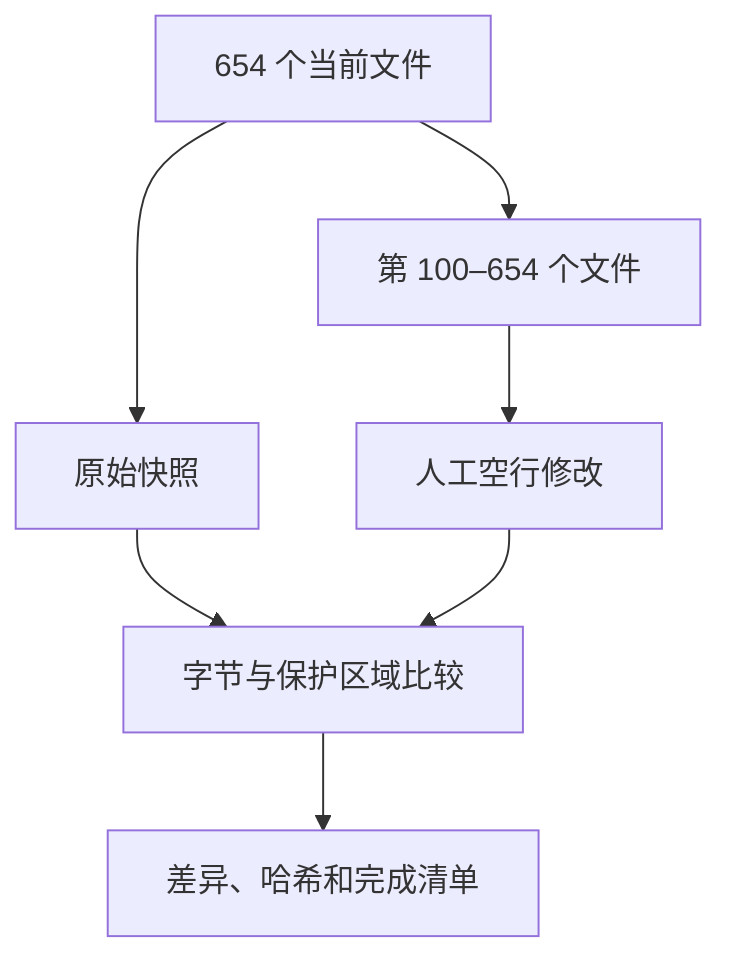

# Java 剩余全部预处理

## Intent：最终目标

按文件名顺序完成第 100–654 个 Java 文件，共 555 个；只按相邻完整语句的表现形式调整空行。

## Data：可用证据

以 rules.md 和用户已确认的修订为依据。开始前保存全部 654 个当前文件快照与文件顺序。前 99 个属于已处理范围，保持用户当前版本。

## Edges：边界与限制

逐文件人工判断；子代理辅助分段分析并交付空行补丁，主代理汇总应用。不得以模型或格式化脚本代替判断。不修改非空行、缩进、行尾、注释及字面量内部；不训练、不改产品代码、不新增测试、不使用浏览器。

## Answer：交付与成功标准

交付剩余 555 个已审阅文件、逐段记录、完整差异与交付 SHA-256。逐文件核查非空行字节一致、注释及字面量原文一致、前 99 个文件完整字节不变。已处理和待处理状态按分段记录，完成后统一报告。

## 执行记录

第 100–654 个文件全部完成：555 个文件、147,005 行原始内容均已完整阅读。386 个文件调整空行，169 个文件审阅后保持原样，无未处理文件。加上此前完成的99个，Java数据集654个文件已全部完成本轮预处理。

共新增8,071个空行、删除417个空行。数字仅用于记录修改量，不作为留白质量目标。

主审完整阅读第520–654个文件，分为四份主审明细；子代理完整阅读第100–519个文件，按每20个文件生成21份补丁和逐文件说明，由主代理应用。所有源码空行位置由逐文件人工阅读决定，自动化只用于差异、内容核查和记录生成。

全量核查通过：

- 全部654个文件的非空行字节序列及原有非空行行尾不变。
- 前99个文件与本批开始时快照完整字节一致，既有用户校正未覆盖。
- 剩余555个文件中13,450个注释、字符串及字符字面量AST节点原文完全一致。
- 全量差异增删内容仅为空行；差异按对应非空行顺序对齐，避免重复代码造成虚假的非空行增删展示。
- 本批未运行产品模型、未训练、未修改产品代码、未生成测试或使用浏览器。

交付记录：

- [完整逐文件清单](Java剩余全部处理清单.md)
- [核查结果与逐文件哈希](../../artifacts/java-preprocess/剩余全部/核查结果.json)
- [整批空行差异](../../artifacts/java-preprocess/剩余全部/本批修改.diff)
- [交付SHA-256清单](../../artifacts/java-preprocess/剩余全部/交付哈希.sha256)

## 自我审查

独立复核第600–630个文件的差异，检查表达式内部、注释贴附、过分拆组和遗漏边界。发现Types多行枚举常量及缓存包装赋值之间遗漏留白，已补齐，并检查补齐TypeToken相同的多行枚举边界。没有发现空行误入参数、链式续行或注释内部。

非空行及保护区域一致只能说明内容和修改范围得到保护，不能证明所有人工外形判断都完全符合用户审美；交付后仍应接受用户校准。
