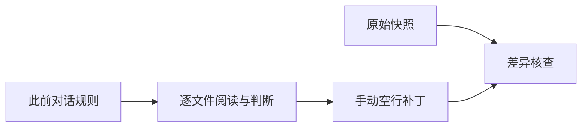
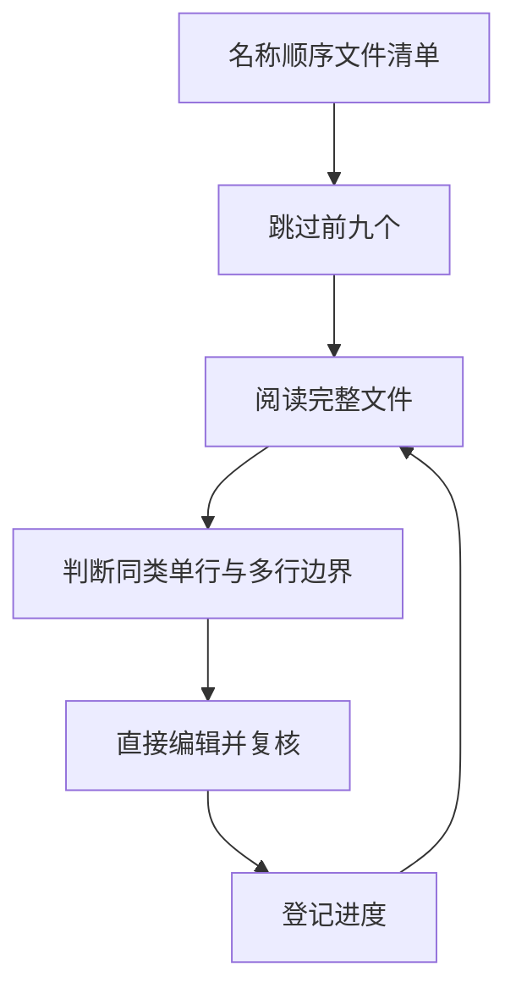

# Java 数据集逐文件预处理

## Intent：最终目标

逐个阅读并直接编辑 dataset/java 后续文件的空行，落实用户此前对话中的规则。禁止调用产品模型或批量格式化脚本代替逐文件判断。用户进一步限定本批只完成后续 10 个文件，随后暂停供其审核。

## Data：可用证据

- 用户已处理按名称排序的前 9 个文件，截止 AbstractFuture--fc6a23aebc8b6e.java。
- 后续 645 个文件从 AbstractFutureState--53907a7b72654c6d.java 开始。
- 用户此前明确：不同类型的表达方式之间需要空行；同类表达式连写仅适用于单行；大段多行表达式前后需要空行。
- 声明到 if、声明到函数调用、其他语句到 return 是用户明确指出的例子。

## Edges：边界与限制

仅编辑空行。保留所有非空行、注释、字面量、缩进和代码顺序；表达式内部不拆段。前 9 个文件原样保留。不训练，不修改产品代码，不生成测试用例，不打开浏览器。

原始文件快照位于 artifacts/java-preprocess/原始快照，用于只读差异核查。核查可以自动化，留白决策由逐文件阅读完成。

## Answer：交付与成功标准

交付直接修改的 Java 文件以及逐文件进度。核查前 9 个文件字节不变、后续文件非空行字节序列不变。未处理文件不得计入完成数。

## 执行进度

- 本批已完成：10 / 10；后续总进度：10 / 645。
- 状态：已暂停，等待用户审核；未继续第 20 个文件。

| 文件 | 处理重点 |
| --- | --- |
| AbstractFutureState--53907a7b72654c6d.java | 声明、赋值、控制流程、返回之间的边界；多行字段声明和赋值外侧留白 |
| AbstractGraph--617e921bb9709ec9.java | 连续多行 if 分段，if 后声明分段 |
| AbstractGraphBuilder--da6406c14af1e12a.java | 单行字段声明连写 |
| AbstractHashFunction--d43345a39de4e9b7.java | 声明或调用到 return 分段 |
| AbstractHasher--db8fae2a1e8612ba.java | 调用到循环、循环或调用到 return 分段；单行调用保留连写 |
| AbstractIdleService--86f1c8ce52e8548a.java | 调用到 return 分段；去掉类块开头空行 |
| AbstractIndexedListIterator--fc713f38f90f653e.java | 调用到赋值、if 到 return 分段 |
| AbstractInvocationHandler--6f1c2099353533e4.java | 连续多行 if、声明到 if、if 到 return 分段 |
| AbstractIterator--647deee1ed877838.java | 赋值、声明、switch、return 分段；多行 case 组分段 |
| AbstractIterator--da0689a6b2d8703b.java | 同上；peek 返回前留白，保留 Javadoc 中的代码示例 |

## 执行核查

- 与原始快照逐文件比较，654 个文件中只有本批 10 个文件发生变化。
- 用户已处理的前 9 个文件和剩余 635 个文件字节不变。
- 所有文件的非空行字节序列（包括缩进和行尾）一致。
- 全部留白补丁由逐文件阅读后直接编辑产生。Python 仅用于只读比较与生成核查报告、差异文件。
- 未执行产品模型、自动格式化、训练、浏览器确认或测试用例。
- 核查报告：artifacts/java-preprocess/核查结果.json。
- 审核差异：artifacts/java-preprocess/本批修改.diff。

## 自我审查

语法类别不能完全替代语义判断。本次按用户要求逐文件处理，不把自动格式化结果当作人工校正结果，也不把非空行一致性当成审美完全正确的证明。
