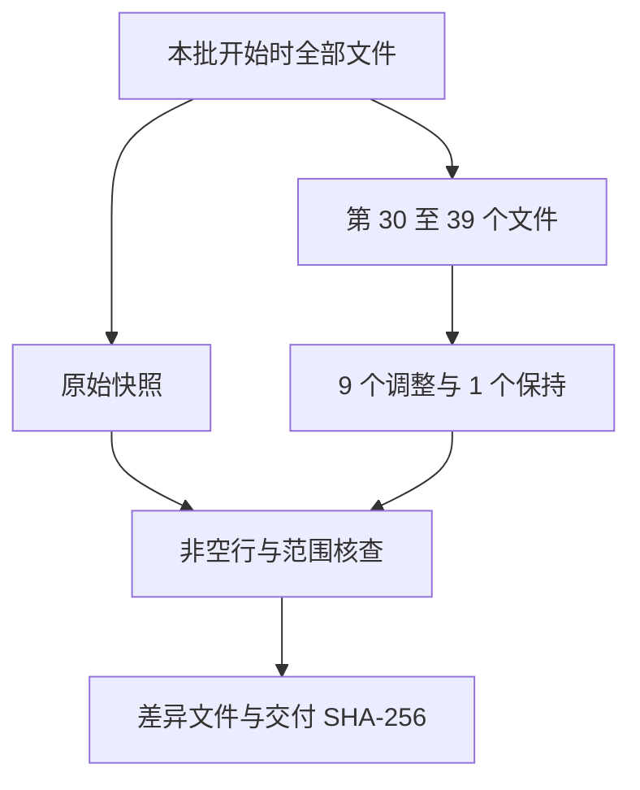

# Java 第三批逐文件预处理

## Intent：最终目标

按文件名顺序处理 dataset/java 第 30 至 39 个文件，完成 10 个后暂停审核。依据 rules.md 最新定义：连续挨着的完整语句长得像不像，长得不像就加空行；长得像的单行语句连写，大段多行表达式前后留白。

## Data：可用证据

本批开始前已读取 rules.md，并保存全部 654 个 Java 文件的当前快照，包含用户对前两批的最新校正。逐个阅读 10 个文件后直接使用空行补丁修改，没有使用产品模型或批量格式化。

## Edges：边界与限制

只修改空行，保留非空行字节、缩进、代码顺序、注释与字面量。语义帮助理解代码，不替代相邻语句外形判断。不训练、不修改产品代码、不生成测试用例、不打开浏览器。只读核查和差异记录可以自动生成。

## Answer：交付与成功标准

| 文件 | 结果与重点 |
| --- | --- |
| AbstractNonStreamingHashFunction--abec653df843e040.java | 无限定调用与带接收者调用分段；声明、循环、返回分段 |
| AbstractOsBasedExecutionCondition--ba59fea713f455cd.java | 声明到返回分段；移除类块边缘空行 |
| AbstractRangeSet--7e8d0de5a373cf1c.java | 声明、返回及控制块外侧留白 |
| AbstractRepeatableAnnotationCondition--6dfd38b4951a8ba6.java | 声明、if、返回分段；lambda 块内独立语句分段，链式表达式续行保留 |
| AbstractScheduledService--de7a2bb3bb74df25.java | 调用与 try 分段；赋值、调用、返回的形式变化；多行调用外侧留白 |
| AbstractSequentialIterator--abab5617a57fd8d6.java | if、声明、赋值、返回分段 |
| AbstractService--e650e4528b4e4c20.java | 多行字段初始化外侧留白；赋值到调用、调用到 break、case 组和 try 边界分段 |
| AbstractSetMultimap--bb874020380f7214.java | 已完整阅读，现有单语句委托方法无需调整 |
| AbstractSortedKeySortedSetMultimap--a53a6d912c11f41b.java | 移除类块起始空行，委托方法保持原样 |
| AbstractSortedMultiset--65af4330925b177f.java | 声明、赋值、调用、返回和控制块边界分段 |

### 核查结果

- 10 个文件全部阅读，9 个修改，1 个保持原样。
- 所有 654 个文件的非空行字节序列一致，包括缩进与行尾。
- 本批之外的 644 个文件字节不变，用户已有校正得到保留。
- 快照：artifacts/java-preprocess/第三批/原始快照。
- 差异：artifacts/java-preprocess/第三批/本批修改.diff。
- 核查及每个文件修改前、交付时的 SHA-256：artifacts/java-preprocess/第三批/核查结果.json。
- 本批完成 10 / 10，后续累计 30 / 645。已暂停，未处理第 40 个文件。

### 自我审查

复核时关注了无限定调用与接收者调用、纯声明与带初始化声明、多行表达式外侧和控制块边界。对相近的单行校验调用、this 字段赋值及普通调用保持连写，没有仅因其职责不同拆段。保留文档中的代码示例和链式调用续行；lambda 块内的独立语句仍按其所在层级判断。

核查证明本次改动范围与内容保真，不代表每处视觉相似性的判断都已获用户认可，具体布局仍待审核。
