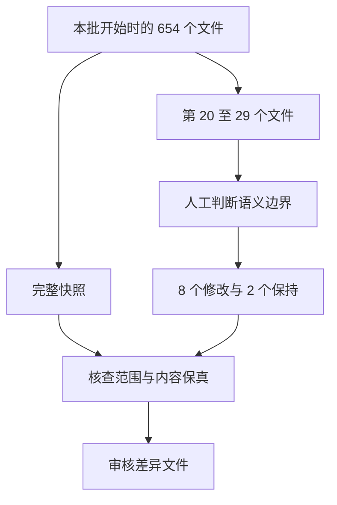

# Java 第二批逐文件预处理

## Intent：最终目标

按根目录 rules.md，继续处理文件名顺序中的第 20 至 29 个 Java 文件。逐个阅读、直接编辑空行，完成 10 个后停止供用户审核。

## Data：可用证据

依据包括用户此前的表达式留白要求，以及首批审核补充的语义阶段原则：同为单行赋值或调用，也要区分设置状态、执行计算、处理数据与更新位置等不同职责。

本批开始前保存了当时全部 654 个 Java 文件的快照，包含用户对首批文件的最新校正，位置为 artifacts/java-preprocess/第二批/原始快照。

## Edges：边界与限制

仅处理本批 10 个文件的空行。不修改非空行、缩进、注释、字面量或代码顺序。不使用模型或批量格式化脚本。Python 仅用于保存快照、只读差异核查和生成审核材料。不生成测试用例、不调用浏览器、不训练模型。

## Answer：执行结果与成功标准

10 个文件均已阅读并处理，其中 8 个需要修改，2 个原有布局符合本轮要求，保持原样。

| 文件 | 处理结果 |
| --- | --- |
| AbstractJreCondition--1e43613382004805.java | 分隔连续多行校验调用，移除类块边缘空行 |
| AbstractJreRangeCondition--ae5f425a79c10b1c.java | 分隔多行校验与连续 if，移除类块边缘空行 |
| AbstractListMultimap--c15fe5da97711e0a.java | 已阅读，单语句委托方法保持原样 |
| AbstractListeningExecutorService--3931b49403b41812.java | 已阅读，单语句委托方法保持原样 |
| AbstractMapBasedMultimap--63f0cfbbdc766a75.java | 区分校验、查询、集合变更、计数更新、迭代器状态和返回；覆盖各集合包装器与映射视图 |
| AbstractMapBasedMultiset--d60b929a049dcadf.java | 区分计数读取、校验、修改、迭代器状态和返回 |
| AbstractMapEntry--c832256a0426454b.java | 声明和返回分段，移除类块起始空行 |
| AbstractMultimap--f1c0d2f6e677b51e.java | 校验、声明、集合修改、循环和返回分段 |
| AbstractMultiset--e606c89eda5c8cfc.java | add 调用与返回分段 |
| AbstractNetwork--7fcb42ad2637f6bb.java | 多行声明、校验、查询、控制流程与返回分段 |

### 核查结果

- 全部 654 个文件的非空行字节序列保持一致，包括缩进与行尾。
- 本批之外的 644 个文件与本批开始时字节一致，用户此前修订得到保留。
- 本批修改差异：artifacts/java-preprocess/第二批/本批修改.diff。
- 未运行产品模型、自动格式化或训练。
- 已完成本批 10 / 10，后续累计 20 / 645；现已暂停，未继续第 30 个文件。

### 自我审查

本批特别复核了“读取原状态 → 执行集合修改 → 更新计数 → 清理映射 → 返回”的阶段边界，避免只按赋值或调用的外形连写；相关的单行字段声明和成组查询仍保留连写。两个无需修改的文件按已阅读记录，不为制造修改而插入空行。

字节核查证明本轮只调整空行，不能代替用户对具体分段节奏的审核。数据仍处于校正阶段，不据此宣称模型效果改善。
