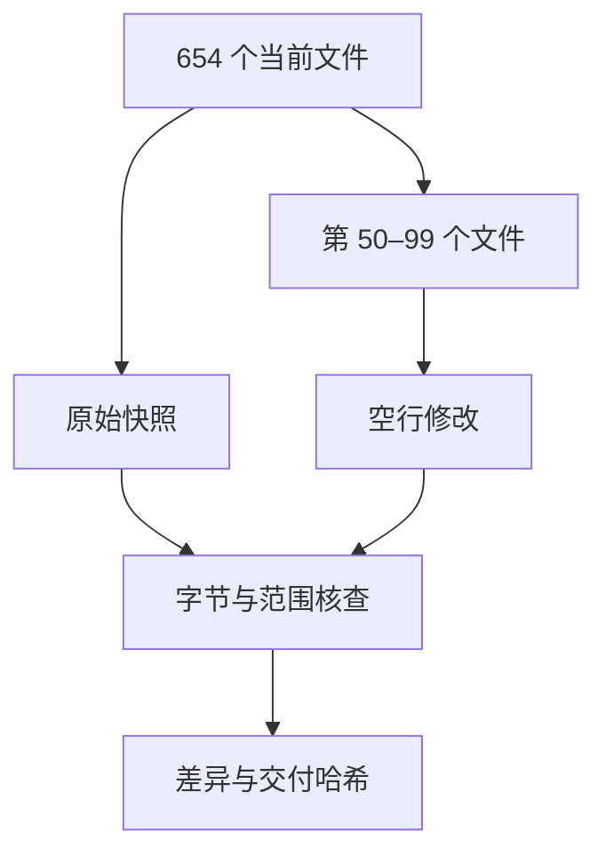

# Java 第五批逐文件预处理

## Intent：最终目标

按文件名顺序预处理 dataset/java 第 50–99 个文件，共 50 个，完成后停止供用户审核。

## Data：可用证据

依据 rules.md 与用户前三批校正，以相邻完整语句的整体表现形式判断留白。开始前保存全部 654 个 Java 文件快照；子代理辅助分段阅读和提出补丁，主代理汇总落地。

## Edges：边界与限制

仅改空行；保留非空行字节、注释与字面量内部、缩进及顺序。不使用产品模型或自动格式化，不训练，不生成测试，不调用浏览器。脚本限于阅读、快照和核查记录。

## Answer：交付格式与成功标准

交付 50 个已审阅文件、修改差异和前后 SHA-256。核查批次外文件不变、全部非空行保持一致，并记录逐文件处理结果。

## 执行细节

第 50–66 与第 67–83 个文件的逐文件说明分别记录在本批 artifacts 下的《审阅50-66.md》《审阅67-83.md》。第 95–99 个文件见《审阅95-99.md》。以下记录主代理直接处理的第 84–94 个文件。

| 序号 | 文件 | 判断 |
| --- | --- | --- |
| 84 | BloomFilter | 多行校验外侧、调用与赋值、声明与返回、反序列化的控制块边界留白；相近的字段赋值和简单调用保留连续。 |
| 85 | BloomFilterStrategies | 简单长度声明与复杂链式哈希初始化分段；CAS 循环、声明与赋值、调用与 return 分段。 |
| 86 | BooleanExecutionCondition | 去类和构造器块边缘空行；字段修饰与类型形式分组；声明到 return 留白。 |
| 87 | Booleans | 数组声明与标量声明、声明与循环、调用与赋值、控制块与 return 分段；相近单行数值声明和调用保持连续。 |
| 88 | BoundType | 保持原样，枚举值和单语句方法布局完整。 |
| 89 | ByFunctionOrdering | 相邻 if 块及声明到 return 留白，构造器的两个同形调用赋值连写。 |
| 90 | ByteArrayDataInput | 保持原样，带注解的方法声明各为完整单元。 |
| 91 | ByteArrayDataOutput | 保持原样，保留方法注解与文档的贴附关系。 |
| 92 | ByteProcessor | 保持原样，两个接口方法及对应注释布局完整。 |
| 93 | ByteSink | 去类块首空行，补声明到 return 边界。 |
| 94 | ByteSource | 声明、try、循环、调用及 return 的边界留白；数组字段与标量字段分段；去嵌套类块首空行。 |

## 自我审查

判断基于完整书写形态，没有按查询、修改、计算等语义职责强行拆组。数组、嵌套泛型、链式初始化与基本类型简单声明需要结合相邻代码比较；没有将类型名不同机械等同于必须分段。保留参数续行、链式表达式及注释内部，lambda 语句块按块内完整语句判断。非空行字节一致只能证明内容没有改变，具体留白仍需用户审核。

## 最终核查结果

- 第 50–99 个文件共 50 个已完成：37 个调整空行，13 个审阅后保持原样。
- 首文件：AggregateFuture--ada4eb1cf02d86db.java；末文件：CacheBuilderSpec--f2ea57371e3c88c1.java。
- 全部 654 个 Java 文件的非空行字节序列与行尾保持一致；本批之外 604 个文件逐字节不变，前批用户校正保留。
- ast-grep 只读提取并比较本批 1882 个注释、字符串和字符字面量节点，原文全部一致，包括其中的空行。
- 复核补充了 BloomFilterStrategies 两个完整匿名类枚举常量之间的空行；没有发现重复连续空行或有依据的过度语义分段。
- git diff --check 通过。本次未编译或执行代码，核查用于确认数据改动范围，不代表编译或运行正确性结论。
- 原始快照：artifacts/java-preprocess/第五批/原始快照。
- 本批修改差异：artifacts/java-preprocess/第五批/本批修改.diff。
- 50 个文件的处理状态、修改前与交付 SHA-256：artifacts/java-preprocess/第五批/核查结果.json。
- 已停止，未处理第 100 个文件；模型与训练继续暂停。
