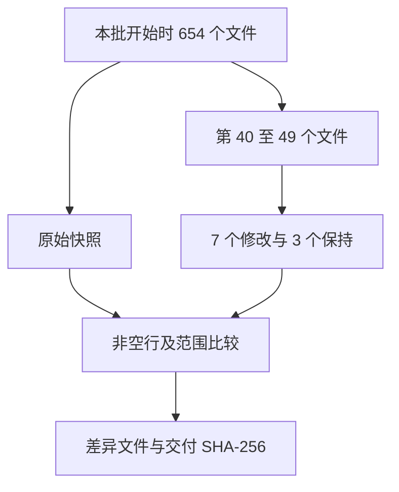

# Java 第四批逐文件预处理

## Intent：最终目标

按文件名顺序处理 dataset/java 第 40 至 49 个文件，完成 10 个后停下审核。核心依据为 rules.md：连续相邻的完整语句长得像就连写，长得不像就加空行；大段多行表达式前后留白。

## Data：可用证据

依据用户前三批手动校正，比较完整书写形式，包括声明左右两侧、简单调用与链式调用、限定调用与直接调用。简单成员调用不因接收者身份不同就分段，简单 null 初始化不机械拆开。

开始时保存全部 654 个 Java 文件的当前快照，包含用户此前修改。10 个文件均已逐个完整阅读，空行通过直接补丁编辑。

## Edges：边界与限制

仅调整空行，保留非空行字节、注释、字面量、缩进与代码顺序。未调用模型或自动格式化，未训练、生成测试用例或打开浏览器。Python 仅用于快照、只读核查、差异和哈希记录。

## Answer：交付与核查

| 文件 | 处理结果 |
| --- | --- |
| AbstractSortedSetMultimap--32c3724b0cfa3ef5.java | 完整阅读，现有布局保持原样 |
| AbstractStreamingHasher--449b35029b6011bc.java | 链式初始化与直接字段赋值、调用与控制块、限定与无限定调用、返回边界分段 |
| AbstractTable--b13f3ad4d0043bcb.java | 强制转换声明与调用初始化声明、声明与返回、控制块外侧分段；去掉类块起始空行 |
| AbstractUndirectedNetworkConnections--1b6f69aa81297b67.java | 调用、声明、if 与返回的外形边界分段 |
| AbstractValueGraph--a57baaee3a4520aa.java | 连续多行 if 及后续声明分段 |
| AfterAll--8d74affb8b3a142a.java | 完整阅读，空注解声明保持原样 |
| AfterClassTemplateInvocationCallback--55dcfd28119559a8.java | 移除接口块首尾空行 |
| AfterEach--380a5fe0cde3abd6.java | 完整阅读，空注解声明保持原样 |
| AfterEachCallback--83ef80f307ea241d.java | 移除接口块首尾空行 |
| AfterTestExecutionCallback--9e7b0342c4cade1e.java | 移除接口块首尾空行 |

- 已阅读并处理 10 / 10，7 个文件修改，3 个保持原样。
- 所有 654 个文件的非空行字节序列保持一致，包括缩进与行尾。
- 本批之外的 644 个文件字节不变，用户前几批修改未被覆盖。
- 快照：artifacts/java-preprocess/第四批/原始快照。
- 审核差异：artifacts/java-preprocess/第四批/本批修改.diff。
- 修改前及交付 SHA-256：artifacts/java-preprocess/第四批/核查结果.json。
- 后续累计完成 40 / 645，已停下，未处理第 50 个文件。

## 自我审查

保持相近的单行 Java8Compatibility 成员调用、checkNotNull 调用及直接字段赋值连写；没有单纯依据动作职责拆段。类型声明、初始化和调用外形仍需结合完整相邻语句判断，不能将本批实例变成文件名或函数名规则。文档和注解内容未变，字节核查只证明改动范围，具体视觉分组仍供用户审核。
