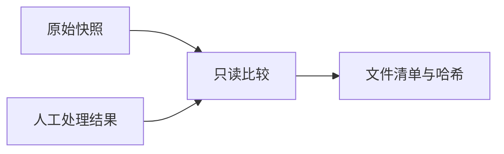
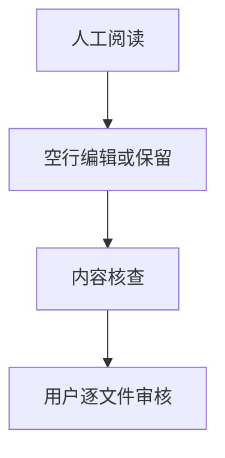

# Rust 逐文件处理清单

## Intent：最终目标

记录本次完整审阅的 304 个 Rust 文件，区分实际修改与保持原样。

## Data：可用证据

本表由本批原始快照与交付文件的字节比较生成；留白决策来自逐文件人工阅读。详细哈希与受保护内容计数见 `artifacts/rust-preprocess/核查结果.json`。

## Edges：边界与限制

“保持原样”表示已阅读后未修改，不表示跳过。计数只描述空行增删，不代表审美质量分数。

## Answer：交付与成功标准

全部 304 文件已处理，其中 245 修改、59 保持。非空行及行尾字节、受保护语法节点文本均一致。

| 顺序 | 文件 | 结果 | 新增空行 | 删除空行 |
|---:|---|---|---:|---:|
| 1 | `abort--7a93be866e29620b.rs` | 修改 | 3 | 0 |
| 2 | `addr--7bdb3d63ead094c1.rs` | 修改 | 6 | 0 |
| 3 | `addr_of--f73326337b556d19.rs` | 修改 | 2 | 0 |
| 4 | `as_ref--e2e2fb41be7d611f.rs` | 保持 | 0 | 0 |
| 5 | `async_buf_read--4b30e2d5ac842788.rs` | 保持 | 0 | 0 |
| 6 | `async_fd--4d3e4d8de9f5e40c.rs` | 修改 | 2 | 0 |
| 7 | `async_read--a78301e4e12c2ec2.rs` | 修改 | 7 | 0 |
| 8 | `async_read_ext--1ff2a108f285c47d.rs` | 修改 | 3 | 0 |
| 9 | `async_seek--4164b257be3ed03e.rs` | 修改 | 1 | 0 |
| 10 | `async_seek_ext--cdca35bbaf52b149.rs` | 保持 | 0 | 0 |
| 11 | `async_write--c1714866e91683c1.rs` | 修改 | 2 | 0 |
| 12 | `async_write_ext--d05df9ff26863048.rs` | 修改 | 3 | 0 |
| 13 | `atomic_cell--9c128a2558ce5af.rs` | 修改 | 1 | 0 |
| 14 | `atomic_u16--dd13eff96bd32b58.rs` | 修改 | 2 | 0 |
| 15 | `atomic_u32--a93d4757dff28882.rs` | 修改 | 2 | 0 |
| 16 | `atomic_u64_as_mutex--c0f2a674897778f8.rs` | 修改 | 7 | 0 |
| 17 | `atomic_u64_static_const_new--291f0f5770bf2769.rs` | 保持 | 0 | 0 |
| 18 | `atomic_u64_static_once_cell--4a834594d2c1ef41.rs` | 修改 | 4 | 0 |
| 19 | `atomic_usize--7894a297f9bf8d12.rs` | 修改 | 2 | 0 |
| 20 | `barrier--9e4ce4d317836cd1.rs` | 修改 | 11 | 0 |
| 21 | `barrier--bf7cf437b8d8e271.rs` | 修改 | 15 | 0 |
| 22 | `bash--11e0ebf80e90fa5b.rs` | 修改 | 12 | 0 |
| 23 | `batch--e157ef28e793a5c1.rs` | 修改 | 21 | 0 |
| 24 | `batch_semaphore--dad280dbe672d71f.rs` | 修改 | 50 | 0 |
| 25 | `block--bcc9264bebff36d5.rs` | 修改 | 9 | 0 |
| 26 | `block_in_place--df862d2b88299ed2.rs` | 保持 | 0 | 0 |
| 27 | `blocking--2d2a801949e502d8.rs` | 修改 | 32 | 0 |
| 28 | `blocking--770814e3433bf676.rs` | 修改 | 3 | 0 |
| 29 | `blocking_check--3509f0b571d6fda5.rs` | 保持 | 0 | 0 |
| 30 | `broadcast--8feca419e017b235.rs` | 修改 | 40 | 1 |
| 31 | `buf_reader--dc4c675768349645.rs` | 修改 | 22 | 0 |
| 32 | `buf_stream--918ffac8c9227f84.rs` | 保持 | 0 | 0 |
| 33 | `buf_writer--fe8ca7a4c34e9d5.rs` | 修改 | 34 | 0 |
| 34 | `builder--8fd112eb2d57f5eb.rs` | 修改 | 9 | 0 |
| 35 | `builder--965e4a0e80d6068e.rs` | 修改 | 52 | 0 |
| 36 | `cacheline--368eee0dd9bd3e6d.rs` | 保持 | 0 | 0 |
| 37 | `cancellation_queue--6183bc5d7361df0c.rs` | 修改 | 1 | 0 |
| 38 | `canonicalize--24f75e4c0748fa96.rs` | 修改 | 1 | 0 |
| 39 | `cfg--691c297346b10294.rs` | 保持 | 0 | 0 |
| 40 | `chain--e8fdb6d094765ca3.rs` | 修改 | 6 | 0 |
| 41 | `config--450d9fbd8851f6c5.rs` | 保持 | 0 | 0 |
| 42 | `config--a95be60ebec220b3.rs` | 修改 | 20 | 0 |
| 43 | `consume_budget--7a86674936fe918a.rs` | 修改 | 3 | 0 |
| 44 | `context--248d064b47a12c34.rs` | 修改 | 1 | 0 |
| 45 | `context--cb53541dee450cde.rs` | 修改 | 11 | 0 |
| 46 | `copy--6ba957daa0924de5.rs` | 修改 | 1 | 0 |
| 47 | `copy_bidirectional--8b34d6d57cdbdf61.rs` | 修改 | 3 | 0 |
| 48 | `core--e4c6576ca7d8292b.rs` | 修改 | 117 | 0 |
| 49 | `core--f4d11c9d363ce518.rs` | 修改 | 22 | 0 |
| 50 | `counters--fc82ca0c852f5bcf.rs` | 保持 | 0 | 0 |
| 51 | `create_dir--3d6ac5956fa97ee6.rs` | 修改 | 1 | 0 |
| 52 | `create_dir_all--2903abd0e99962ae.rs` | 修改 | 1 | 0 |
| 53 | `ctrl_c--179fbf674310539c.rs` | 修改 | 1 | 0 |
| 54 | `current--6743016d6160abc8.rs` | 修改 | 2 | 0 |
| 55 | `defer--2718b20904f17915.rs` | 修改 | 1 | 0 |
| 56 | `defs--56014bebb7528f89.rs` | 修改 | 1403 | 0 |
| 57 | `dir_builder--27d73c258f4d6c65.rs` | 修改 | 3 | 0 |
| 58 | `disabled--ee69fff69b26a0b2.rs` | 保持 | 0 | 0 |
| 59 | `driver--54cb5e0fa70a2546.rs` | 修改 | 14 | 0 |
| 60 | `dump--97e324db1c76e01.rs` | 修改 | 4 | 0 |
| 61 | `empty--f9a5a3219b4e4c9b.rs` | 修改 | 8 | 0 |
| 62 | `entry--36f9b6e7b4d89405.rs` | 修改 | 17 | 0 |
| 63 | `entry--c0eaf93010ba5df1.rs` | 修改 | 7 | 1 |
| 64 | `error--413d5640bbd2ffff.rs` | 修改 | 1 | 0 |
| 65 | `error--c8d5efa7fa0fe6fc.rs` | 修改 | 1 | 0 |
| 66 | `error--f91c2a39a45f54b4.rs` | 保持 | 0 | 0 |
| 67 | `fill_buf--c55f4a6618b087cf.rs` | 修改 | 3 | 0 |
| 68 | `fish--5c81936d3d248a8f.rs` | 修改 | 6 | 0 |
| 69 | `flush--ee98eef8d2f259b2.rs` | 修改 | 1 | 0 |
| 70 | `glue--75803e7c965f51b9.rs` | 修改 | 139 | 0 |
| 71 | `h2_histogram--afe743d7fb36577d.rs` | 修改 | 41 | 0 |
| 72 | `handle--23dcf8066666f822.rs` | 修改 | 3 | 0 |
| 73 | `handle--7a63027e9ee7c135.rs` | 修改 | 10 | 0 |
| 74 | `harness--f8641c4f58445785.rs` | 修改 | 15 | 1 |
| 75 | `haystack--88553cda8c0238a7.rs` | 修改 | 10 | 0 |
| 76 | `help--420713491a4cf81d.rs` | 修改 | 53 | 0 |
| 77 | `hiargs--645e628222133e63.rs` | 修改 | 152 | 1 |
| 78 | `histogram--4286c16a9f0ed9db.rs` | 修改 | 50 | 1 |
| 79 | `id--3588d4b3163caba8.rs` | 保持 | 0 | 0 |
| 80 | `idle--3a62d42546cea45e.rs` | 修改 | 12 | 1 |
| 81 | `idle_notified_set--dfd4e3770510b69.rs` | 修改 | 19 | 2 |
| 82 | `instant--ef69132918230281.rs` | 保持 | 0 | 0 |
| 83 | `interval--cd29c4f81fe5b2fb.rs` | 修改 | 6 | 1 |
| 84 | `io--fef3f96dd052cb05.rs` | 保持 | 0 | 0 |
| 85 | `join--5d60a4543c794e79.rs` | 保持 | 0 | 0 |
| 86 | `join--c8e1cda3efd5db20.rs` | 修改 | 4 | 0 |
| 87 | `join--f6ee7c0001a4e8b9.rs` | 修改 | 4 | 0 |
| 88 | `kill--24551a996d35de46.rs` | 保持 | 0 | 0 |
| 89 | `level--90d88d6b1edbbab.rs` | 修改 | 7 | 0 |
| 90 | `level--cf69946e268f1977.rs` | 修改 | 7 | 0 |
| 91 | `lib--3dd62abc91e40b57.rs` | 保持 | 0 | 0 |
| 92 | `lib--462b3d16395e817.rs` | 修改 | 3 | 0 |
| 93 | `line_buffer--29d2862e6ff1e871.rs` | 修改 | 97 | 11 |
| 94 | `lines--6045cf3329d82c0b.rs` | 修改 | 34 | 20 |
| 95 | `lines--94f724b2e920f409.rs` | 修改 | 1 | 0 |
| 96 | `linked_list--9591da18fe5cff93.rs` | 修改 | 33 | 16 |
| 97 | `list--92d0eb8e70f06bd1.rs` | 修改 | 19 | 0 |
| 98 | `listener--b1f6e7a5631e280.rs` | 修改 | 6 | 0 |
| 99 | `local--d97e880b115aa66b.rs` | 修改 | 29 | 1 |
| 100 | `logger--ba06baf682ce5ce5.rs` | 保持 | 0 | 0 |
| 101 | `loom--a70748f8ff24835f.rs` | 保持 | 0 | 0 |
| 102 | `lowargs--1b6120f0a6a4bd00.rs` | 修改 | 12 | 0 |
| 103 | `main--ee0f4ccbf3c90766.rs` | 修改 | 66 | 0 |
| 104 | `man--75f722c14c4358ca.rs` | 修改 | 28 | 1 |
| 105 | `maybe_done--db23049f6dabb1ed.rs` | 修改 | 6 | 0 |
| 106 | `mem--8cb6ca39fe186bab.rs` | 修改 | 22 | 0 |
| 107 | `memchr--62a08b240460cd4d.rs` | 修改 | 4 | 0 |
| 108 | `messages--e9b2bdd98e62159d.rs` | 保持 | 0 | 0 |
| 109 | `metadata--88b740aefa365eb1.rs` | 修改 | 1 | 0 |
| 110 | `metric_atomics--fa09cfbd0d2d3d32.rs` | 保持 | 0 | 0 |
| 111 | `metrics--6be447c0035b68fc.rs` | 保持 | 0 | 0 |
| 112 | `metrics--74931ca3126e66f8.rs` | 保持 | 0 | 0 |
| 113 | `mmap--47e8a78df55cc15b.rs` | 修改 | 5 | 0 |
| 114 | `mock--147181c9b5e736b7.rs` | 保持 | 0 | 0 |
| 115 | `mock_open_options--25252b227b8b7b6e.rs` | 修改 | 4 | 0 |
| 116 | `mocked--caa7f9255249bc65.rs` | 修改 | 0 | 1 |
| 117 | `mocks--1659fccb3b99ae79.rs` | 修改 | 6 | 0 |
| 118 | `mod--11f50801f4d8894f.rs` | 修改 | 1 | 3 |
| 119 | `mod--15afbc3c66d61dca.rs` | 修改 | 2 | 0 |
| 120 | `mod--180b6d478629a6ba.rs` | 修改 | 6 | 0 |
| 121 | `mod--1bb20118d0482921.rs` | 保持 | 0 | 0 |
| 122 | `mod--1e4c87ae23dddc1e.rs` | 修改 | 7 | 0 |
| 123 | `mod--1e9cf94b59292a9.rs` | 修改 | 3 | 0 |
| 124 | `mod--326da17242357995.rs` | 修改 | 6 | 0 |
| 125 | `mod--3dce6c4f2de439f7.rs` | 保持 | 0 | 0 |
| 126 | `mod--6776368d7d03d10f.rs` | 修改 | 6 | 1 |
| 127 | `mod--68bc4998edc6d04d.rs` | 修改 | 3 | 0 |
| 128 | `mod--8abe2d28b680d242.rs` | 修改 | 2 | 0 |
| 129 | `mod--9f300dfc27b32bed.rs` | 修改 | 5 | 0 |
| 130 | `mod--a7a2207519ab7b1.rs` | 修改 | 2 | 0 |
| 131 | `mod--a91ad272393ab0de.rs` | 修改 | 30 | 2 |
| 132 | `mod--aa809e82ffd121cd.rs` | 修改 | 20 | 1 |
| 133 | `mod--ac48769bda2d6d.rs` | 修改 | 11 | 0 |
| 134 | `mod--cf762df8dd67c701.rs` | 修改 | 2 | 1 |
| 135 | `mod--d003d31e7424288d.rs` | 修改 | 5 | 0 |
| 136 | `mod--d0b9bda96652c376.rs` | 保持 | 0 | 0 |
| 137 | `mod--d3da95d006b9e006.rs` | 修改 | 21 | 0 |
| 138 | `mod--d6d47117a34e94a4.rs` | 保持 | 0 | 0 |
| 139 | `mod--e319cceb288897b4.rs` | 修改 | 23 | 0 |
| 140 | `mod--e45a4d9fea408ae9.rs` | 修改 | 20 | 9 |
| 141 | `mod--e9cc2f6585aecd2e.rs` | 修改 | 10 | 0 |
| 142 | `mod--eb0795ad41f2c696.rs` | 修改 | 2 | 0 |
| 143 | `mod--f2387a574c51c2c8.rs` | 修改 | 43 | 3 |
| 144 | `mod--f3dc81bcbffc6f70.rs` | 修改 | 88 | 1 |
| 145 | `mod--f599195b7d46ad94.rs` | 修改 | 7 | 0 |
| 146 | `mod--fac705fbae9b8726.rs` | 修改 | 3 | 0 |
| 147 | `mod--ff5055b425b8bed.rs` | 保持 | 0 | 0 |
| 148 | `mutex--5f71e8f765898445.rs` | 保持 | 0 | 0 |
| 149 | `mutex--6f8eb3d71d21d725.rs` | 修改 | 45 | 0 |
| 150 | `named_pipe--4e68655c71119bac.rs` | 修改 | 44 | 0 |
| 151 | `notify--523a4b3d5196593d.rs` | 修改 | 53 | 4 |
| 152 | `once_cell--feb47e016586ba12.rs` | 修改 | 9 | 0 |
| 153 | `oneshot--f1b0e648fef22c70.rs` | 修改 | 32 | 0 |
| 154 | `op--5a213cc72599c04f.rs` | 修改 | 13 | 0 |
| 155 | `open--26067b6ab4790b1b.rs` | 修改 | 4 | 0 |
| 156 | `open_options--c27258e1f6b9a16d.rs` | 修改 | 14 | 0 |
| 157 | `options--d8af0eb9adb3c044.rs` | 保持 | 0 | 0 |
| 158 | `os--e3c31a0c41b34e4f.rs` | 保持 | 0 | 0 |
| 159 | `overflow--7d3f8876c1139316.rs` | 保持 | 0 | 0 |
| 160 | `owned_read_guard--5025c296662d18ff.rs` | 修改 | 2 | 0 |
| 161 | `owned_write_guard--22863db4893e3732.rs` | 修改 | 9 | 0 |
| 162 | `park--76bdc33dcd915453.rs` | 修改 | 10 | 0 |
| 163 | `parking_lot--93cc7601cfeaa0d8.rs` | 修改 | 5 | 0 |
| 164 | `parse--a9eb37ed885d8c94.rs` | 修改 | 57 | 0 |
| 165 | `pidfd_reaper--f6ab03c8b979f5b8.rs` | 修改 | 11 | 0 |
| 166 | `pin--377b7c0f8b672577.rs` | 保持 | 0 | 0 |
| 167 | `pipe--8da3e1724120575f.rs` | 修改 | 29 | 0 |
| 168 | `poll_aio--3661e372f6e1ddf0.rs` | 修改 | 7 | 0 |
| 169 | `poll_evented--65e58070ab79608c.rs` | 修改 | 7 | 1 |
| 170 | `pool--3c7981ce1bd5df31.rs` | 修改 | 31 | 0 |
| 171 | `pop--75661b200ea527e2.rs` | 修改 | 1 | 0 |
| 172 | `powershell--919f215e9bbd69ea.rs` | 修改 | 9 | 0 |
| 173 | `process--289e09691e30f158.rs` | 保持 | 0 | 0 |
| 174 | `ptr_expose--2f1094c4d9233fac.rs` | 修改 | 2 | 0 |
| 175 | `queue--d3199e7c230f988f.rs` | 修改 | 12 | 0 |
| 176 | `rand--2d0a8892ddf9a86c.rs` | 修改 | 3 | 0 |
| 177 | `rc_cell--56bf7fa72f170651.rs` | 修改 | 1 | 0 |
| 178 | `read--d285a99c783f1ee.rs` | 修改 | 2 | 0 |
| 179 | `read--f720a0e648a38d7b.rs` | 修改 | 4 | 0 |
| 180 | `read_buf--28a0a48d76f2b344.rs` | 修改 | 2 | 0 |
| 181 | `read_buf--a86c7d6489c89a1f.rs` | 修改 | 13 | 0 |
| 182 | `read_dir--3b9b9957d581c56e.rs` | 修改 | 5 | 0 |
| 183 | `read_exact--78e9af5d90d80a76.rs` | 修改 | 2 | 0 |
| 184 | `read_guard--301c070429a56465.rs` | 修改 | 2 | 0 |
| 185 | `read_int--8c8ea3988271b6b4.rs` | 修改 | 2 | 6 |
| 186 | `read_line--db74e24c4d51f9c9.rs` | 修改 | 10 | 0 |
| 187 | `read_link--2dfce1a468a8c787.rs` | 修改 | 1 | 0 |
| 188 | `read_to_end--28fa2ff2f004b38e.rs` | 修改 | 13 | 0 |
| 189 | `read_to_string--5936dfe46833bf42.rs` | 修改 | 2 | 0 |
| 190 | `read_to_string--cb5a59f8b3eb386e.rs` | 修改 | 1 | 0 |
| 191 | `read_until--46ae2e781016b363.rs` | 修改 | 7 | 0 |
| 192 | `reap--d384f9f431f60c01.rs` | 修改 | 11 | 0 |
| 193 | `registration--8c3b4a2fa08c7163.rs` | 修改 | 4 | 0 |
| 194 | `registration_queue--8eeb83f7d1096036.rs` | 保持 | 0 | 0 |
| 195 | `registration_set--ea3d2eb14c1038b6.rs` | 修改 | 3 | 0 |
| 196 | `registry--12409b77dde7d80.rs` | 修改 | 8 | 0 |
| 197 | `remove_dir--ea7d12118181afa6.rs` | 修改 | 1 | 0 |
| 198 | `remove_dir_all--ca8f09d4deca066e.rs` | 修改 | 1 | 0 |
| 199 | `remove_file--c045c9fe9c864531.rs` | 修改 | 1 | 0 |
| 200 | `rename--6f32cba1ccb75f44.rs` | 修改 | 1 | 0 |
| 201 | `rename--bd7fb850b64fdd0d.rs` | 保持 | 0 | 0 |
| 202 | `repeat--75db3584eabbd0ef.rs` | 修改 | 2 | 0 |
| 203 | `reusable_box--44fd1bd7cff8e9c4.rs` | 修改 | 14 | 0 |
| 204 | `rt--c5a80ab52f67c32b.rs` | 保持 | 0 | 0 |
| 205 | `rt_multi_thread--6826ba603a81a4c4.rs` | 修改 | 4 | 0 |
| 206 | `rt_unstable--e9da4b0e4d98f864.rs` | 修改 | 2 | 0 |
| 207 | `runtime--2e4d5fbc3faccad2.rs` | 修改 | 1 | 1 |
| 208 | `runtime_mt--b005a3524b5cab23.rs` | 修改 | 5 | 0 |
| 209 | `rwlock--181176ea1e86e1ea.rs` | 保持 | 0 | 0 |
| 210 | `schedule--ce91f4af88493b38.rs` | 修改 | 2 | 0 |
| 211 | `schedule_latency--bc231eb568d83cc5.rs` | 修改 | 1 | 0 |
| 212 | `schedule_latency_mock--e7717c885964fd88.rs` | 保持 | 0 | 0 |
| 213 | `scheduled_io--45f904c62cd3073c.rs` | 修改 | 19 | 3 |
| 214 | `scheduler--cc8280ec27fda2de.rs` | 保持 | 0 | 0 |
| 215 | `scoped--d2720d6af6e4ce9b.rs` | 修改 | 1 | 0 |
| 216 | `search--4351e117dd7a5a2d.rs` | 修改 | 40 | 0 |
| 217 | `seek--2bfe9d7d69c943a1.rs` | 修改 | 3 | 0 |
| 218 | `select--e2c9f29aee395610.rs` | 修改 | 4 | 0 |
| 219 | `set_once--df7792496eab1e76.rs` | 修改 | 3 | 0 |
| 220 | `set_permissions--28157230df074439.rs` | 修改 | 1 | 0 |
| 221 | `sharded--58bc9d977a2e90f8.rs` | 修改 | 32 | 0 |
| 222 | `sharded_list--759fec02b8c1992b.rs` | 修改 | 11 | 0 |
| 223 | `shared--1ce0191d95e85070.rs` | 修改 | 2 | 0 |
| 224 | `shutdown--3759e43687219965.rs` | 修改 | 2 | 0 |
| 225 | `shutdown--79528b03a44748a8.rs` | 修改 | 1 | 0 |
| 226 | `signal--34c087ab7e3965df.rs` | 修改 | 3 | 0 |
| 227 | `sink--c2fd4fe3d390ac17.rs` | 修改 | 3 | 0 |
| 228 | `sleep--64715bbaa589f8a7.rs` | 修改 | 18 | 0 |
| 229 | `socket--561e32ed510ff2e0.rs` | 修改 | 17 | 0 |
| 230 | `socket--64fed5b60407b184.rs` | 修改 | 11 | 0 |
| 231 | `socket--da454023d4396ec7.rs` | 修改 | 14 | 0 |
| 232 | `socketaddr--b3c677532f3dcad.rs` | 保持 | 0 | 0 |
| 233 | `source--cf70c8f6f9541592.rs` | 修改 | 2 | 0 |
| 234 | `split--15850d4317e894b6.rs` | 修改 | 1 | 0 |
| 235 | `split--4f48925beeb03319.rs` | 修改 | 1 | 0 |
| 236 | `split--617162d73c1c16c8.rs` | 修改 | 3 | 0 |
| 237 | `split_owned--d4127769f77753e0.rs` | 修改 | 9 | 0 |
| 238 | `state--3167e4dc93357686.rs` | 修改 | 29 | 0 |
| 239 | `stats--16fc973fdf7a02bb.rs` | 修改 | 2 | 0 |
| 240 | `statx--de82a89dd03f9491.rs` | 修改 | 5 | 0 |
| 241 | `stderr--51e4c0db49694d09.rs` | 修改 | 2 | 0 |
| 242 | `stdin--56517c20fbcad0d3.rs` | 修改 | 2 | 0 |
| 243 | `stdio_common--21ef962a0358e000.rs` | 修改 | 14 | 0 |
| 244 | `stream--77dd240fd9d338f0.rs` | 修改 | 13 | 0 |
| 245 | `stream--f9f1d6625960de23.rs` | 修改 | 9 | 0 |
| 246 | `support--eb401773719b026b.rs` | 修改 | 0 | 2 |
| 247 | `symbol--7540d81d532f667b.rs` | 修改 | 5 | 0 |
| 248 | `symlink--5a30f32e3f534c15.rs` | 保持 | 0 | 0 |
| 249 | `symlink_dir--1fc04698138a9171.rs` | 保持 | 0 | 0 |
| 250 | `symlink_file--36ea5eb7f2a9a958.rs` | 保持 | 0 | 0 |
| 251 | `symlink_metadata--85fdf0a898ff2c05.rs` | 修改 | 1 | 0 |
| 252 | `sync_wrapper--ada012dbfe5b20dc.rs` | 保持 | 0 | 0 |
| 253 | `synced--813ebbbe4cd36fb9.rs` | 保持 | 0 | 0 |
| 254 | `sys--a92a535f5d15e37c.rs` | 修改 | 1 | 0 |
| 255 | `take--deaac9ecb98e6553.rs` | 修改 | 9 | 0 |
| 256 | `task--47d2651193eb2b60.rs` | 修改 | 1 | 0 |
| 257 | `task_hooks--1e4b8879fa28debd.rs` | 修改 | 3 | 0 |
| 258 | `task_local--a40663475d01ab3f.rs` | 修改 | 10 | 0 |
| 259 | `taskdump--18715e6c8938cede.rs` | 修改 | 3 | 0 |
| 260 | `taskdump--ccce79f5c4e226c2.rs` | 保持 | 0 | 0 |
| 261 | `taskdump_mock--5e79527a4b0be509.rs` | 保持 | 0 | 0 |
| 262 | `tests--37aa050a2e8f4f4b.rs` | 修改 | 7 | 0 |
| 263 | `tests--4e68dd1706d19f88.rs` | 修改 | 4 | 0 |
| 264 | `tests--606db6c855cf15ca.rs` | 修改 | 8 | 0 |
| 265 | `tests--828137d24067ff4e.rs` | 修改 | 23 | 2 |
| 266 | `tests--b9fcb79ae7567a82.rs` | 修改 | 134 | 0 |
| 267 | `thread_id--cfb29470866a2baf.rs` | 修改 | 1 | 0 |
| 268 | `thread_local--7bbaf2597176151c.rs` | 保持 | 0 | 0 |
| 269 | `time_alt--6a2389b0b4c0195d.rs` | 修改 | 6 | 0 |
| 270 | `timeout--88db45604daed66f.rs` | 保持 | 0 | 0 |
| 271 | `timer--60cfaa5c0648311a.rs` | 修改 | 8 | 0 |
| 272 | `trace--7e70fe935cde185f.rs` | 保持 | 0 | 0 |
| 273 | `trace_impl--f3476c0ae17cdff7.rs` | 修改 | 2 | 0 |
| 274 | `try_exists--1d4917201cfe3304.rs` | 修改 | 2 | 0 |
| 275 | `try_join--8f41e185359f0484.rs` | 保持 | 0 | 0 |
| 276 | `try_join--f626a73cd76619ba.rs` | 保持 | 0 | 0 |
| 277 | `try_lock--a81ef5cdfbfa8b72.rs` | 保持 | 0 | 0 |
| 278 | `typeid--891fc04286a5aa62.rs` | 修改 | 2 | 0 |
| 279 | `ucred--7c8d9fdce38bf962.rs` | 修改 | 4 | 0 |
| 280 | `udp--416cde6a3d8bfc93.rs` | 修改 | 20 | 0 |
| 281 | `unix--8065546a2dfc049b.rs` | 修改 | 7 | 0 |
| 282 | `unsafe_cell--734e103f900c1225.rs` | 保持 | 0 | 0 |
| 283 | `uring--9f01c8c672c1a670.rs` | 修改 | 11 | 0 |
| 284 | `uring_open_options--c1cad006f74a5aff.rs` | 修改 | 8 | 1 |
| 285 | `version--2eefc3a29afb066a.rs` | 修改 | 25 | 0 |
| 286 | `wake--c2a1d120c7daa1d.rs` | 修改 | 3 | 0 |
| 287 | `wake_list--39f9dd315d6fffce.rs` | 修改 | 9 | 0 |
| 288 | `wake_queue--2386e01ea0c609e1.rs` | 保持 | 0 | 0 |
| 289 | `waker--c011a08902d7e7ff.rs` | 修改 | 13 | 0 |
| 290 | `watch--54b51551321e6039.rs` | 修改 | 28 | 1 |
| 291 | `windows--dc0c4162757b16fe.rs` | 修改 | 5 | 0 |
| 292 | `windows--e7b5454b1a99701f.rs` | 修改 | 13 | 0 |
| 293 | `worker--86fde243e00b60b7.rs` | 修改 | 2 | 0 |
| 294 | `write--8d70f0eaaecb44f6.rs` | 修改 | 2 | 0 |
| 295 | `write--9fe9756dd66f4d79.rs` | 修改 | 1 | 0 |
| 296 | `write--e8f0df4d118e677d.rs` | 修改 | 4 | 0 |
| 297 | `write_all--46f9d0cfb4eb78d5.rs` | 修改 | 4 | 0 |
| 298 | `write_all_buf--28c105e66153c5f7.rs` | 修改 | 5 | 0 |
| 299 | `write_buf--339d5793953a1663.rs` | 修改 | 3 | 0 |
| 300 | `write_guard--68468841cc60e898.rs` | 修改 | 9 | 0 |
| 301 | `write_guard_mapped--45c73de13b1dc69c.rs` | 修改 | 2 | 0 |
| 302 | `write_int--360717b975f62d2f.rs` | 修改 | 3 | 0 |
| 303 | `write_vectored--17edac55cd89e994.rs` | 修改 | 1 | 0 |
| 304 | `zsh--a9c651be7951a7aa.rs` | 修改 | 1 | 0 |
