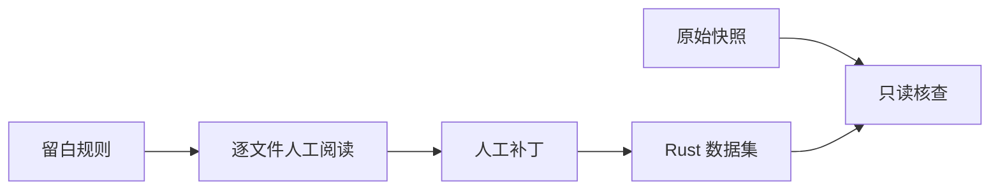
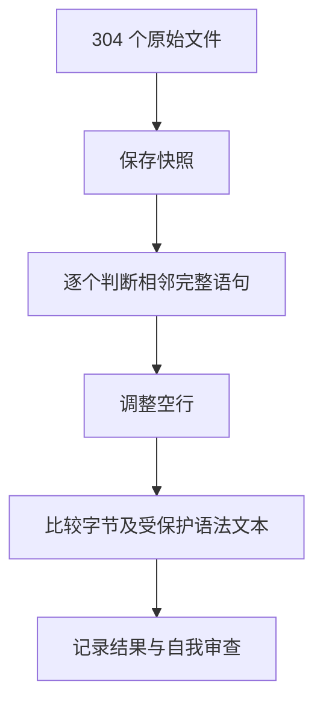

# Rust 逐文件预处理

## Intent：最终目标

按根目录 `rules.md` 逐个阅读并预处理 `dataset/rust` 全部 304 个文件，仅调整完整语句之间的空行。

## Data：可用证据

- 当前文件共 98,763 行，按文件名排序。
- 当前版本快照保存在 `artifacts/rust-preprocess/原始快照`，保留开始本批前的全部修改。
- 判断依据是相邻完整语句的书写形态，不以语义阶段替代视觉判断。

## Edges：边界与限制

不改非空行、注释内部、字符串、表达式续行，不启动训练或产品格式化器，不生成测试用例。分析协作者只读数据集并提交人工补丁，由主审应用；自动化仅用于快照和核查。

## Answer：交付与成功标准

交付直接修改的文件、逐文件处理清单、差异与哈希核查结果。确认非空行与受保护内容一致，并自查是否误拆相似单行语句或表达式内部。

## 执行记录

全部 304 个文件已逐个读完。主审完成第 57–69、229–304 个文件；分析协作者完成第 1–56、70–152、153–228 个文件。协作者只提交人工补丁，均由主审应用。

第 56 个 `defs` 文件共 8,161 行，逐页完整阅读后记录每个人工选定的原始行号，再机械转换为补丁；转换过程不判断边界，也不直接编辑数据集。

## 核查结果

| 项目 | 结果 |
|---|---:|
| 已阅读文件 | 304 |
| 实际修改 | 245 |
| 保持原样 | 59 |
| 原始总行数 | 98,763 |
| 新增空行 | 4,480 |
| 删除空行 | 101 |
| 非空行与行尾字节一致 | 304 / 304 |
| 受保护语法节点文本一致 | 42,297 / 42,297 |

使用 ast-grep 对比行注释、块注释、普通字符串、原始字符串与字符字面量的完整节点文本。此项检查与非空行字节比较互补，避免只比较非空行而漏掉多行字符串或块注释内部的空行变化。它不等于编译、运行验证，也不证明每处审美判断都已符合用户预期。

统一差异按非空行位置对齐，确保增删内容仅为空行；`git apply --check` 确认可应用于原始快照。`git diff --check` 通过。没有生成测试用例、调用浏览器、启动训练或修改产品代码。

## 自我审查

- 对相似的单行 `ready!` 调用、简单声明与方法调用保持连写；不因语义动作不同而逐句分段。
- 将闭包、控制块、多行初始化和调用视作完整结构，留白放在外边界；保留属性与声明的贴附关系。
- 独立差异复核覆盖第 57–69、280–304 个文件；后者补齐两处数组构造声明与计数调用声明之间的空行。
- 复核中回撤了 `oneshot` 两处相似 `enter()` 声明之间的空行，以及 `open_options` 一处互斥 cfg 声明之间的空行，避免仅因属性出现就分段。
- 全文人工判断仍可能遗漏个别边界；字节与节点核查仅证明内容保留。逐文件清单、快照与交付哈希用于支持后续人工校正，不将本次布局视为不可修订的标准。

## 交付文件

- [逐文件处理清单](Rust逐文件处理清单.md)
- [整批空行差异](../../artifacts/rust-preprocess/本批修改.diff)
- [逐文件核查与交付哈希](../../artifacts/rust-preprocess/核查结果.json)
- [交付哈希清单](../../artifacts/rust-preprocess/交付哈希.sha256)

训练继续保持暂停，后续人工修订以数据集当前文件为准。
