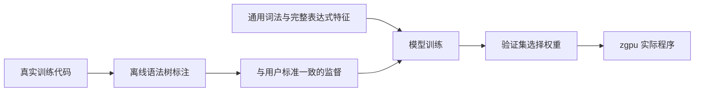
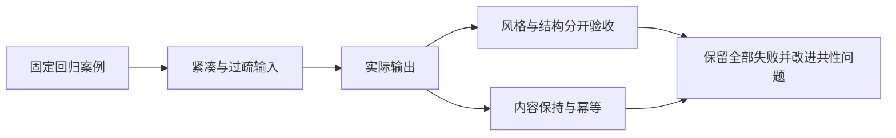

# 全量验收达标计划

## Intent：最终目标

按用户确认的标准调整训练与模型，直到现有验收中的风格和结构要求全部通过。标准优先级：完整多行表达式外侧留白；单行异类留白；单行同类连写。最终再次检查实际 GPU 程序、字节保持和幂等。

## Data：可用证据

当前特征 v4、权重约 41 KiB；两套 v2 回归集的风格结果分别为 118/144、174/192，结构全部通过。历史模型与配置保存在 `artifacts/before-conformance/`。

当前模型读取相邻行形状与粗粒度角色，尚未直接表示完整表达式跨度；原始风格训练标签也不是严格新版规则的标准化标签。将分别检查表示、监督与置信放弃，不仅调整阈值。

## Edges：边界与限制

- 不读取验收源码作为训练样本，不按案例名、变量名、文件扩展名或预期答案做产品特判。
- 验收仅在标注明显不符合用户标准时纠正，记录依据；不删失败项，不缩小分母。
- 两套验收已用于开发反馈，保持回归身份；全部通过不等于任意代码的泛化证明。
- 采集、标注、训练和推理继续使用 Zig；GPU 继续由 zgpu 提供。
- 多行文本内部必须保持原内容；区分文本内部保护和已结束文本之后的合法边界。

## Answer：交付与成功标准

1. 审计所有失败，修复共性表示和监督问题。
2. 在独立训练代码上生成与用户规则一致的监督，保留验证隔离与来源记录。
3. 重训和实测直到两套当前回归集所有风格、结构、非空行保持、幂等检查通过。
4. 保留原始对照、训练来源、最终权重哈希、实际后端和结果，自我审查是否因过拟合或验收口径变化造成虚假通过。

## 执行记录与自我审查

用户随后要求先完成数据文件的移动与合并，再停下来由其手工检查。已按此暂停模型迭代，没有宣称验收全部通过。

- `evaluation/cases/<case>/input/` 保存 dense 与 spaced 输入，共享同一 `output.<ext>` 和 `metadata.json`。
- 两个历史分组已合并为 cases 下直接的 60 个案例目录，未覆盖输出校正。
- 报告与模型预测位于 `evaluation/artifacts/`；不再保留 `evaluation/runs/`。旧产物已迁入 artifacts 下的 history。
- `dataset/train/<language>/<name>.<ext>` 共 2,171 个文件；`dataset/validation/<language>/<name>.<ext>` 共 478 个文件，保留来源和分区元数据。
- 训练源码来自现有筛选与去重结果，迁移不改变样本内容。检测到的三个已修改样本受到保留，准备数据时其布局优先于自动监督。
- validation 不参与梯度训练，供选模、停止轮次与阈值校准使用；数据应符合相同标准并与 train 隔离。
- 当前最新一次已验收的中间模型仍有 8 项未通过。后续特征与训练改进尚待完整验收，用户人工校正前不继续迭代。
