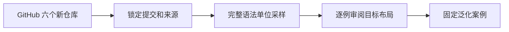
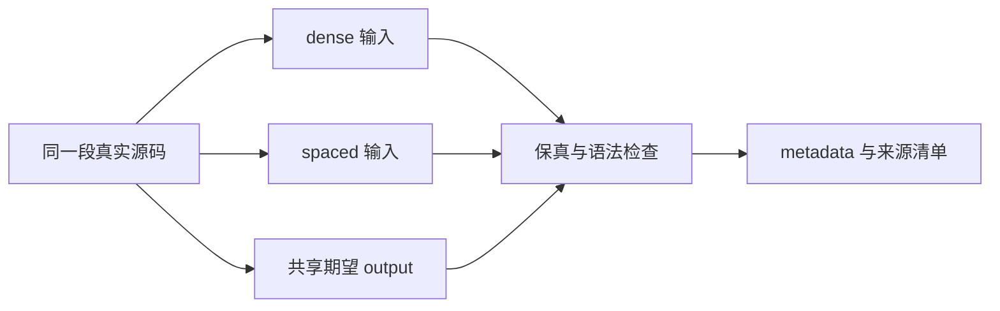

# 新增六语言泛化样本计划

## Intent：目标

在 evaluation/validation 中加入 30 个独立泛化案例，从 GitHub 的 6 个高关注度项目各取 5 个，不恢复模型训练或运行模型预测。最初要求语言不属于旧 archives 清单；用户随后明确将 Elixir/Haskell 改成 Go/OCaml，Go 作为显式例外保留并标记为新仓库验证。

## Data：证据与来源

现有锁定语料语言：TypeScript、JavaScript、Python、Java、Rust、Zig、Go、C++、C#、Ruby、Kotlin、Swift。

最终采用 PHP/Laravel、Lua/Kong、Dart/Flutter、Scala/Spark、Go/Hugo、OCaml/Infer。通过 GitHub ZIP 获取固定提交，再解压到 data/validation；不读取旧 archives 项目作为样本来源。

## Edges：边界

- 每仓库 5 个真实代码片段，保留完整语法单位；不按模型输出或已知失败挑选样本。
- input/dense 与 input/spaced 只改变代码间空行，不能改写词元、缩进或多行文本内容。
- 共享 output 由助手依据已确认标准逐例审阅，不调用产品程序生成，不声称已经人工确认。
- 多行完整表达式外侧留白；单行异类留白；单行同类连续。表达式内部与注释贴附保持完整。
- 记录仓库热度快照、提交、源码路径/行号、许可、提取或包裹方式、文件哈希与审阅状态。
- 不将样本加入训练或开发验收；不运行模型来检查是否能通过这批样本。

## Answer：交付与成功标准

30 个案例目录，每个目录含 input/dense.<ext>、input/spaced.<ext>、output.<ext>、metadata.json。验证来源可追溯、语言排除、词元/非空行保持、样本互不重复以及可用语法检查。补充来源清单与自我审查。

## 执行记录

已完成 30 个案例，90 个输入/目标文件。6 个仓库均已下载 ZIP 并解压，ZIP SHA256 记录在 data/validation/repositories.json 与 zip-checksums.sha256，来源清单同步至 evaluation/validation/sources.json。

Elixir/Haskell 的源码、ZIP、案例和原始选择记录已移出活动目录，保存在 artifacts/validation-replaced-2026-09-11，避免丢失可能的人工修改。原有20个PHP/Lua/Dart/Scala案例代码未被重写；只补充10个Go/OCaml案例。

90 个文件语法树与同段源码的输入/目标结构一致，直接重复为0，与2171个训练样本及60个开发案例的直接源码重叠为0。新增OCaml语法检查使用tree-sitter/tree-sitter-ocaml固定提交a4ce49a6c17e88e7ca8350cfb666749d9a5c6630的动态解析库；未调用产品模型。

### 自我审查

- Go 不满足最初“语言全未见”的条件，但符合用户后续明确替换要求；元数据已如实标记，不能拿这5个样本证明未见语言泛化。
- 目标为助手逐例预标注，不等于用户已确认的金标准。用户可以校正output，导入不会覆盖它；验证以当前代码一致性为准。
- 保真与解析检查不是模型效果分数，不是类型/业务正确性证明，也没有形式化排除语义近重复。
- 留白位置来自独立源码审阅，没有通过运行模型或查看预测挑选容易通过的案例。
