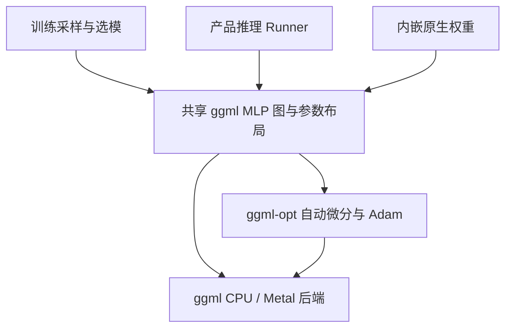
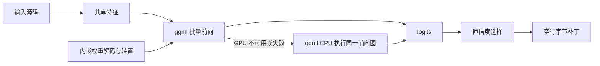

# 统一 ggml 计算后端计划

## Intent：最终目标

移除 zgpu、Dawn 与项目内的 WGSL 模型。训练和产品推理共用 ggml 前向图及参数布局转换；CPU 回退也使用 ggml。

## Data：可用证据

- `src/inference.zig` 当前通过 `src/gpu.zig` 调用 Dawn，失败后执行手写 Zig 前向。
- 上一轮 ggml 训练已经验证加权梯度、权重转置和合成收敛。
- 产品与评估工具只有四个 Runner 初始化调用点，权重编码不依赖 GPU 库。
- `build.zig.zon` 的全部依赖都属于 zgpu/Dawn，可清空。
- 固定 ggml 提供静态链接与 Metal 源内嵌，能继续保留单文件应用交付。

## Edges：边界与限制

- 不修改数据集、评估集、特征、校准配置和已发布模型。
- 验证只用现有合成探针及系统临时目录；不新增测试文件、不调用浏览器。
- 保留原生 Zig 前向作为独立数值参考和离线评分工具；产品 CPU/GPU 推理统一由 ggml 执行。
- 复用 `-Dgpu=false` 表示不尝试 ggml GPU，训练运行时的 `--backend` 选项保持。
- 默认构建 CPU + macOS Metal；不在此次扩展 CUDA/Vulkan 工具链或跨架构编译。

## Answer：交付与成功标准

1. 共享的 ggml 设备、参数和前向图模块；产品推理使用该图。
2. 删除 zgpu、Dawn、WGSL 代码及构建依赖。
3. ggml 静态链接，保留内嵌权重，不要求用户携带开发目录动态库。
4. CPU/Metal 推理与独立原生参考数值一致，现有训练探针不退化。
5. README 与执行记录反映实际后端和平台限制。

## 架构图

## 数据流图

