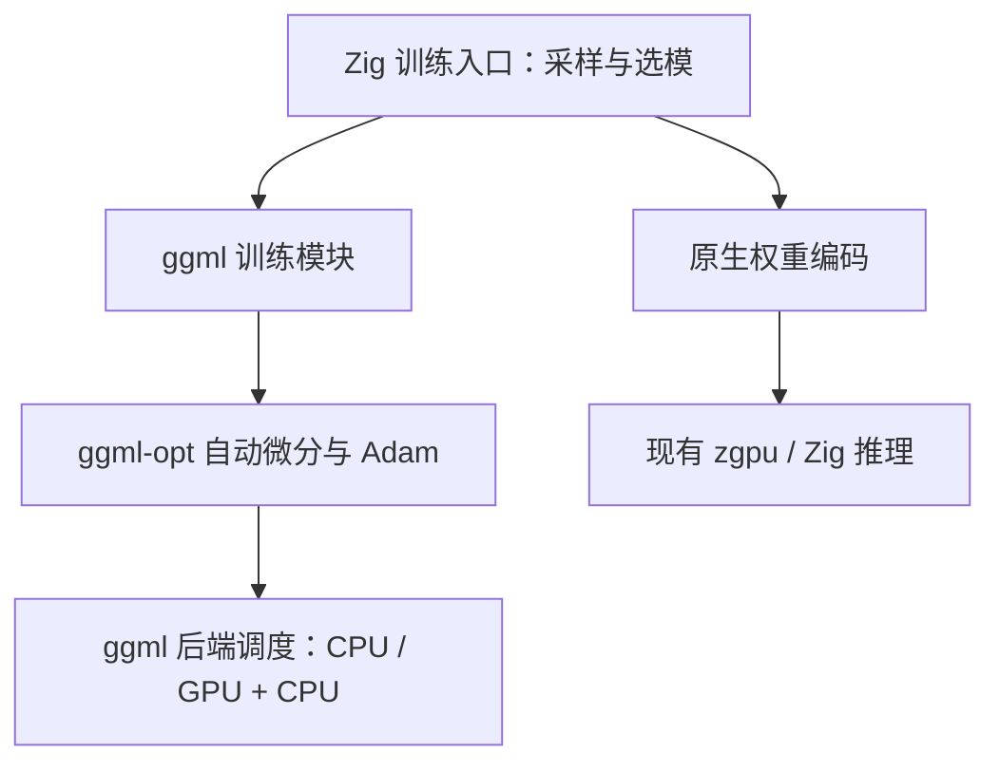
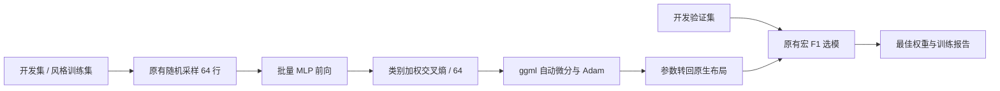

# ggml 训练后端迁移计划

## Intent：最终目标

把正式训练入口的手写反向传播和 Adam 替换为 ggml 自动微分与 `ggml-opt`，保留采样、类别加权、验证选模与原生权重协议。

## Data：可用证据

- `tools/train.zig` 当前逐样本调用 Zig 解析梯度，每 64 个样本执行一次 Adam；zgpu 仅用于推理。
- `src/model.zig` 的矩阵按输入优先排列；ggml 矩阵乘法需要在导入导出时转置。
- ggml 固定提交：`7840aaba1989c6deeefede1d77d5aaf8f52b947e`。
- 上游 `include/ggml-opt.h` 提供静态计算图、自动微分和 AdamW。关闭权重衰减即可保持原 Adam 配置。
- 上游交叉熵反向实现假设标签归一化，直接给 one-hot 乘类别权重会改变梯度。因此使用 ggml 基础算子表达加权损失，再交给 `ggml-opt` 求导和更新。

## Edges：边界与限制

- 不改特征、数据划分、默认训练预算、推理后端或已发布模型。
- 将现有 `train-probe` 梯度/ONNX 探针接入同一 ggml 模块，删除不再使用的手写梯度与 Adam。
- 不新增测试用例，不使用浏览器确认 UI。通过现有训练命令、编译和导出结果进行验证。
- 用户补充：真实数据集与评估集尚未校准。补充要求之后只使用系统临时目录内的合成数据；现有合成探针输出到构建缓存。
- CMake 编译 ggml 原生依赖；训练依赖与应用构建隔离。硬件加速的收益需要实测，不预设 GPU 对小批量一定更快。

## Answer：交付格式与成功标准

1. 固定版本的依赖获取/编译入口与 Zig 绑定。
2. 正式训练由 ggml 批量前向、反向、Adam 更新；原采样和验证逻辑保持。
3. 训练报告记录后端、线程与 ggml 版本；旧权重可加载，新权重可供现有工具读取。
4. 记录实际编译、短训练和数学一致性检查结果，以及未验证边界。

## 架构图

## 数据流图

