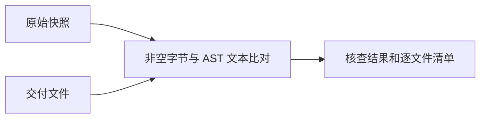

# TypeScript 预处理逐文件交付

## Intent：最终目标

按根规则人工整理相邻完整语句的空行，覆盖全部 603 个文件。

## Data：可用证据

共 96,235 原始行，258 个文件调整、345 个文件保留；增加 6,111、删除 56 空行。

非空行字节及行尾全部保持。ast-grep 比对 33,977 个注释、字符串、模板字符串和正则节点，文本完全一致。空行数量按相邻非空行之间的间隔计数，避免重复代码影响差异算法的对齐。

## Edges：边界与限制

未执行产品模型、训练、测试或浏览器。机械核查证明修改边界，不证明所有视觉判断都符合用户审美。

## Answer：交付与成功标准

全部文件已完整阅读，清单如下。原始快照、完整差异及 SHA-256 存于 artifacts/ts-zig-preprocess。

## 自我审查

留白依据完整语句外观，保留相似单行连续性及受保护文本；仍应以用户后续审核修订作为校准。

| 序号 | 文件 | 原始行数 | 结果 | 增加空行 | 删除空行 |
| --- | --- | ---: | --- | ---: | ---: |
| 001 | `$cellContainsEmptyParagraph--35e6e69bd9c97ec7.ts` | 15 | 保留 | 0 | 0 |
| 002 | `$cloneNode--7e22af9df045b67c.ts` | 36 | 保留 | 0 | 0 |
| 003 | `$computeTableMap--bcc6629ddc0b82c6.ts` | 57 | 调整 | 1 | 0 |
| 004 | `$convertBlockquoteElement--d7b956e5f6ff2967.ts` | 14 | 保留 | 0 | 0 |
| 005 | `$convertTableCellNodeElement--a4ceabbb8509a796.ts` | 51 | 调整 | 2 | 0 |
| 006 | `$convertTableElement--81e5206a383cf316.ts` | 5 | 保留 | 0 | 0 |
| 007 | `$convertTableRowElement--7cc96cbf8225620.ts` | 5 | 保留 | 0 | 0 |
| 008 | `$copyAttributes--3211d6f5e7d935f7.ts` | 12 | 调整 | 1 | 0 |
| 009 | `$createCodeNode--b6731b30cd214ec5.ts` | 9 | 保留 | 0 | 0 |
| 010 | `$createCodeTextNode--4738721029fd0120.ts` | 9 | 保留 | 0 | 0 |
| 011 | `$createDividerNode--ad1feb5497f6c181.ts` | 7 | 保留 | 0 | 0 |
| 012 | `$createImageNode--41df594248939c2d.ts` | 9 | 保留 | 0 | 0 |
| 013 | `$createKatexNode--842fc36180ad7c7d.ts` | 9 | 保留 | 0 | 0 |
| 014 | `$createNavigationNode--9cf53eb86761b1b1.ts` | 7 | 保留 | 0 | 0 |
| 015 | `$createQuoteNode--76895d4dd780d8c7.ts` | 15 | 保留 | 0 | 0 |
| 016 | `$createRefNode--f8ddb24a37b62691.ts` | 9 | 保留 | 0 | 0 |
| 017 | `$createTableNode--c162cf82d534033f.ts` | 9 | 保留 | 0 | 0 |
| 018 | `$createTableSelection--7d9373299ef7dbd.ts` | 10 | 保留 | 0 | 0 |
| 019 | `$createToggleHeadNode--e14d5c8d8227d413.ts` | 7 | 保留 | 0 | 0 |
| 020 | `$createToggleNode--9b269a8de0235aed.ts` | 9 | 保留 | 0 | 0 |
| 021 | `$deleteTableColumnAtSelection--a08b086ebd8f3fa7.ts` | 72 | 调整 | 6 | 0 |
| 022 | `$deleteTableRow--78527cfe267e7706.ts` | 9 | 保留 | 0 | 0 |
| 023 | `$deleteTableRowAtSelection--264e37cc48c67773.ts` | 71 | 调整 | 4 | 0 |
| 024 | `$exportNodeToJson--498130e90b91224c.ts` | 22 | 保留 | 0 | 0 |
| 025 | `$findRowNode--4bdc7f8422c20f58.ts` | 12 | 保留 | 0 | 0 |
| 026 | `$findTableNode--a21e1e0e05da76cc.ts` | 12 | 保留 | 0 | 0 |
| 027 | `$focus--2fc9d9bc255e677b.ts` | 5 | 保留 | 0 | 0 |
| 028 | `$forEachTableCell--10ad37b66d4942d9.ts` | 30 | 保留 | 0 | 0 |
| 029 | `$getCodeLines--a001cbcd635d2d2a.ts` | 31 | 调整 | 1 | 0 |
| 030 | `$getEditorSize--9c4a1e29522f7ea7.ts` | 9 | 保留 | 0 | 0 |
| 031 | `$getExitingToNode--e247f7fc807eb4c4.ts` | 20 | 保留 | 0 | 0 |
| 032 | `$getMatchingParent--4bd6309dbec304e6.ts` | 11 | 保留 | 0 | 0 |
| 033 | `$getNodeTriplet--c073377991bf00ff.ts` | 25 | 保留 | 0 | 0 |
| 034 | `$getRemovedParent--defb60a1bfc6b17b.ts` | 23 | 保留 | 0 | 0 |
| 035 | `$getSelectionType--ab79a4565bada1e1.ts` | 13 | 保留 | 0 | 0 |
| 036 | `$getTableCellNodeRect--a902cb36758f52fd.ts` | 51 | 调整 | 4 | 0 |
| 037 | `$getTableCellSiblingsFromTableCellNode--34191ee2925f8ebc.ts` | 16 | 调整 | 1 | 0 |
| 038 | `$getTableColumnIndexFromTableCellNode--68b7c9e39e5b8ff1.ts` | 9 | 保留 | 0 | 0 |
| 039 | `$getTableEdgeCursorPosition--4c3c7a612b433e57.ts` | 47 | 调整 | 2 | 0 |
| 040 | `$getTopLevelNode--8915b47f44278f8a.ts` | 17 | 调整 | 1 | 0 |
| 041 | `$handleArrowKey--8a5feb2f44e7af31.ts` | 200 | 调整 | 5 | 0 |
| 042 | `$insertFirst--6a6b491fcc98ea90.ts` | 11 | 保留 | 0 | 0 |
| 043 | `$insertParagraphAtTableEdge--dec67231eef22864.ts` | 17 | 保留 | 0 | 0 |
| 044 | `$insertTableColumn--7e37fd023456dd14.ts` | 38 | 调整 | 1 | 0 |
| 045 | `$insertTableRow--5a92fdf773ed4b54.ts` | 35 | 保留 | 0 | 0 |
| 046 | `$isCodeTextNode--41cdf5742f35dcdc.ts` | 7 | 保留 | 0 | 0 |
| 047 | `$isSelectionInCode--7b06fafb0fb55de4.ts` | 20 | 保留 | 0 | 0 |
| 048 | `$isSelectionInTable--c446afa99b5427a6.ts` | 18 | 保留 | 0 | 0 |
| 049 | `$isTableNode--474ac7d87062b5eb.ts` | 7 | 保留 | 0 | 0 |
| 050 | `$isTableSelection--d4d91158f02f42a1.ts` | 5 | 保留 | 0 | 0 |
| 051 | `$isToggleBodyNode--615a0cccd840fd21.ts` | 7 | 保留 | 0 | 0 |
| 052 | `$isToggleBtnNode--4870844618eb06d1.ts` | 7 | 保留 | 0 | 0 |
| 053 | `$isToggleNode--d437a1f987c3b925.ts` | 7 | 保留 | 0 | 0 |
| 054 | `$restoreNodeFromJson--62748b291ffc78df.ts` | 34 | 保留 | 0 | 0 |
| 055 | `$updateParagraphNodeProperties--7cdc6704ca9d65df.ts` | 7 | 保留 | 0 | 0 |
| 056 | `$updateTableCols--a51029c3806f7bbb.ts` | 44 | 保留 | 0 | 0 |
| 057 | `$updateTextNodeProperties--95e70acef9f3eb5e.ts` | 10 | 保留 | 0 | 0 |
| 058 | `Code--d81e84189bf160a9.ts` | 32 | 保留 | 0 | 0 |
| 059 | `CodeNode--bb8e3dbafad28f21.ts` | 211 | 调整 | 4 | 0 |
| 060 | `CodeTextNode--b97d1222adf93a04.ts` | 78 | 保留 | 0 | 0 |
| 061 | `Divider--8509afac079e1a4b.ts` | 24 | 保留 | 0 | 0 |
| 062 | `Katex--5793ccb5652ed933.ts` | 44 | 保留 | 0 | 0 |
| 063 | `KeepAlive--6e89740397489af9.ts` | 485 | 调整 | 60 | 1 |
| 064 | `Navigation--a2161a7b8065917c.ts` | 42 | 调整 | 1 | 0 |
| 065 | `Quote--2dfa44c1ea700b0c.ts` | 41 | 保留 | 0 | 0 |
| 066 | `QuoteNode--1a873fc26089536d.ts` | 96 | 保留 | 0 | 0 |
| 067 | `RegExp--f176c32f1a7f8598.ts` | 7 | 保留 | 0 | 0 |
| 068 | `Suspense--3b806108e76a99f7.ts` | 972 | 调整 | 119 | 0 |
| 069 | `Table--70a64b909cc793ec.ts` | 201 | 调整 | 5 | 0 |
| 070 | `TableCellNode--615c9b31ac536f0d.ts` | 138 | 调整 | 1 | 0 |
| 071 | `TableNode--cf90fa4dd68fd77d.ts` | 303 | 调整 | 3 | 0 |
| 072 | `TableObserver--c681d69be5ccb787.ts` | 280 | 调整 | 12 | 0 |
| 073 | `TableRowNode--56d4ebcdf573401.ts` | 59 | 保留 | 0 | 0 |
| 074 | `TableSelection--2f8bacd1a3069f37.ts` | 251 | 调整 | 4 | 0 |
| 075 | `Teleport--aa505291144734d6.ts` | 588 | 调整 | 58 | 0 |
| 076 | `Toggle--e530232a34ba2cc2.ts` | 66 | 调整 | 2 | 0 |
| 077 | `ToggleBodyNode--877e4aecbc4cc91f.ts` | 72 | 保留 | 0 | 0 |
| 078 | `ToggleNode--e91dfcbba93d962b.ts` | 87 | 保留 | 0 | 0 |
| 079 | `TrayModel--27798dd5d11ac100.ts` | 241 | 调整 | 2 | 0 |
| 080 | `activity_items--48662efff2b4e3e6.ts` | 62 | 保留 | 0 | 0 |
| 081 | `antd--773c33894bc7724.ts` | 47 | 保留 | 0 | 0 |
| 082 | `apiComputed--e2d758b30d9cc6fd.ts` | 17 | 调整 | 3 | 0 |
| 083 | `apiCreateApp--97baad7c9b477a13.ts` | 493 | 调整 | 39 | 0 |
| 084 | `apiDefineComponent--6175af8351003ac.ts` | 315 | 调整 | 7 | 0 |
| 085 | `apiInject--d551838236a4e64b.ts` | 94 | 调整 | 7 | 0 |
| 086 | `apiLifecycle--445b216b7433427e.ts` | 116 | 调整 | 18 | 0 |
| 087 | `apiSetupHelpers--489b09dec6543c4a.ts` | 573 | 调整 | 37 | 0 |
| 088 | `apiWatch--32b597539c5c9c97.ts` | 282 | 调整 | 25 | 0 |
| 089 | `app--405cd9b9899f898.ts` | 9 | 保留 | 0 | 0 |
| 090 | `app--43c36e8393795f79.ts` | 87 | 保留 | 0 | 0 |
| 091 | `app--4e25fb7080949794.ts` | 33 | 保留 | 0 | 0 |
| 092 | `app--a3a291e418166475.ts` | 241 | 调整 | 6 | 0 |
| 093 | `app--e326655a585a7aea.ts` | 89 | 保留 | 0 | 0 |
| 094 | `applyTableHandlers--e2393db47f14ff8.ts` | 770 | 调整 | 19 | 0 |
| 095 | `archive--6ed6ed0afe04e113.ts` | 22 | 保留 | 0 | 0 |
| 096 | `archive--8a526c3f137962cc.ts` | 53 | 保留 | 0 | 0 |
| 097 | `arrayInstrumentations--cc5c801d8bd600ee.ts` | 372 | 调整 | 32 | 0 |
| 098 | `atoms--6e6abdd2995776aa.ts` | 9 | 保留 | 0 | 0 |
| 099 | `atoms--89898b7d2f6782a9.ts` | 9 | 保留 | 0 | 0 |
| 100 | `attrsFallthrough--b6bb47093d33686f.ts` | 29 | 调整 | 4 | 0 |
| 101 | `auth--c56f816e6c259bc3.ts` | 23 | 保留 | 0 | 0 |
| 102 | `auth--d7c10d0a8762127.ts` | 32 | 保留 | 0 | 0 |
| 103 | `base--581683e935215a09.ts` | 62 | 调整 | 8 | 0 |
| 104 | `baseEnvironment--746ac6ccc3c9426.ts` | 137 | 调整 | 9 | 0 |
| 105 | `baseHandlers--9ad5e6363e4f9ca.ts` | 264 | 调整 | 26 | 0 |
| 106 | `block--c2b6c878113887e9.ts` | 163 | 调整 | 4 | 0 |
| 107 | `build--883223761d58ba80.ts` | 1988 | 调整 | 151 | 0 |
| 108 | `charts--62660e9b5f35d9a0.ts` | 11 | 保留 | 0 | 0 |
| 109 | `clearStorage--e961afcb25aed2bd.ts` | 8 | 保留 | 0 | 0 |
| 110 | `cli--8965dca778911f3a.ts` | 491 | 调整 | 44 | 0 |
| 111 | `clientInjections--950ea9789231b172.ts` | 151 | 调整 | 14 | 0 |
| 112 | `collectionHandlers--1a1e5ce06df58c71.ts` | 329 | 调整 | 44 | 0 |
| 113 | `collisionDetection--9e69700eaf07cf5c.ts` | 21 | 保留 | 0 | 0 |
| 114 | `color--c797588e670c2984.ts` | 19 | 保留 | 0 | 0 |
| 115 | `commands--250e9c23f24b4c17.ts` | 15 | 保留 | 0 | 0 |
| 116 | `common--28890d245b078f54.ts` | 158 | 保留 | 0 | 0 |
| 117 | `common--dff6e522edd2ca2d.ts` | 158 | 保留 | 0 | 0 |
| 118 | `component--6b33201f22262304.ts` | 57 | 调整 | 4 | 0 |
| 119 | `componentAsync--48c46abe69d0b302.ts` | 61 | 调整 | 4 | 0 |
| 120 | `componentEmits--a24181a4969a5f95.ts` | 316 | 调整 | 33 | 0 |
| 121 | `componentFunctional--ef203db5d7150caf.ts` | 65 | 调整 | 9 | 0 |
| 122 | `componentOptions--67b8275d6ed52e43.ts` | 1327 | 调整 | 71 | 0 |
| 123 | `componentProps--2513cc4a215fabdf.ts` | 821 | 调整 | 88 | 0 |
| 124 | `componentPublicInstance--7b4d7d620c8416ef.ts` | 756 | 调整 | 48 | 0 |
| 125 | `componentRenderContext--ec9fbd2dd18cf7a4.ts` | 126 | 调整 | 10 | 0 |
| 126 | `componentRenderUtils--2052eb6ad77c1c4a.ts` | 498 | 调整 | 65 | 0 |
| 127 | `componentSlots--473895cc32c9796e.ts` | 252 | 调整 | 26 | 0 |
| 128 | `componentVModel--1ddffa1e3bef4d6d.ts` | 93 | 调整 | 15 | 0 |
| 129 | `components--63645a0052726dbe.ts` | 13 | 保留 | 0 | 0 |
| 130 | `components--c2b1c401193017b.ts` | 13 | 保留 | 0 | 0 |
| 131 | `computed--ae89210327b129a3.ts` | 221 | 调整 | 15 | 0 |
| 132 | `config--626686076ce135d0.ts` | 103 | 调整 | 5 | 0 |
| 133 | `config--c21375d2d3ae8438.ts` | 2961 | 调整 | 193 | 0 |
| 134 | `console_ban--3d176bbc4caf788f.ts` | 5 | 保留 | 0 | 0 |
| 135 | `const--7cc573da40693956.ts` | 151 | 调整 | 3 | 0 |
| 136 | `constants--1f9903f38523b30f.ts` | 24 | 保留 | 0 | 0 |
| 137 | `constants--f709b33479d3837f.ts` | 227 | 调整 | 11 | 0 |
| 138 | `context--dd9ac625ba8b8fb9.ts` | 25 | 保留 | 0 | 0 |
| 139 | `convertImageElement--e7b68f3143868f64.ts` | 30 | 保留 | 0 | 0 |
| 140 | `convertKatexElement--6ff95b57aef19e60.ts` | 16 | 保留 | 0 | 0 |
| 141 | `convertMermaidElement--88bd27612cfff178.ts` | 15 | 保留 | 0 | 0 |
| 142 | `convertNavigationElement--a4f9aa0a098a3742.ts` | 7 | 保留 | 0 | 0 |
| 143 | `convertToggleBodyElement--ecc6d57683bb9862.ts` | 5 | 保留 | 0 | 0 |
| 144 | `convertToggleBtnElement--72c29d84ae419fe8.ts` | 5 | 保留 | 0 | 0 |
| 145 | `convertToggleElement--45c313cedf9d8bf2.ts` | 11 | 保留 | 0 | 0 |
| 146 | `convertToggleHeadElement--f8120c8b023b052c.ts` | 5 | 保留 | 0 | 0 |
| 147 | `crdt--724986d2cc666e2a.ts` | 549 | 调整 | 42 | 0 |
| 148 | `createFile--37cf904856cbb0cf.ts` | 7 | 保留 | 0 | 0 |
| 149 | `createJob--62371df499bf8001.ts` | 57 | 调整 | 4 | 0 |
| 150 | `createMouseHandlers--692973294d6d1479.ts` | 42 | 保留 | 0 | 0 |
| 151 | `createSlots--74789318efc178e9.ts` | 44 | 调整 | 4 | 0 |
| 152 | `css--e5d6dd71bcee1838.ts` | 3685 | 调整 | 422 | 0 |
| 153 | `cursor--6851064ba89fc59e.ts` | 28 | 保留 | 0 | 0 |
| 154 | `customDirective--adb25e2699a9e3e9.ts` | 60 | 调整 | 6 | 0 |
| 155 | `customFormatter--17f30b8bf5ab024d.ts` | 212 | 调整 | 24 | 0 |
| 156 | `customs--bde805159f04e6db.ts` | 95 | 调整 | 3 | 0 |
| 157 | `cycle--84f885eb19d865e0.ts` | 90 | 保留 | 0 | 0 |
| 158 | `data--2dbaa4cddda31720.ts` | 123 | 保留 | 0 | 0 |
| 159 | `data--300e38f9ffe3d2cd.ts` | 25 | 保留 | 0 | 0 |
| 160 | `data--a8a4be77bd30d8a5.ts` | 16 | 调整 | 3 | 0 |
| 161 | `date--7b864444e202dd65.ts` | 145 | 调整 | 5 | 0 |
| 162 | `dayjs--82cdeb8b63050e.ts` | 36 | 调整 | 3 | 0 |
| 163 | `db--2183e1fd8291a374.ts` | 173 | 调整 | 3 | 0 |
| 164 | `define--c7e679954571b994.ts` | 223 | 调整 | 28 | 0 |
| 165 | `dep--28002ef2b3ad0bbb.ts` | 397 | 调整 | 29 | 0 |
| 166 | `deprecations--4ae84e56cd4ef867.ts` | 105 | 调整 | 12 | 0 |
| 167 | `devtools--790438d8ad71eeb4.ts` | 174 | 调整 | 6 | 0 |
| 168 | `directives--eefc76d6cbcf7d38.ts` | 200 | 调整 | 19 | 0 |
| 169 | `dirtree--8fe1a9c1cdf3e5ca.ts` | 11 | 保留 | 0 | 0 |
| 170 | `dirtree_items--6e8e2acd5c6c3f45.ts` | 5 | 保留 | 0 | 0 |
| 171 | `dirtree_items--7ee265038b3d440a.ts` | 24 | 保留 | 0 | 0 |
| 172 | `dirtree_items--b732e1f20579579e.ts` | 131 | 保留 | 0 | 0 |
| 173 | `dirtree_items--f4aaec5158708ad5.ts` | 22 | 保留 | 0 | 0 |
| 174 | `disableWatcher--bf938ebcc7456560.ts` | 21 | 保留 | 0 | 0 |
| 175 | `doc_parser--6fbe8dc38069a87b.ts` | 5 | 保留 | 0 | 0 |
| 176 | `dragInsert--23ad0cf823db170f.ts` | 31 | 保留 | 0 | 0 |
| 177 | `dynamicImportVars--61df2e1173edd4db.ts` | 317 | 调整 | 26 | 0 |
| 178 | `editor--12d921d691201671.ts` | 87 | 保留 | 0 | 0 |
| 179 | `editor--b87e3a07fe7794dc.ts` | 87 | 保留 | 0 | 0 |
| 180 | `effect--74df72dfe8365195.ts` | 582 | 调整 | 64 | 0 |
| 181 | `emoji--94849a16602a8554.ts` | 10 | 保留 | 0 | 0 |
| 182 | `emoji.d--d804e1d5debd59f6.ts` | 10 | 保留 | 0 | 0 |
| 183 | `en--3d63358cef6ecc68.ts` | 28 | 调整 | 1 | 0 |
| 184 | `en--b441f1e45df4bbf6.ts` | 158 | 调整 | 2 | 0 |
| 185 | `enums--966156155da1ac6e.ts` | 16 | 保留 | 0 | 0 |
| 186 | `env--4800e692883e82b4.ts` | 9 | 保留 | 0 | 0 |
| 187 | `env--e560892bd7644fe5.ts` | 127 | 调整 | 10 | 0 |
| 188 | `environment--1bc2e5b1fbbcdfc2.ts` | 37 | 保留 | 0 | 0 |
| 189 | `environment--5d0c35bc7687489f.ts` | 31 | 调整 | 3 | 0 |
| 190 | `error--5a856ad55f821392.ts` | 108 | 调整 | 4 | 0 |
| 191 | `errorHandling--dd10ef7267a75e8d.ts` | 185 | 调整 | 19 | 0 |
| 192 | `esbuild--cda556fb779c6a79.ts` | 510 | 调整 | 33 | 0 |
| 193 | `esbuildBannerFooterCompatPlugin--42f83de742bfd899.ts` | 61 | 调整 | 7 | 0 |
| 194 | `extend--ffcd1468d9799f9.ts` | 8 | 保留 | 0 | 0 |
| 195 | `external--2487cd044e31dffb.ts` | 153 | 调整 | 21 | 0 |
| 196 | `feather_icons_data--a21171429eca2f9e.ts` | 239 | 保留 | 0 | 0 |
| 197 | `featureFlags--a8a49cc0e3713635.ts` | 38 | 调整 | 4 | 0 |
| 198 | `fetchModule--fd180c21b40da81.ts` | 154 | 调整 | 11 | 0 |
| 199 | `fetchableEnvironments--3f1338fa5c836099.ts` | 64 | 调整 | 4 | 0 |
| 200 | `file--55d068a5faa08dac.ts` | 61 | 调整 | 3 | 0 |
| 201 | `file--dd6d41a53c259267.ts` | 150 | 调整 | 3 | 0 |
| 202 | `filter--26f54697150a273f.ts` | 80 | 保留 | 0 | 0 |
| 203 | `find--ef3afd2681c206fb.ts` | 24 | 保留 | 0 | 0 |
| 204 | `findNextNonBlankInLine--557df594dea7d068.ts` | 36 | 调整 | 5 | 0 |
| 205 | `forwardConsole--f3a9bf2a792b02ff.ts` | 144 | 调整 | 25 | 0 |
| 206 | `getAntdTheme--6e02ceba8a2eaa0d.ts` | 86 | 保留 | 0 | 0 |
| 207 | `getBlockStyle--cac81ff752332e10.ts` | 14 | 调整 | 1 | 0 |
| 208 | `getBlockWrapStyle--ed857bc26d1c0694.ts` | 24 | 调整 | 3 | 0 |
| 209 | `getCachedClassNameArray--27f4244e35c2fe59.ts` | 28 | 保留 | 0 | 0 |
| 210 | `getCalendarDays--4766cea6f31e0366.ts` | 23 | 保留 | 0 | 0 |
| 211 | `getCodeTokenNodes--f431571c00951c2b.ts` | 14 | 保留 | 0 | 0 |
| 212 | `getCrdtSchema--f5229b4b8498d6f2.ts` | 12 | 调整 | 1 | 0 |
| 213 | `getCrossTime--b14da9c699e237aa.ts` | 23 | 保留 | 0 | 0 |
| 214 | `getDOMCellFromTarget--383e5511eb01188.ts` | 21 | 保留 | 0 | 0 |
| 215 | `getDayDetails--717583baf0b0acd1.ts` | 59 | 调整 | 1 | 0 |
| 216 | `getDocItemsData--da3b09ac93475176.ts` | 24 | 保留 | 0 | 0 |
| 217 | `getEditorJSON--33070cd6a0daaa3a.ts` | 22 | 保留 | 0 | 0 |
| 218 | `getEditorText--c9fda06171f70951.ts` | 33 | 保留 | 0 | 0 |
| 219 | `getFileAlt--2faa584c1278aa34.ts` | 7 | 保留 | 0 | 0 |
| 220 | `getFirstCodeNodeOfLine--66811eb7b1b29944.ts` | 17 | 调整 | 1 | 0 |
| 221 | `getLang--5f2f707c3592b8e9.ts` | 6 | 保留 | 0 | 0 |
| 222 | `getLangName--8399c38341a5e212.ts` | 40 | 保留 | 0 | 0 |
| 223 | `getModelContext--f7f2af1eac6cfab3.ts` | 99 | 调整 | 4 | 0 |
| 224 | `getMonthdays--27275696d4a4c4ee.ts` | 40 | 调整 | 4 | 0 |
| 225 | `getNodeEdge--47cef84dcbbe8bcd.ts` | 77 | 调整 | 1 | 0 |
| 226 | `getNodesFromText--3388201d420c388d.ts` | 16 | 保留 | 0 | 0 |
| 227 | `getPosition--8aa69e896577343b.ts` | 12 | 保留 | 0 | 0 |
| 228 | `getRelativeMinute--833b26b12058c46.ts` | 21 | 保留 | 0 | 0 |
| 229 | `getRelativeTime--9ccd3f12478a11a1.ts` | 21 | 保留 | 0 | 0 |
| 230 | `getSelectedNode--12d228d7397853e0.ts` | 16 | 保留 | 0 | 0 |
| 231 | `getSerialNumber--cc253b1eeb0ad542.ts` | 16 | 保留 | 0 | 0 |
| 232 | `getStartByY--d42d13d917d1c2e1.ts` | 11 | 保留 | 0 | 0 |
| 233 | `getStartEnd--78e372c191fb3576.ts` | 17 | 保留 | 0 | 0 |
| 234 | `getStartOfCodeInLine--fb4fa3e371331e87.ts` | 77 | 调整 | 2 | 0 |
| 235 | `getStateJson--53bb23e4f7a88386.ts` | 126 | 调整 | 2 | 0 |
| 236 | `getTabCommand--9986e6566fe102e2.ts` | 57 | 保留 | 0 | 0 |
| 237 | `getTable--1bfc7fa3ded7fc1f.ts` | 68 | 调整 | 4 | 0 |
| 238 | `getTableObserverFromTableElement--c31936ec69bfca9d.ts` | 8 | 保留 | 0 | 0 |
| 239 | `getTimeText--cd709c98ba1de54b.ts` | 17 | 保留 | 0 | 0 |
| 240 | `getTimeTextValue--25fac7732c8ecfd8.ts` | 10 | 保留 | 0 | 0 |
| 241 | `getTimelineMonthDays--ff6fadce9815ac51.ts` | 21 | 调整 | 1 | 0 |
| 242 | `getTimelineRows--8d2e36bdcd8525f3.ts` | 13 | 保留 | 0 | 0 |
| 243 | `getYearDays--e3a7746ac0e1c227.ts` | 22 | 保留 | 0 | 0 |
| 244 | `global--6d4a83ccff23be0e.ts` | 10 | 保留 | 0 | 0 |
| 245 | `global--ee4dde5b0288a38.ts` | 669 | 调整 | 85 | 0 |
| 246 | `globalConfig--d316eaa932d444ce.ts` | 84 | 调整 | 5 | 0 |
| 247 | `global_css--aba45f0e4c54dcfe.ts` | 11 | 保留 | 0 | 0 |
| 248 | `graph--11d4415edd08e1f5.ts` | 7 | 保留 | 0 | 0 |
| 249 | `h--e38395e37c8b7430.ts` | 227 | 调整 | 17 | 0 |
| 250 | `handleSchema--559bddabc99bdd61.ts` | 62 | 保留 | 0 | 0 |
| 251 | `highlighter--28239f325bb33d80.ts` | 6 | 保留 | 0 | 0 |
| 252 | `hmr--de2e040eb54aa6bf.ts` | 1193 | 调整 | 123 | 0 |
| 253 | `hono--d92ad77fd7502d03.ts` | 30 | 保留 | 0 | 0 |
| 254 | `html--aeb7e8c6d5f6e5a.ts` | 1753 | 调整 | 181 | 0 |
| 255 | `htmlFallback--349e51462620395b.ts` | 87 | 调整 | 11 | 0 |
| 256 | `http--c416541202f1aede.ts` | 355 | 调整 | 40 | 0 |
| 257 | `hydration--dbbdd8fbe1a94fd6.ts` | 1104 | 调整 | 121 | 0 |
| 258 | `hydrationStrategies--65cac050a80c3c85.ts` | 139 | 调整 | 24 | 0 |
| 259 | `i18n--3bbf0169336638d9.ts` | 10 | 保留 | 0 | 0 |
| 260 | `i18n.d--b684e9339935dc8a.ts` | 8 | 保留 | 0 | 0 |
| 261 | `iap--a9517a578e2ab6ae.ts` | 6 | 保留 | 0 | 0 |
| 262 | `id--2d84fffb1795d1f2.ts` | 20 | 保留 | 0 | 0 |
| 263 | `importAnalysisBuild--af8860d3481b1a4a.ts` | 664 | 调整 | 94 | 0 |
| 264 | `importMetaGlob--8ebc5f39baa42dc3.ts` | 725 | 调整 | 74 | 0 |
| 265 | `index--1a63500f4fc69b60.ts` | 29 | 保留 | 0 | 0 |
| 266 | `index--1c64d2d59a622059.ts` | 59 | 保留 | 0 | 0 |
| 267 | `index--241dd5bf1917b288.ts` | 29 | 保留 | 0 | 0 |
| 268 | `index--2b79ecc11ffe767.ts` | 13 | 保留 | 0 | 0 |
| 269 | `index--2f5d715f0536ea85.ts` | 17 | 保留 | 0 | 0 |
| 270 | `index--3106bdff098cb151.ts` | 6 | 保留 | 0 | 0 |
| 271 | `index--331fcad43a9b99b0.ts` | 90 | 调整 | 2 | 0 |
| 272 | `index--433bb0334db2e2bf.ts` | 7 | 保留 | 0 | 0 |
| 273 | `index--450eebdb95814073.ts` | 38 | 保留 | 0 | 0 |
| 274 | `index--4bec81ff23da053.ts` | 6 | 保留 | 0 | 0 |
| 275 | `index--4cc91d3c9d578c46.ts` | 10 | 保留 | 0 | 0 |
| 276 | `index--4dcb0d23b47d4f4d.ts` | 74 | 调整 | 2 | 0 |
| 277 | `index--4f0cd45aeccbdec9.ts` | 209 | 保留 | 0 | 0 |
| 278 | `index--562dbc9b3aa29a85.ts` | 4 | 保留 | 0 | 0 |
| 279 | `index--63e6275d2497cf8f.ts` | 4 | 保留 | 0 | 0 |
| 280 | `index--684f156aa85af2de.ts` | 4 | 保留 | 0 | 0 |
| 281 | `index--6da21a1adf0a7465.ts` | 4 | 保留 | 0 | 0 |
| 282 | `index--72f3092db7523ccb.ts` | 35 | 保留 | 0 | 0 |
| 283 | `index--7824a30440f9b496.ts` | 4 | 保留 | 0 | 0 |
| 284 | `index--7dcd1b8e2f99c857.ts` | 14 | 保留 | 0 | 0 |
| 285 | `index--7e0098a5c49a2f43.ts` | 52 | 保留 | 0 | 0 |
| 286 | `index--810085597c26775.ts` | 46 | 保留 | 0 | 0 |
| 287 | `index--8c4957caa28e51dc.ts` | 1504 | 调整 | 132 | 0 |
| 288 | `index--8e307bd0260b0732.ts` | 4 | 保留 | 0 | 0 |
| 289 | `index--9af2e0e1b489d9f6.ts` | 39 | 调整 | 1 | 0 |
| 290 | `index--9c8909e827b1f0e.ts` | 8 | 保留 | 0 | 0 |
| 291 | `index--a092523cf9612778.ts` | 484 | 调整 | 43 | 0 |
| 292 | `index--a358ee4393023934.ts` | 7 | 保留 | 0 | 0 |
| 293 | `index--b04beda587369a15.ts` | 5 | 保留 | 0 | 0 |
| 294 | `index--b38ace2005824ec0.ts` | 97 | 调整 | 7 | 0 |
| 295 | `index--b63a2ebc46774510.ts` | 19 | 保留 | 0 | 0 |
| 296 | `index--bbed50e9f4a2fc2d.ts` | 5 | 保留 | 0 | 0 |
| 297 | `index--c05935a89b6fcea8.ts` | 7 | 保留 | 0 | 0 |
| 298 | `index--c3c6982ea1e7207d.ts` | 279 | 调整 | 37 | 0 |
| 299 | `index--c5714aee9ba1ad4e.ts` | 1496 | 调整 | 115 | 0 |
| 300 | `index--c669921fa17fec63.ts` | 5 | 保留 | 0 | 0 |
| 301 | `index--c8f1d8a3ebdbe5c2.ts` | 7 | 保留 | 0 | 0 |
| 302 | `index--c9196994f9c48b83.ts` | 10 | 保留 | 0 | 0 |
| 303 | `index--cca733692c663ac3.ts` | 20 | 保留 | 0 | 0 |
| 304 | `index--d58f66af3ce53840.ts` | 33 | 保留 | 0 | 0 |
| 305 | `index--d9c80a003d88c0c1.ts` | 8 | 保留 | 0 | 0 |
| 306 | `index--da5a7f7942d739e8.ts` | 4 | 保留 | 0 | 0 |
| 307 | `index--e63235d41e7c2019.ts` | 4 | 保留 | 0 | 0 |
| 308 | `index--f1207bcfb9c1a655.ts` | 33 | 保留 | 0 | 0 |
| 309 | `index--f47b14ea418cc576.ts` | 32 | 保留 | 0 | 0 |
| 310 | `index--fb72cff93203ef59.ts` | 12 | 保留 | 0 | 0 |
| 311 | `index.d--88cafd689afd89a4.ts` | 11 | 保留 | 0 | 0 |
| 312 | `indexHtml--6aeb13dfa896520b.ts` | 631 | 调整 | 59 | 0 |
| 313 | `initSession--55dad2f2d332553d.ts` | 43 | 调整 | 1 | 1 |
| 314 | `initials--fce0e52f86e5e655.ts` | 21 | 保留 | 0 | 0 |
| 315 | `insert--24ff72a5e321ee82.ts` | 23 | 保留 | 0 | 0 |
| 316 | `insertBlock--a6e1a427e0ae748d.ts` | 39 | 调整 | 0 | 1 |
| 317 | `insertDefault--9dfff021a6ef4063.ts` | 22 | 保留 | 0 | 0 |
| 318 | `insertDefault--b040112a968a43b8.ts` | 12 | 保留 | 0 | 0 |
| 319 | `insertDefaultSettings--426c34f9cc06f9e6.ts` | 10 | 保留 | 0 | 0 |
| 320 | `insertItems--8330d916874b7503.ts` | 55 | 调整 | 1 | 0 |
| 321 | `insertSetting--50ddda6c162f10c4.ts` | 22 | 保留 | 0 | 0 |
| 322 | `insertSetting--f1412bf6ac0ce29f.ts` | 16 | 保留 | 0 | 0 |
| 323 | `instance--22464a98964c86b8.ts` | 199 | 调整 | 21 | 0 |
| 324 | `instanceChildren--50b5900c9361af8d.ts` | 28 | 调整 | 4 | 0 |
| 325 | `instanceEventEmitter--72540c7672985df6.ts` | 109 | 调整 | 22 | 0 |
| 326 | `instanceListeners--7a40e0203e7b4439.ts` | 21 | 调整 | 3 | 0 |
| 327 | `internalObject--eda4063a5634ed48.ts` | 13 | 保留 | 0 | 0 |
| 328 | `ionicons_data--a4c94335db118ab4.ts` | 5376 | 保留 | 0 | 0 |
| 329 | `ipc--1de6cc8a536ee287.ts` | 7 | 保留 | 0 | 0 |
| 330 | `ipc--e0b850ea89dbc26b.ts` | 10 | 保留 | 0 | 0 |
| 331 | `is--ad78ae668cd0a8a5.ts` | 12 | 调整 | 4 | 0 |
| 332 | `isExitingCell--6298f2065b1250b3.ts` | 15 | 调整 | 1 | 0 |
| 333 | `isExitingTableAnchor--5dd22126bfb60910.ts` | 33 | 保留 | 0 | 0 |
| 334 | `isShowEmpty--1dece563bf140803.ts` | 5 | 保留 | 0 | 0 |
| 335 | `json--5f98f5fc2b6b63f7.ts` | 19 | 调整 | 1 | 0 |
| 336 | `kv--8b579096209d495f.ts` | 21 | 保留 | 0 | 0 |
| 337 | `kv_settings_model--5cce68e4a62feac7.ts` | 31 | 保留 | 0 | 0 |
| 338 | `layout--26e8c22ba384e40.ts` | 65 | 调整 | 2 | 0 |
| 339 | `layout--3bd7ad93018aaa81.ts` | 10 | 保留 | 0 | 0 |
| 340 | `layout--9a032b0ff1a4dea6.ts` | 99 | 调整 | 2 | 0 |
| 341 | `lexical--74ad1f8b0d0637f1.ts` | 12 | 保留 | 0 | 0 |
| 342 | `loadStore--43a1435458d621df.ts` | 59 | 调整 | 1 | 0 |
| 343 | `loading--f2e8102b2664a2b6.ts` | 17 | 保留 | 0 | 0 |
| 344 | `loadmore--3ef86bb18a78a1b5.ts` | 16 | 保留 | 0 | 0 |
| 345 | `locale--20aab1aa32f0c744.ts` | 68 | 保留 | 0 | 0 |
| 346 | `locales--c780e86d502d7c9e.ts` | 16 | 保留 | 0 | 0 |
| 347 | `makeMutable--e3d72724350edbb3.ts` | 5 | 保留 | 0 | 0 |
| 348 | `manifest--23be8db2d0509ec6.ts` | 192 | 调整 | 23 | 0 |
| 349 | `matchers--6550ca0c0407c3eb.ts` | 16 | 保留 | 0 | 0 |
| 350 | `memoryFiles--a0bf673d403cf12a.ts` | 55 | 调整 | 11 | 0 |
| 351 | `mermaidRender--c8d750a39b3b9aee.ts` | 33 | 保留 | 0 | 0 |
| 352 | `mixedModuleGraph--f9f1397cd0c0597f.ts` | 741 | 调整 | 99 | 0 |
| 353 | `model--108f29b1ff167253.ts` | 122 | 调整 | 3 | 0 |
| 354 | `model--18c857433fca55d7.ts` | 97 | 调整 | 1 | 0 |
| 355 | `model--28124a7f35cd0326.ts` | 134 | 保留 | 0 | 0 |
| 356 | `model--2ebc71d762eeaa22.ts` | 153 | 调整 | 1 | 0 |
| 357 | `model--2f283211678a183.ts` | 101 | 调整 | 3 | 0 |
| 358 | `model--3a04c9f358e6fab6.ts` | 21 | 调整 | 0 | 1 |
| 359 | `model--447d986972f7dcdd.ts` | 39 | 调整 | 2 | 0 |
| 360 | `model--491d30eebbadf405.ts` | 236 | 调整 | 1 | 3 |
| 361 | `model--4a4e066defc41b66.ts` | 289 | 调整 | 8 | 2 |
| 362 | `model--4c0cd247a926b81b.ts` | 47 | 保留 | 0 | 0 |
| 363 | `model--518d1df4ea1bccb.ts` | 361 | 调整 | 12 | 0 |
| 364 | `model--51b0d874fa4cd31f.ts` | 202 | 调整 | 8 | 2 |
| 365 | `model--54dd13b241849f56.ts` | 8 | 保留 | 0 | 0 |
| 366 | `model--64f17da1f61bd268.ts` | 541 | 调整 | 15 | 4 |
| 367 | `model--69e77f719dcd16bf.ts` | 271 | 调整 | 9 | 1 |
| 368 | `model--6bad26a0fbc38f07.ts` | 134 | 调整 | 5 | 1 |
| 369 | `model--6e5e5de4fb12f0ee.ts` | 132 | 调整 | 1 | 2 |
| 370 | `model--7b1f797a3fe585d0.ts` | 97 | 保留 | 0 | 0 |
| 371 | `model--885f4d123b966070.ts` | 361 | 调整 | 5 | 4 |
| 372 | `model--8ecede691c67c0b1.ts` | 42 | 保留 | 0 | 0 |
| 373 | `model--90515a2bff324834.ts` | 103 | 调整 | 3 | 1 |
| 374 | `model--90d6930c458439da.ts` | 119 | 调整 | 0 | 1 |
| 375 | `model--90dd3418d962c159.ts` | 51 | 保留 | 0 | 0 |
| 376 | `model--9ae3873c1d507362.ts` | 9 | 保留 | 0 | 0 |
| 377 | `model--a14b17e1044d529b.ts` | 7 | 保留 | 0 | 0 |
| 378 | `model--a2a332ba6afd413f.ts` | 77 | 调整 | 0 | 2 |
| 379 | `model--b5861035b3eb7acb.ts` | 1248 | 调整 | 24 | 2 |
| 380 | `model--ba917a2b12511dbd.ts` | 221 | 调整 | 5 | 2 |
| 381 | `model--c6c4d97646c3a102.ts` | 718 | 调整 | 22 | 4 |
| 382 | `model--c9d0c31491c34723.ts` | 173 | 调整 | 8 | 0 |
| 383 | `model--ce21634bd017067f.ts` | 82 | 调整 | 0 | 1 |
| 384 | `model--d2847579967f262d.ts` | 56 | 保留 | 0 | 0 |
| 385 | `model--d3c25607e1c8686.ts` | 204 | 调整 | 13 | 0 |
| 386 | `model--d4cbd5b9ce61785a.ts` | 307 | 调整 | 15 | 1 |
| 387 | `model--d945b0b4200aa801.ts` | 74 | 保留 | 0 | 0 |
| 388 | `model--d9749cdfeb334053.ts` | 13 | 保留 | 0 | 0 |
| 389 | `model--e6af6d9b765ca89f.ts` | 264 | 调整 | 18 | 1 |
| 390 | `model--f5c0d583c8d0ebcd.ts` | 432 | 调整 | 12 | 1 |
| 391 | `moduleGraph--cffd720bef6f7c0a.ts` | 489 | 调整 | 61 | 3 |
| 392 | `module_setting--23b62a47e2cd59e5.ts` | 24 | 保留 | 0 | 0 |
| 393 | `module_setting--f1b132364efb4fe0.ts` | 12 | 保留 | 0 | 0 |
| 394 | `module_settings_model--a7677ae52875b43e.ts` | 35 | 保留 | 0 | 0 |
| 395 | `modules--89905d63313fa5b.ts` | 28 | 保留 | 0 | 0 |
| 396 | `modules--c700cc2756de4dac.ts` | 28 | 保留 | 0 | 0 |
| 397 | `modules--ee074db4661a033f.ts` | 8 | 保留 | 0 | 0 |
| 398 | `nativeConfigCompat--3b080e4c7ecf0fdb.ts` | 336 | 调整 | 39 | 0 |
| 399 | `nodeResolve--16a3181ffe8cf4c.ts` | 43 | 保留 | 0 | 0 |
| 400 | `nodes--fcfe0f8aca6c35e6.ts` | 57 | 保留 | 0 | 0 |
| 401 | `normalizeClassNames--edb395cbbec0745e.ts` | 11 | 调整 | 2 | 0 |
| 402 | `notFound--25e6118445929857.ts` | 9 | 调整 | 1 | 0 |
| 403 | `note_items--1568ff2033bc7ab1.ts` | 76 | 保留 | 0 | 0 |
| 404 | `note_items--9f199edecea0f8d4.ts` | 23 | 保留 | 0 | 0 |
| 405 | `ofetch--f34b777efe0f3928.ts` | 88 | 保留 | 0 | 0 |
| 406 | `onCodeNodeTransform--1cdd319124fd78de.ts` | 53 | 保留 | 0 | 0 |
| 407 | `onMoveTo--aa6d543cb40f2d3f.ts` | 49 | 调整 | 2 | 0 |
| 408 | `onMultilineIndent--7e4ff23923367fcc.ts` | 72 | 保留 | 0 | 0 |
| 409 | `onMutation--6541f2e57f92daea.ts` | 20 | 保留 | 0 | 0 |
| 410 | `onShiftLines--6843aef200d72b82.ts` | 121 | 调整 | 5 | 2 |
| 411 | `onTextNodeTransform--2bf76fe5e14e1330.ts` | 16 | 保留 | 0 | 0 |
| 412 | `onWheel--f72f60a93a276731.ts` | 16 | 保留 | 0 | 0 |
| 413 | `optimizedDeps--e1013112c3fa7f2c.ts` | 149 | 调整 | 23 | 0 |
| 414 | `optimizer--e49953e3286ea9bd.ts` | 808 | 调整 | 88 | 1 |
| 415 | `option--4de0b2def205c72.ts` | 29 | 调整 | 1 | 0 |
| 416 | `options--939d4583636bafb5.ts` | 8 | 保留 | 0 | 0 |
| 417 | `oxc--b303382518f19b9.ts` | 422 | 调整 | 45 | 0 |
| 418 | `packages--8432b05eab840295.ts` | 411 | 调整 | 46 | 0 |
| 419 | `pay--63ebb3cf93526755.ts` | 36 | 保留 | 0 | 0 |
| 420 | `phosphor_icons_data--2724a120bfc0a93e.ts` | 6029 | 保留 | 0 | 0 |
| 421 | `plugin--183b5334e07a1163.ts` | 457 | 调整 | 20 | 0 |
| 422 | `plugin--82bc099971b0adbb.ts` | 46 | 调整 | 3 | 0 |
| 423 | `pluginContainer--f73d17e79ed4d58.ts` | 1332 | 调整 | 170 | 0 |
| 424 | `pluginConverter--c1d3d2037cfa6123.ts` | 318 | 调整 | 35 | 0 |
| 425 | `points--5c509cf5e9cdcd76.ts` | 9 | 保留 | 0 | 0 |
| 426 | `pomo--1846d4396587dfb9.ts` | 18 | 保留 | 0 | 0 |
| 427 | `pomo--f06edeee4ab2f9c0.ts` | 18 | 保留 | 0 | 0 |
| 428 | `pomo_items--5dce37a5887106ba.ts` | 114 | 保留 | 0 | 0 |
| 429 | `pomo_items--8db8c61d0d9b56d6.ts` | 20 | 保留 | 0 | 0 |
| 430 | `pomo_items--a80e91b12af3abcf.ts` | 28 | 保留 | 0 | 0 |
| 431 | `postcss--b88eedaaf11cee23.ts` | 20 | 保留 | 0 | 0 |
| 432 | `preAlias--2b735ef4b915654c.ts` | 135 | 调整 | 20 | 0 |
| 433 | `prepareOutDir--d13596614d111d21.ts` | 108 | 调整 | 14 | 0 |
| 434 | `prettier_langs--8b5096602c5bacf8.ts` | 105 | 保留 | 0 | 0 |
| 435 | `preview--aa29358c05dd3244.ts` | 328 | 调整 | 23 | 0 |
| 436 | `profiling--3e946f5c03b7f02a.ts` | 55 | 调整 | 4 | 0 |
| 437 | `project_items--1da7f8b5919d5b3.ts` | 25 | 保留 | 0 | 0 |
| 438 | `props--9cacd22e2ffd889f.ts` | 43 | 调整 | 6 | 0 |
| 439 | `proxy--3b1d887f31921ea0.ts` | 249 | 调整 | 35 | 0 |
| 440 | `publicDir--d40fb8752b2454.ts` | 64 | 调整 | 9 | 0 |
| 441 | `react.d--82e20f7fbab89389.ts` | 31 | 保留 | 0 | 0 |
| 442 | `reactflow--c9a866bdac292b0c.ts` | 57 | 保留 | 0 | 0 |
| 443 | `ref--72990fb7f563980f.ts` | 578 | 调整 | 32 | 0 |
| 444 | `refreshCodexAuthState--66cd0fe45ab111cd.ts` | 60 | 保留 | 0 | 0 |
| 445 | `rejectInvalidRequest--ffd9164dd040d3eb.ts` | 23 | 调整 | 2 | 0 |
| 446 | `remove--1cae96e991507938.ts` | 7 | 保留 | 0 | 0 |
| 447 | `remove--7208b2bc64e9851.ts` | 7 | 保留 | 0 | 0 |
| 448 | `remove--7fa432f76cf81631.ts` | 23 | 保留 | 0 | 0 |
| 449 | `remove--8c6439063ff6b1d4.ts` | 12 | 保留 | 0 | 0 |
| 450 | `remove--9713d03775390b92.ts` | 24 | 保留 | 0 | 0 |
| 451 | `renderFn--6cbe8b24de84e93d.ts` | 346 | 调整 | 37 | 0 |
| 452 | `renderHelpers--1219c48373f83b5a.ts` | 182 | 调整 | 17 | 0 |
| 453 | `renderSlot--19eab97e189a6a9c.ts` | 143 | 调整 | 19 | 0 |
| 454 | `renderer--a8750acdc31f7197.ts` | 2653 | 调整 | 249 | 1 |
| 455 | `rendererTemplateRef--416fa78783dc3c52.ts` | 215 | 调整 | 29 | 0 |
| 456 | `resolve--63c1faa9f8e46d88.ts` | 187 | 调整 | 24 | 0 |
| 457 | `resolve--a67f548913d95641.ts` | 1208 | 调整 | 106 | 0 |
| 458 | `rolldownDepPlugin--1153d318ed099da9.ts` | 431 | 调整 | 29 | 0 |
| 459 | `rspack.config--3523e069933c99a5.ts` | 224 | 调整 | 2 | 0 |
| 460 | `runJobSession--790f115e3bb8ff68.ts` | 26 | 保留 | 0 | 0 |
| 461 | `runnableEnvironment--47521511deb8e909.ts` | 75 | 调整 | 10 | 0 |
| 462 | `rxdb--8c8df568cb082b30.ts` | 27 | 保留 | 0 | 0 |
| 463 | `rxdb--a450efab3885f365.ts` | 41 | 调整 | 1 | 0 |
| 464 | `saveDocument--e3de83602316a3fa.ts` | 36 | 保留 | 0 | 0 |
| 465 | `scan--74b8050137e071fd.ts` | 800 | 调整 | 84 | 0 |
| 466 | `schedule--11b859e53b6587d0.ts` | 32 | 保留 | 0 | 0 |
| 467 | `schedule--f4e8c513c0f8b235.ts` | 32 | 保留 | 0 | 0 |
| 468 | `schedule_items--12e49d0951930b7f.ts` | 65 | 保留 | 0 | 0 |
| 469 | `schedule_items--501a92cff4590cb6.ts` | 586 | 保留 | 0 | 0 |
| 470 | `schedule_items--5d9a107b73aa5cb2.ts` | 24 | 保留 | 0 | 0 |
| 471 | `scheduler--d4e0b51ae38c36fb.ts` | 297 | 调整 | 38 | 0 |
| 472 | `schema--f0aaa7f1e4c80a01.ts` | 35 | 保留 | 0 | 0 |
| 473 | `search--6ed72057bd6a5426.ts` | 212 | 调整 | 4 | 1 |
| 474 | `searchRoot--dd5e1dea9467ff30.ts` | 97 | 调整 | 10 | 0 |
| 475 | `semanticSearch--df52aeaa01ddbcd2.ts` | 31 | 保留 | 0 | 0 |
| 476 | `send--c24f82b9f8defc7a.ts` | 101 | 调整 | 7 | 0 |
| 477 | `services--17547f234fd8c4d6.ts` | 17 | 保留 | 0 | 0 |
| 478 | `services--73e4d71a49135a57.ts` | 93 | 保留 | 0 | 0 |
| 479 | `services--88e5abb56da99b0.ts` | 11 | 保留 | 0 | 0 |
| 480 | `services--946f1e1630342ba0.ts` | 89 | 保留 | 0 | 0 |
| 481 | `services--959d712e650b667.ts` | 11 | 保留 | 0 | 0 |
| 482 | `services--be0fb7e4a4505d52.ts` | 22 | 保留 | 0 | 0 |
| 483 | `services--ea14ed723547fa62.ts` | 684 | 调整 | 11 | 1 |
| 484 | `setFavicon--99e2e83d9f8d7029.ts` | 6 | 调整 | 1 | 0 |
| 485 | `setGlobalAnimation--73649df2b7fdf544.ts` | 9 | 调整 | 0 | 1 |
| 486 | `setting--86547e4b64aa2d2c.ts` | 213 | 保留 | 0 | 0 |
| 487 | `setting--bc9c73d4fadb60b.ts` | 213 | 保留 | 0 | 0 |
| 488 | `shiki_langs--d105288c01ea665b.ts` | 12 | 保留 | 0 | 0 |
| 489 | `shortcuts--48ef26d91325cb25.ts` | 196 | 调整 | 11 | 0 |
| 490 | `shortcuts--614454975f047a02.ts` | 7 | 保留 | 0 | 0 |
| 491 | `shortcuts--a8890203f512c106.ts` | 23 | 保留 | 0 | 0 |
| 492 | `sleep--f32df1c7eee9a494.ts` | 5 | 保留 | 0 | 0 |
| 493 | `snapGridModifier--fcb47fe057947487.ts` | 12 | 保留 | 0 | 0 |
| 494 | `sound--f500648271391069.ts` | 25 | 调整 | 1 | 0 |
| 495 | `sourcemap--98286f2e04eb275.ts` | 243 | 调整 | 26 | 0 |
| 496 | `ssrManifestPlugin--7167ee4abc0adf1f.ts` | 116 | 调整 | 21 | 0 |
| 497 | `ssrStacktrace--991d7d7a6759748e.ts` | 115 | 调整 | 10 | 0 |
| 498 | `stack--23e6ac48c4ac2664.ts` | 397 | 调整 | 4 | 2 |
| 499 | `stack--244116cebf842d3d.ts` | 26 | 保留 | 0 | 0 |
| 500 | `stack--a843cbdeb78c6613.ts` | 22 | 保留 | 0 | 0 |
| 501 | `static--13068a0ae0f744.ts` | 397 | 调整 | 44 | 0 |
| 502 | `stopEvent--3cf05a51db4f4d6f.ts` | 5 | 保留 | 0 | 0 |
| 503 | `style--cad9979dd3d0f25c.ts` | 15 | 保留 | 0 | 0 |
| 504 | `swipe_x--709742e555cd1125.ts` | 23 | 保留 | 0 | 0 |
| 505 | `terser--ac3813327a9882fc.ts` | 143 | 调整 | 11 | 0 |
| 506 | `theme--5cdb8ec2dca60a8c.ts` | 22 | 保留 | 0 | 0 |
| 507 | `theme--cc3eae8b7252069d.ts` | 20 | 保留 | 0 | 0 |
| 508 | `time--757886b7bdf066cd.ts` | 18 | 调整 | 3 | 0 |
| 509 | `toHandlers--3c488ed0e00f02dc.ts` | 25 | 调整 | 4 | 0 |
| 510 | `todo--65e88c1cb8912eea.ts` | 184 | 保留 | 0 | 0 |
| 511 | `todo--e5cc2a19ac16800b.ts` | 50 | 保留 | 0 | 0 |
| 512 | `todo--ed6d9cef77e6cedf.ts` | 184 | 保留 | 0 | 0 |
| 513 | `todo--f4a6d9f5dfa39424.ts` | 618 | 保留 | 0 | 0 |
| 514 | `todo_items--bac519aa65cde760.ts` | 86 | 保留 | 0 | 0 |
| 515 | `transform--87c088c3a372cf8.ts` | 384 | 调整 | 56 | 0 |
| 516 | `transformRequest--339cfb747dea9eaf.ts` | 565 | 调整 | 59 | 0 |
| 517 | `transformersByType--321dc1376e0ba410.ts` | 13 | 保留 | 0 | 0 |
| 518 | `tray--bacba3b8d34e1ac9.ts` | 13 | 保留 | 0 | 0 |
| 519 | `triggerLazyBundling--9ff9f72a89008b27.ts` | 47 | 调整 | 7 | 0 |
| 520 | `trpc--da1f7b36a237ffd0.ts` | 91 | 调整 | 1 | 0 |
| 521 | `trpcRefreshTokenLink--2f04f8e6eaddf0b8.ts` | 55 | 保留 | 0 | 0 |
| 522 | `typeOptions--1cd03f9c455c0dea.ts` | 21 | 调整 | 2 | 0 |
| 523 | `types--14c42d41c3899cda.ts` | 45 | 保留 | 0 | 0 |
| 524 | `types--2bf80b5dc5fb3d1e.ts` | 109 | 保留 | 0 | 0 |
| 525 | `types--2c01d5bb44bc6363.ts` | 34 | 保留 | 0 | 0 |
| 526 | `types--3de1cf9eb5858f37.ts` | 45 | 保留 | 0 | 0 |
| 527 | `types--535a22736aa12e5.ts` | 11 | 保留 | 0 | 0 |
| 528 | `types--593f69aeaa603f89.ts` | 26 | 保留 | 0 | 0 |
| 529 | `types--6f94962d2fbb939.ts` | 15 | 保留 | 0 | 0 |
| 530 | `types--873950b272759896.ts` | 30 | 保留 | 0 | 0 |
| 531 | `types--9ea63a128505f3df.ts` | 48 | 保留 | 0 | 0 |
| 532 | `types--a419092b035cc01b.ts` | 15 | 保留 | 0 | 0 |
| 533 | `types--acd839d7aece5073.ts` | 14 | 保留 | 0 | 0 |
| 534 | `types--b7184013d0ff689f.ts` | 17 | 保留 | 0 | 0 |
| 535 | `types--bfb4c920f2a6bb3b.ts` | 33 | 调整 | 1 | 0 |
| 536 | `types--c64a8e69895c81f0.ts` | 6 | 保留 | 0 | 0 |
| 537 | `types--cb2e935ffb52d716.ts` | 22 | 保留 | 0 | 0 |
| 538 | `types--d1c7f57d7099f5f7.ts` | 17 | 保留 | 0 | 0 |
| 539 | `types--eefd4bbfe030d731.ts` | 7 | 保留 | 0 | 0 |
| 540 | `types--f3c1812e5d245fd7.ts` | 192 | 保留 | 0 | 0 |
| 541 | `updateAndRetainSelection--5a2fcb11a368c0f9.ts` | 52 | 调整 | 1 | 0 |
| 542 | `updateModuleGlobalSetting--567e9a2aba1e22cd.ts` | 11 | 保留 | 0 | 0 |
| 543 | `updateSetting--1453e59a5350438a.ts` | 9 | 保留 | 0 | 0 |
| 544 | `updateSetting--e371a5175277e43f.ts` | 11 | 保留 | 0 | 0 |
| 545 | `updateSetting--f03f3ac47ce332cc.ts` | 11 | 保留 | 0 | 0 |
| 546 | `useAntdApp--4f942163b8abc1e5.ts` | 13 | 保留 | 0 | 0 |
| 547 | `useAntdLocale--b5c8d969014b83d4.ts` | 14 | 保留 | 0 | 0 |
| 548 | `useArchiveOptions--b5eb7367f7c2ffe7.ts` | 18 | 保留 | 0 | 0 |
| 549 | `useChanging--713b42bd2f43c8ba.ts` | 15 | 保留 | 0 | 0 |
| 550 | `useCommandsLog--f2cdf75d47f2c9e9.ts` | 16 | 保留 | 0 | 0 |
| 551 | `useCopyMemberEmail--a73fcd241a19ead4.ts` | 14 | 保留 | 0 | 0 |
| 552 | `useCreateEffect--beea38bd774670c8.ts` | 17 | 保留 | 0 | 0 |
| 553 | `useCssVariable--fdb4aff000e5fb42.ts` | 20 | 保留 | 0 | 0 |
| 554 | `useCurrentModule--6545fec44ee6e080.ts` | 23 | 保留 | 0 | 0 |
| 555 | `useDarkIconWeight--ca1493e282782b2c.ts` | 9 | 保留 | 0 | 0 |
| 556 | `useDragLength--1eb8a708e89b1d29.ts` | 87 | 调整 | 3 | 0 |
| 557 | `useEditorEffect--4c210e7b5075581f.ts` | 62 | 调整 | 1 | 1 |
| 558 | `useElementScrollRestoration--e9380792dd853cf2.ts` | 43 | 调整 | 1 | 0 |
| 559 | `useGlobalTranslate--1d18d3e00f3b787f.ts` | 11 | 保留 | 0 | 0 |
| 560 | `useHiddenReactflowROLoop--f67a4e706210bdb1.ts` | 19 | 调整 | 1 | 0 |
| 561 | `useId--84d54ae7ba6449d4.ts` | 28 | 调整 | 3 | 0 |
| 562 | `useLook--91d21b54bae62550.ts` | 56 | 保留 | 0 | 0 |
| 563 | `useModel--b90f01bb49842654.ts` | 137 | 调整 | 16 | 0 |
| 564 | `useMounted--55ff4e8e6cc74123.ts` | 17 | 保留 | 0 | 0 |
| 565 | `useOnContextMenu--50b80427908489fb.ts` | 106 | 调整 | 9 | 0 |
| 566 | `usePageScrollRestoration--e3b6ea28e470cf61.ts` | 54 | 调整 | 1 | 0 |
| 567 | `usePathChange--bd256fb60894f9a9.ts` | 11 | 保留 | 0 | 0 |
| 568 | `useScrollToBottom--9e76688c5c26ea6a.ts` | 27 | 保留 | 0 | 0 |
| 569 | `useScrollToBottom--b8d2c8dba13f300d.ts` | 31 | 保留 | 0 | 0 |
| 570 | `useSsrContext--3609895b3b3a9822.ts` | 20 | 调整 | 2 | 0 |
| 571 | `useStackEffect--774a2a12bc014b14.ts` | 64 | 调整 | 2 | 1 |
| 572 | `useStackId--d7b110d807e84808.ts` | 7 | 保留 | 0 | 0 |
| 573 | `useStackLayoutEffect--d23d6162f69268a2.ts` | 63 | 调整 | 2 | 1 |
| 574 | `useStyle--8b9c4243a20dd9a6.ts` | 30 | 保留 | 0 | 0 |
| 575 | `useSystemTheme--52086d6d01ecfeb1.ts` | 34 | 调整 | 1 | 0 |
| 576 | `useTagColor--644c4e64c3f6d32e.ts` | 12 | 保留 | 0 | 0 |
| 577 | `useTagStyles--8eea46b44926451f.ts` | 17 | 保留 | 0 | 0 |
| 578 | `useTemplateRef--ae63a64ff2893f16.ts` | 44 | 调整 | 6 | 0 |
| 579 | `useText--a1e96069feea6890.ts` | 29 | 调整 | 1 | 0 |
| 580 | `useTextChange--26636d48623809d0.ts` | 46 | 调整 | 1 | 0 |
| 581 | `useTheme--e171b57aebb5458.ts` | 9 | 保留 | 0 | 0 |
| 582 | `useTime--267107ef4ebd9c6.ts` | 33 | 保留 | 0 | 0 |
| 583 | `useTimes--182e5c1dab7fe879.ts` | 18 | 调整 | 0 | 1 |
| 584 | `useTodos--88dab3591c06e686.ts` | 34 | 保留 | 0 | 0 |
| 585 | `useVisibleDetail--72e83729865f45fc.ts` | 25 | 保留 | 0 | 0 |
| 586 | `utils--5421556a988b7132.ts` | 34 | 调整 | 2 | 0 |
| 587 | `utils--5739c5eb457362ff.ts` | 2022 | 调整 | 262 | 0 |
| 588 | `utils--85f73e27eaeb9eff.ts` | 17 | 调整 | 1 | 0 |
| 589 | `utils--895dcc1d1a994537.ts` | 58 | 保留 | 0 | 0 |
| 590 | `values--4028d018665a98dd.ts` | 7 | 保留 | 0 | 0 |
| 591 | `vnode--bdd1ce9a0d26410a.ts` | 944 | 调整 | 59 | 0 |
| 592 | `warmup--ac98944880e606dc.ts` | 100 | 调整 | 11 | 0 |
| 593 | `warning--4dc71bef1934317c.ts` | 182 | 调整 | 24 | 0 |
| 594 | `wasm--29e2ee15c86bf621.ts` | 422 | 调整 | 39 | 0 |
| 595 | `watch--40c2b08d7e6e4d99.ts` | 369 | 调整 | 39 | 0 |
| 596 | `watch--7c24d442fa618009.ts` | 163 | 调整 | 5 | 0 |
| 597 | `waveEffect--bdd9cc1cd26afb36.ts` | 26 | 保留 | 0 | 0 |
| 598 | `window--c25a2ed653ddf1b4.ts` | 31 | 调整 | 3 | 0 |
| 599 | `withMemo--424bccf15750de8e.ts` | 40 | 调整 | 5 | 0 |
| 600 | `worker--e0ffd64d5113e4e7.ts` | 871 | 调整 | 112 | 1 |
| 601 | `workerImportMetaUrl--7f4279a979e80f8c.ts` | 312 | 调整 | 28 | 0 |
| 602 | `zh--b4d2cbead6d9a471.ts` | 158 | 调整 | 2 | 0 |
| 603 | `zh--bdd62f9adf7bef5b.ts` | 64 | 保留 | 0 | 0 |
