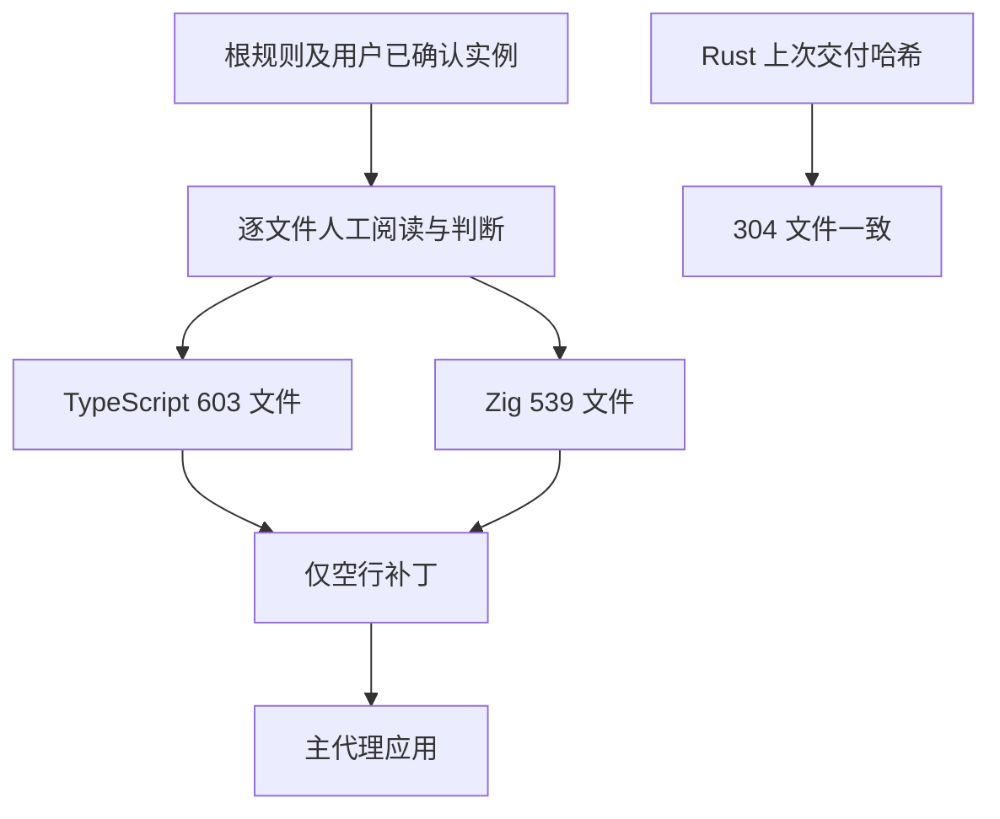
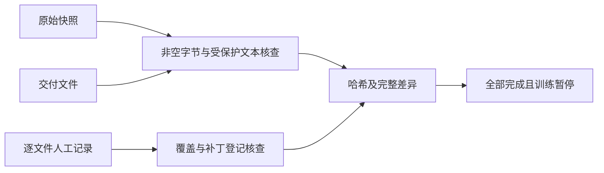

# 剩余 Rust、TypeScript 与 Zig 预处理

## Intent：最终目标

按照根目录 `rules.md`，逐文件人工比较同一层级相邻完整语句的书写形态，只调整空行，完成剩余 Rust、TypeScript 与 Zig 数据集预处理。

## Data：可用证据

| 语言 | 文件数 | 本次调整 | 保留原样 | 本次增加空行 | 本次删除空行 |
| --- | ---: | ---: | ---: | ---: | ---: |
| Rust | 304 | 0 | 304 | 0 | 0 |
| TypeScript | 603 | 258 | 345 | 6,111 | 56 |
| Zig | 539 | 502 | 37 | 39,846 | 845 |

Rust 已在上一批完成，本次再次核对全部交付 SHA-256，无变化、无新增文件。TypeScript 96,235 原始行和 Zig 357,121 原始行均已完整人工阅读。

本批原始快照、固定文件顺序、人工行号决策、分段补丁、已应用补丁清单、完整差异和最终哈希均保存在 `artifacts/ts-zig-preprocess/`。

## Edges：边界与限制

只调整空行；非空行字节、缩进、顺序、行尾、注释及字符串内容保持。人工判断先于补丁转写，脚本仅用于明确行号的机械转写、只读核查及记录生成，不推断留白边界。

没有启动训练、产品模型、格式化器或数据文件中的命令，没有生成或运行测试，也没有调用浏览器。已跟踪文件的修改范围精确等于本次调整的 760 个 TypeScript/Zig 数据文件。

各分段在读取前明确划分，后续转交均发生在未读范围：TypeScript 分为 001–300、301–603；Zig 最终分为 001–099、100–210、211–220、221–245、246–270、271–380、381–399、400–539。全部完成，没有未处理范围。

## Answer：交付与成功标准

- [TypeScript 逐文件交付](TypeScript预处理逐文件交付.md)：603 个文件的行数、调整状态和空行增删。
- [Zig 逐文件交付](Zig预处理逐文件交付.md)：539 个文件的行数、调整状态和空行增删。
- `artifacts/ts-zig-preprocess/最终核查汇总.json`：最终汇总、补丁登记及范围核查。
- `TypeScript核查结果.json` 和 `Zig核查结果.json`：每个文件的原始及交付 SHA-256；Zig 还列出人工审阅证据。
- `TypeScript完整差异.diff` 和 `Zig完整差异.diff`：相对本批原始快照的完整差异。

最终核查全部通过：非空行字节序列及行尾一致；TypeScript 使用 ast-grep 比对 33,977 个注释、字符串、模板字符串及正则 AST 节点，并比较 1,520 个相邻注释间隔；Zig 比较 20,470 个相邻注释间隔和 3,196 个多行字符串间隔，空白字节全部一致。当前 ast-grep 不支持 Zig，因此 Zig 使用字节及行间隔核查，不将其称为 AST 核查。`git diff --check` 通过。

空行统计以相邻非空行间隔为基准，避免重复代码影响差异算法的对齐。两份被紧凑分片取代的原始大补丁，以及没有修改内容的空补丁，均在汇总中单独记录，没有重复应用。

## 自我审查

检查重点是完整语句外侧、多行表达式边界、声明与调用及返回之间的形态变化；相似单行不因语义职责变化而机械拆散。注释示例、数字表和字符串内部保持原样。

字节与受保护文本一致证明本次修改范围受控，不能证明所有留白判断都已完全符合审美。最终保留用户逐文件审核和继续校准的空间，不将机械核查当作审美验收。
