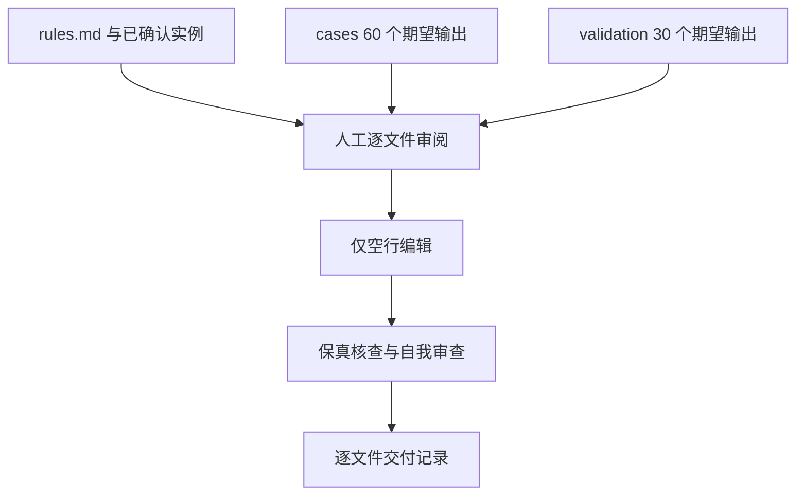
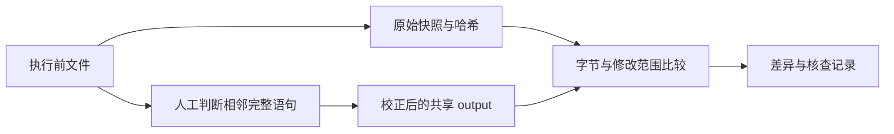

# 评估集预处理计划

## Intent：最终目标

依据根目录 `rules.md`，逐文件阅读并校正 evaluation 中共享期望输出的空行，使相邻完整语句按整体书写形态分组。

## Data：可用证据

- `evaluation/cases`：60 个 output，原始共 678 行。
- `evaluation/validation`：30 个 output，原始共 943 行。
- `rules.md`：用户已确认的形态比较原则及人工判断边界。
- `evaluation/validation/说明.md`：只改空行时无需同步输入；独立验证输出先于模型评估确认。
- 执行前快照与全部 evaluation 文件哈希：`artifacts/evaluation-preprocess-20260914/`。

## Edges：边界与限制

仅修改以上 90 个 output 中需要校正的空行。保留非空行字节、缩进、顺序、行尾、注释内部与字符串内容。dense/spaced 输入、元数据中的首次生成记录、历史预测、训练数据及产品代码保持原样。

逐文件人工决策，自动化仅承担快照、核查及记录生成。不运行模型、训练、格式化器、测试或浏览器。已有工作区修改以本轮开始时的实际内容为基准保留。

## Answer：交付格式与成功标准

交付直接修改的 output、逐文件处理记录及核查结果。90 个文件均须阅读，明确区分调整与保留；确认非空行字节序列一致、输入和元数据不变，并复核表达式内部及注释贴附关系。助手预处理完成仍待用户审美审核，不声称用户已经确认。

### 工作结构

### 数据流

