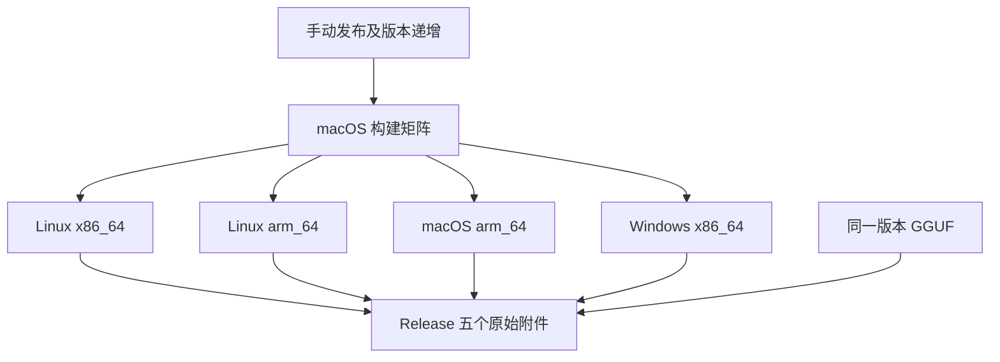
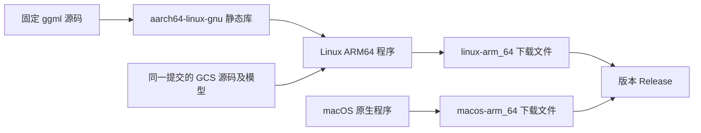

# ARM64 产物命名与 Linux 支持

## Intent：最终目标

将 macOS ARM64 下载文件名统一为 `macos-arm_64`，新增 Linux ARM64 可执行文件 `linux-arm_64`，纳入自动发布流程。

## Data：可用证据

- 现有 macOS 构建运行在 Apple Silicon runner，`macos-aarch64` 是对外命名，不需要改变编译目标。
- Linux ARM64 需要 Zig 的 `aarch64-linux-gnu` 目标，以及面向同一架构的 ggml 静态库。
- 现有交叉构建支持独立依赖目录和 Zig 归档器，可复用。
- Release 脚本使用明确的附件列表，需要同步加入新平台并更名 macOS 附件。
- 开始时工作区存在用户的布局代码及 JSX 文档修改，本次不将这些未提交内容纳入提交。

## Edges：边界与限制

- 对外使用用户指定的 `arm_64`；编译器及 CMake 仍使用规范目标名 `aarch64`。
- Linux ARM64 使用 CPU 后端，不增加新的 GPU 工具链。
- 四个构建任务仍统一运行在 macOS；不新增 Linux 或 Windows 原生验证任务。
- 不新增测试用例，本次通过实际依赖编译、云端构建、文件格式及 Release 附件核对验证。
- 本地保持 `master`，仅提交本次构建、发布脚本及说明文档。

## Answer：交付与成功标准

1. macOS 产物改为 `gcs-v<版本>-macos-arm_64`。
2. 新增 `gcs-v<版本>-linux-arm_64`，使用独立 ggml ARM64 目录。
3. Release 发布前检查四个程序及一个 GGUF，共五个文件。
4. 保留版本自动递增、双分支推送、提交 changelog 和原样下载。
5. 发布新版本并核对 Linux ARM64 为 AArch64 ELF，附件名称和数量正确。

## 架构图

## 数据流图

## 执行记录

- 已更新矩阵、交叉依赖构建和 Release 附件列表；actionlint、Python 语法检查及 Zig 格式检查通过。
- 实际构建和发布结果待补充。

## 自我审查

- 名称变更与编译目标分离，避免将 `arm_64` 直接传给不接受该别名的编译器。
- 新架构独立存放静态库，避免与 Linux x86_64 目标混用。
- 不根据 macOS 上编译成功声称完成了 Linux ARM64 原生运行验证。
