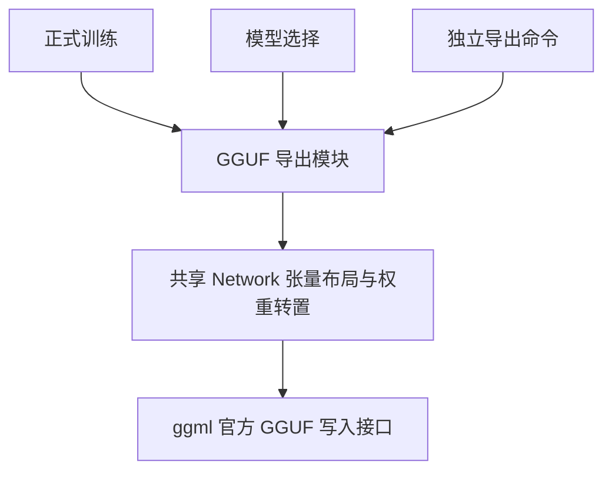
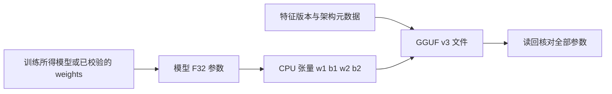

# GGUF 模型同步导出

## Intent：最终目标

保留现有 `.weights` 使用方式，让正式训练和选模同时生成 GGUF 文件，并将当前内嵌模型导出为 `models/spacer.gguf`。

## Data：可用证据

- `src/weights.zig` 保存 GCSPMLP2 文件，包含模型维度、特征版本、F32 参数和校验和。
- `src/ggml.zig` 的 `Network` 已统一张量形状和权重转置，训练与推理共用。
- `tools/train.zig` 输出训练权重；`tools/select_model.zig` 将选中的权重保存到 `models/spacer.weights`。
- 固定依赖中的 `gguf.h` 提供 GGUF v3 官方写入接口。

## Edges：边界与限制

- 不重新训练、不重新选模，不更改当前权重、特征、校准配置或推理入口。
- 导出 F32 参数，不量化，避免改变数值。
- GGUF 使用自定义架构 `gcs_mlp`，保存四个张量及特征版本、层维度和激活函数；不包含可自动执行的计算图。
- 输入仍为项目特征向量；源码预处理和置信度策略仍由项目代码及配置定义。该文件不自动兼容 llama.cpp 或 Ollama。
- 本次不新增测试用例、不做浏览器 UI 检查；使用编译及实际产物读回核对。

## Answer：交付格式与成功标准

1. 新增共享 GGUF 导出模块，复用 `Network.upload` 的张量排列。
2. 正式训练同时保存同名前缀的 `.weights` 和 `.gguf`。
3. 选模同步生成 `models/spacer.gguf`。
4. 提供 `zig build export-gguf`，默认转换当前选定模型，也支持显式输入输出路径。
5. 生成当前模型文件，核对四个张量的维度及全部参数，确认原权重哈希不变。

### 架构图

### 数据流图

## 执行记录

- 已确认仓库中 README 和编辑钩子相关文件存在用户已有改动，修改时保留。
- 新增 `tools/learning/gguf.zig`，通过官方 GGUF 接口写入文件，复用共享 `Network.upload`，没有复制权重转置实现。
- 新增 `tools/export_gguf.zig` 与 `zig build export-gguf`；正式训练、选模均接入同一导出模块。
- `check-tools` 增加选模和独立导出工具的编译检查。
- README 补充默认导出、显式路径和格式边界。

### 验证结果

- `zig build export-gguf -Doptimize=ReleaseSafe`：成功，实际生成 `models/spacer.gguf`。
- `zig build check-tools -Doptimize=ReleaseSafe`：通过，包含修改后的训练、选模和导出工具。
- 使用 Python 标准库独立解析实际 GGUF 文件，核对版本、元数据、维度、F32 类型和张量对齐；按原权重布局逐位比对全部 12,547 个参数，通过。
- GGUF 张量维度（ggml 的第一维连续）：`w1=[192,64]`、`b1=[64]`、`w2=[64,3]`、`b2=[3]`。
- 文件大小：50,848 字节；特征版本：6。
- GGUF SHA-256：`e74cd2fd54ae4a16181f0688772f8ce21f18e7c0901444cdfc19c597c4290288`。
- 原 `.weights` SHA-256 仍为 `2120e1fd52294df6a7b6f41076a46e9964dc980ac2823ededf0773de2334913e`，与现有元数据一致。

## 自我审查

- 导出范围覆盖当前模型和后续正式训练、选模；没有修改合成探针的 ONNX 导出流程。
- 逐位一致证明权重转存没有精度损失；本次未重新训练或执行选模，因此不声称验证了新一轮训练质量或选模结果。
- GGUF 是权重及元数据容器，不是通用可执行计算图。本次交付导出能力，未新增 GGUF 推理加载器。
- 未增加第三方依赖、测试用例或浏览器检查。
