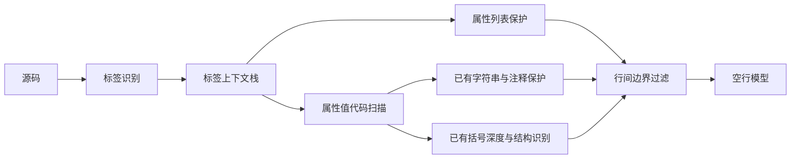
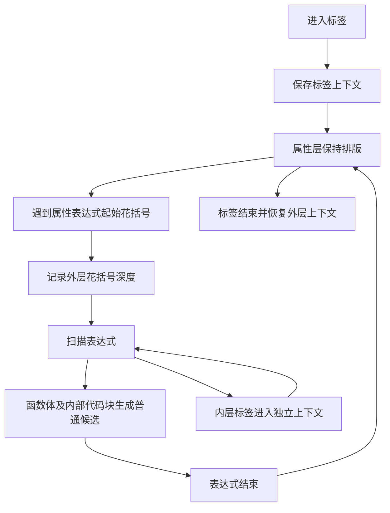

# JSX 属性层与函数体空行处理

## Intent：最终目标

保护 XML/JSX 属性列表的排版，同时允许 JSX 属性值中的多行函数体按普通代码规则处理空行。保护边界取决于语法层级，不依赖具体标签名、属性名或业务用例。

## Data：可用证据

- 用户提供的多行 `button` 属性列表被错误插入空行。
- 用户进一步明确：不能保护整个标签，因为属性值可能包含多行函数。
- 原实现通过 `markup_tail` 跳过整个标签，函数体也被跳过，与澄清后的要求不符。
- 现有扫描器已有引号、注释和代码括号深度；可以复用这些信息恢复函数体扫描。

## Edges：边界与限制

- 属性列表与属性表达式外层保持原有空行；函数体及内部代码块正常生成模型候选。
- 字符串、模板文本和注释继续沿用现有保护。
- 仅调整词法边界；不改模型、训练数据、非空行内容，不清理之前生成的空行。
- 不新增测试用例，不用浏览器；用现有验证工具检查已确认的片段。
- 保留现有标签识别策略及其局限；这不是完整 JSX/XML 解析器。

## Answer：交付格式与成功标准

修改 `src/layout.zig`，将整段跳过改为标签上下文栈。完成格式检查、已有词法保护验证及用户确认片段的边界检查。完整二进制构建与模型样式评估如受环境阻挡，明确记录，不能使用旧二进制替代验证。

### 架构图

### 数据流图

## 执行记录

- `Scanner` 使用动态标签上下文栈，保存结束位置、属性引号和表达式基准深度，支持属性函数内嵌套 JSX。
- 属性字符串逐字扫描，不将字符串里的花括号误当成代码入口。
- 属性表达式复用原来的代码扫描；表达式外层保护，进入内部代码块后恢复候选生成。
- 栈内存随扫描结束释放，分配错误正常向上传递，无固定嵌套层数。
- 初次编译发现 Zig 不允许在结构体字段之间声明嵌套类型，调整声明位置后通过。
- 现有 `verify_guards` 已通过：20 类词法保护、60 个空行变体，词法无损与空行无关特征检查通过。
- `zig fmt --check src/layout.zig src/markup.zig` 与 `git diff --check` 通过。
- 用现有 `inspect_layout` 检查用户确认的回调片段：属性层无候选；函数内第 4 行（声明之后）与第 8 行（if 块之后）恢复候选，现有模型选择一行空行的概率分别约为 0.99999964、0.99998009；函数与 if 的块边缘选择零空行。
- 重新检查用户最初的按钮片段：属性间仍无候选，只有开始标签之后及子节点之后的两处边界。
- 上述检查直接运行现有工具源码，不链接不需要的 ggml/libc++，没有新增测试用例。
- 初次完整构建受本机 `INFINITY` 错误阻挡；后续按用户要求修复本机工具链后，原构建命令已通过，新二进制可用。详见 [Zig 本机头文件兼容修复](Zig本机头文件兼容修复.md)。
- 新二进制通过现有样式集合的 214/214 个断言及 36 次内容保留与幂等检查。

## 自我批判

- 用户澄清揭示初次整段保护方案范围过大，本次用语法层级替代整段跳过。
- 代码块开放遵循括号深度，函数内部沿用普通代码的模型策略；不为特定回调或业务代码添加空行规则。
- 既有标签前瞻识别并非完整 AST；复杂正则字面量、嵌套模板插值、带类型参数的 JSX 标签仍存在识别局限。本次不声称完整语法覆盖。
- 未涉及当前工作区其他任务的发布、构建脚本与 README 修改。
