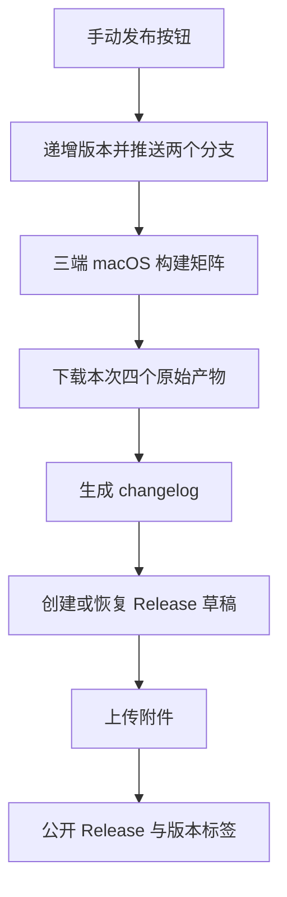
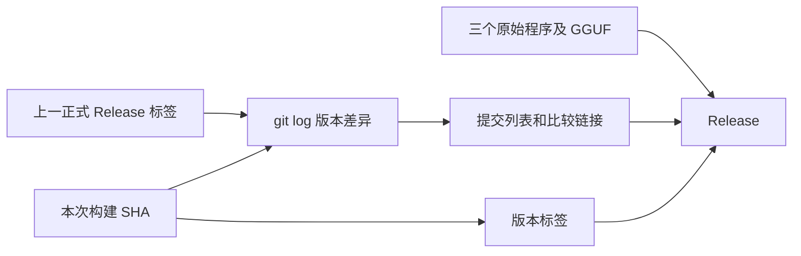

# Release 发布与更新日志

## Intent：最终目标

手动发布流程在三端构建完成后，把原始可执行文件及 GGUF 发布到 GitHub Releases，并自动生成版本之间的提交更新日志。

## Data：可用证据

- 仓库当前没有 Release 或版本标签；已有 Actions 产物尚不构成正式 Release。
- 手动准备阶段已支持递增版本，并将版本提交原子推送到 `master` 和 `build`。
- 三个平台使用同一源码 SHA，产物为三个带版本可执行文件和一个 GGUF。
- 官方 `download-artifact@v8` 支持下载 `upload-artifact@v7` 上传的无压缩文件。
- GitHub CLI 支持指定目标提交创建版本标签和草稿 Release，并分步上传附件、公开发布。

## Edges：边界与限制

- 仅手动发布生成正式 Release；直接推送 `build` 只生成构建产物，避免同一版本被覆盖。
- 所有构建成功才开始发布；草稿上传完整四个附件后才公开。
- 版本标签固定到构建提交，不跟随之后变化的主分支。
- 更新日志采用上一正式 Release 到当前提交的完整 git log，不依赖 PR，保留普通提交及合并提交。
- 首次无旧版本时列出全部提交；后续旧版本必须是当前构建的祖先。
- 已存在标签指向其他提交时停止；草稿可重试，已公开且完整的 Release 不重写。
- 不新增测试用例、不重新引入 Windows 验证任务；本地保持 `master`。

## Answer：交付与成功标准

1. 工作流增加依赖准备与三端构建的 Release 任务，仍运行在 macOS。
2. 下载同一次运行的四个原始产物，检查文件齐全。
3. 自动查询上一正式 Release，生成带提交链接的 changelog 和版本比较链接。
4. 创建或恢复草稿，上传四个文件后公开，并将新版本设为 Latest。
5. 实际手动发布，核对 Release、版本标签、changelog 及四个附件。

## 架构图

## 数据流图

## 执行记录

- 已添加独立发布脚本和工作流发布任务，README 以 Releases 为正式下载入口。
- actionlint、Python 语法和 diff 检查通过。
- 实际云端发布结果待补充。

## 自我审查

- 使用实际提交生成更新日志，避免 GitHub 默认 PR 摘要遗漏直接提交。
- 草稿阶段允许补齐附件，公开后不覆盖文件，避免失败重试改变已经发布的版本。
- 首次发布包含所有历史，与后续按版本差异生成的日志明确区分。
