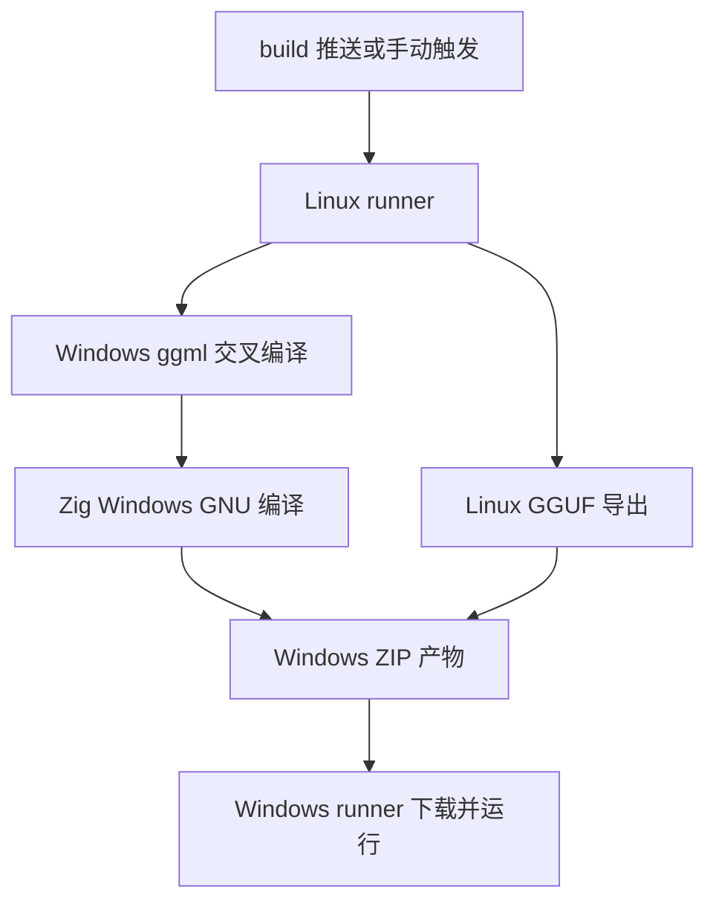
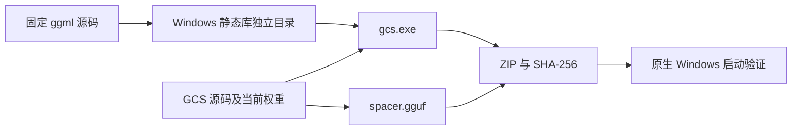

# Windows 交叉打包计划

## Intent：最终目标

在 Linux 上交叉编译 Windows x86_64 的 `gcs.exe`，沿用 `build` 分支推送与手动触发机制，输出包含 GGUF 的 ZIP 包。

## Data：可用证据

- Zig 0.16 支持 `x86_64-windows-gnu` 目标，但 ggml 的静态库也必须面向同一目标编译。
- 当前 bootstrap 已使用 Zig 编译 Linux ggml，可扩展独立 Windows 构建和安装目录。
- 文件选择器依赖 POSIX `fnmatch.h`，Windows 无该接口；现有路径展开假定 Unix 根路径。
- 其他读取、原子写入、权限及硬链接检查使用 Zig 的跨平台 `std.Io`，不提前修改。

## Edges：边界与限制

- 编译与 GGUF 导出在 Linux 完成；Windows runner 只下载并执行构建产物。
- Windows 首先支持 x86_64 CPU 后端，不加入 Windows GPU 或 ARM 构建。
- Unix glob 仍用原有 fnmatch；Windows 使用独立段匹配器，并遵循 Windows 路径分隔规则。
- 不新增测试用例、不打开浏览器检查 UI；验证真实构建产物的启动和模型初始化。

## Answer：交付格式与成功标准

1. bootstrap 新增 `--ggml-windows`，构建固定 ggml 提交的 Windows GNU 静态库。
2. 构建增加 `-Dggml-prefix`，明确选择目标依赖目录。
3. 工作流增加 Linux 执行的 Windows 构建项，上传 ZIP 和校验和。
4. Windows 文件选择器可以编译，普通路径、驱动器绝对路径及 UNC glob 按 Windows 规则解析。
5. Windows runner 下载 ZIP，校验 SHA-256，运行 `--help` 和 `--model-info`；记录实际结果和边界。

## 架构图

## 数据流图

