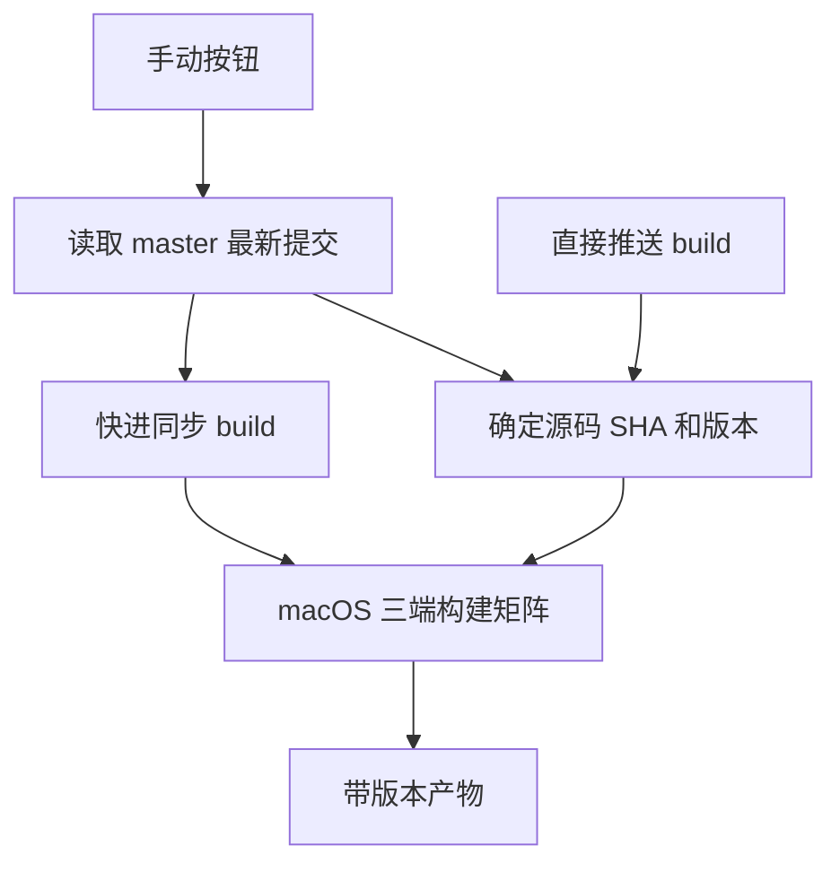
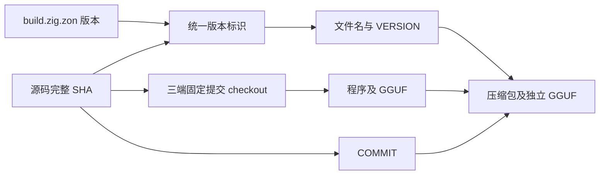

# 主分支同步与版本打包

## Intent：最终目标

本地留在 `master` 开发。用户点击 GitHub Actions 手动按钮后，将主分支最新提交同步到 `build`，并生成带版本的三端程序及 GGUF。

## Data：可用证据

- 开始时本地位于 `build`，已按用户要求立即切回 `master`；两个分支此前指向相同提交。
- `build.zig.zon` 当前包版本为 `0.1.0`，可作为统一版本来源。
- 原工作流直接构建触发分支，无法保证手动运行先同步主分支；原产物名称不包含版本。
- [GitHub 官方说明](https://docs.github.com/en/actions/how-tos/write-workflows/choose-when-workflows-run/trigger-a-workflow)：使用 `GITHUB_TOKEN` 的推送不会再触发 push 工作流，因此手动同步后应在同一次运行中继续构建。

## Edges：边界与限制

- 手动运行从 `master` 读取最新源码；直接推送 `build` 时仍构建该次推送的提交。
- 同步只允许快进，分叉时失败，不强制覆盖独有提交。
- 仅准备任务获得 `contents: write`，三个构建任务保持读取权限。
- 工作流共享并发组，不取消正在进行的构建；每次构建固定完整 SHA，避免跨平台产物来自不同提交。
- 版本号来自现有清单，不自动递增、不创建 Release。内部可执行文件名保持 `gcs` / `gcs.exe`。
- 不新增测试用例，不使用 Windows 验证任务，不切换本地开发分支。

## Answer：交付与成功标准

1. 准备任务读取主分支、版本号和 SHA；手动触发时推送该 SHA 到 `build`。
2. 三端构建全部 checkout 准备任务确定的 SHA。
3. Artifact、压缩包、校验和、独立 GGUF 文件名包含 `v<版本>-<12位提交哈希>`。
4. 包内 `VERSION` 与 `COMMIT` 来自实际构建源码，不使用可能过时的触发事件 SHA。
5. 验证 actionlint 和手动运行，检查远端 build、实际构建 SHA 与产物名称一致。

## 架构图

## 数据流图

## 执行记录

- 本地已切回 `master`，后续仅提交和推送主分支，由手动工作流同步远端 `build`。
- actionlint 和 diff 检查通过。
- [手动运行 34944920879](https://github.com/MatrixAges/gpu-code-spacer/actions/runs/34944920879)全部成功：准备阶段同步 `master` 到 `build`，随后三个平台完成构建及上传。
- 已通过 GitHub API 确认同步后的两个远端引用均为 `61bb93f64121c03288ef21d93f750e278d663826`。
- 本次版本为 `v0.1.0-61bb93f64121`，三个平台 Artifact 和独立 GGUF Artifact 均带此版本。
- 实际下载 macOS 包并通过 SHA-256 检查，包内 `VERSION` 和 `COMMIT` 与文件名及构建提交一致。
- 最后仅在 `master` 补充验证记录，不手动更新 `build`；下次点击按钮时按设计同步当时最新主分支。

## 自我审查

- 手动同步分支和选择构建源码是两个步骤，固定 SHA 才能确保所有产物一致。
- 不依赖机器人推送再次触发工作流，避免同步成功却没有打包的情况。
- 清单版本与提交哈希共同标识产物，同版本的不同提交仍能区分；相同提交重复构建保持同名。
