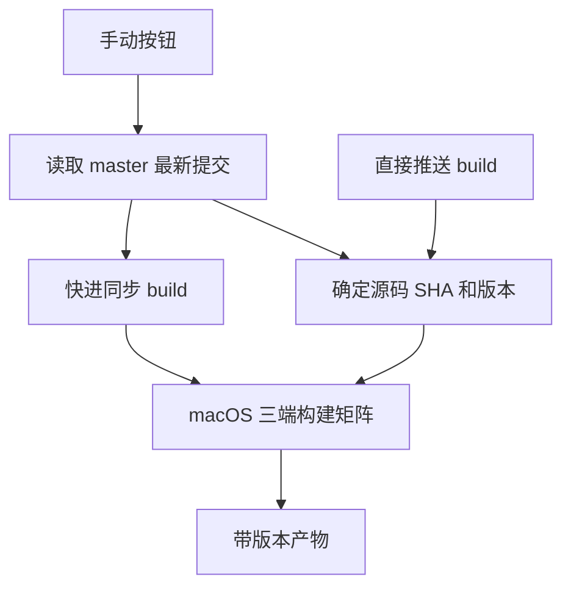
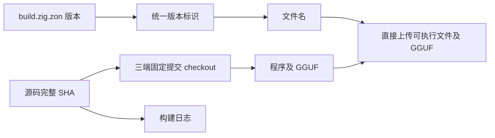

# 主分支同步与版本打包

后续已加入手动按钮自动递增版本并推送两个分支，当前发布流程见[自动递增版本发布](自动递增版本发布.md)。下文保留此前同步与产物格式调整的记录。

## Intent：最终目标

本地留在 `master` 开发。用户点击 GitHub Actions 手动按钮后，将主分支最新提交同步到 `build`，并生成带版本的三端程序及 GGUF。

## Data：可用证据

- 开始时本地位于 `build`，已按用户要求立即切回 `master`；两个分支此前指向相同提交。
- `build.zig.zon` 当前包版本为 `0.1.0`，可作为统一版本来源。
- 原工作流直接构建触发分支，无法保证手动运行先同步主分支；原产物名称不包含版本。
- [GitHub 官方说明](https://docs.github.com/en/actions/how-tos/write-workflows/choose-when-workflows-run/trigger-a-workflow)：使用 `GITHUB_TOKEN` 的推送不会再触发 push 工作流，因此手动同步后应在同一次运行中继续构建。

## Edges：边界与限制

- 手动运行从 `master` 读取最新源码；直接推送 `build` 时仍构建该次推送的提交。
- 同步只允许快进，分叉时失败，不强制覆盖独有提交。
- 仅准备任务获得 `contents: write`，三个构建任务保持读取权限。
- 工作流共享并发组，不取消正在进行的构建；每次构建固定完整 SHA，避免跨平台产物来自不同提交。
- 版本号来自现有清单，不自动递增、不创建 Release。下载文件使用带版本号的可执行文件名。
- 不新增测试用例，不使用 Windows 验证任务，不切换本地开发分支。

## Answer：交付与成功标准

1. 准备任务读取主分支、版本号和 SHA；手动触发时推送该 SHA 到 `build`。
2. 三端构建全部 checkout 准备任务确定的 SHA。
3. Artifact、可执行文件和独立 GGUF 文件名只包含 `v<版本>`，不附加提交哈希。
4. 使用 `archive: false` 直接上传单文件，无 ZIP 或 tar 外壳；完整源码 SHA 记录在准备任务日志中。
5. 验证 actionlint 和手动运行，检查远端 build、实际构建 SHA 与产物名称一致。

## 架构图

## 数据流图

## 执行记录

- 本地已切回 `master`，后续仅提交和推送主分支，由手动工作流同步远端 `build`。
- actionlint 和 diff 检查通过。
- [手动运行 34944920879](https://github.com/MatrixAges/gpu-code-spacer/actions/runs/34944920879)全部成功：准备阶段同步 `master` 到 `build`，随后三个平台完成构建及上传。
- 已通过 GitHub API 确认同步后的两个远端引用均为 `61bb93f64121c03288ef21d93f750e278d663826`。
- 初次验证版本为 `v0.1.0-61bb93f64121`；后续按用户要求去掉提交哈希，当前命名只使用清单版本，例如 `v0.1.0`。
- 实际下载 macOS 包并通过 SHA-256 检查，包内 `VERSION` 和 `COMMIT` 与文件名及构建提交一致。
- 最后仅在 `master` 补充验证记录，不手动更新 `build`；下次点击按钮时按设计同步当时最新主分支。

## 自我审查

- 手动同步分支和选择构建源码是两个步骤，固定 SHA 才能确保所有产物一致。
- 不依赖机器人推送再次触发工作流，避免同步成功却没有打包的情况。
- 产物名称只使用清单版本，同版本的不同运行保持同名，由 Actions 运行记录追溯源码。
- 去除版本哈希后通过 actionlint 和 diff 检查；未重新构建二进制，下次手动运行使用新命名。

## 后续调整：直接下载文件

- 用户要求不压缩，已删除 ZIP、tar 及压缩包附带文件的生成步骤。
- 已确认 `actions/upload-artifact@v7` 的 `archive: false` 支持单文件原样上传，避免 Actions 再次套 ZIP；此模式直接使用文件名作为 Artifact 名称。
- 输出三个带清单版本的可执行文件及 `spacer-v<版本>.gguf`，不附加提交哈希。
- README 补充 macOS/Linux 下载后设置执行权限的命令。
- actionlint 和 diff 检查通过。[运行 34946113171](https://github.com/MatrixAges/gpu-code-spacer/actions/runs/34946113171)成功同步主分支并完成三端构建和原样上传。
- 产物为 `gcs-v0.1.0-linux-x86_64`、`gcs-v0.1.0-macos-aarch64`、`gcs-v0.1.0-windows-x86_64.exe` 和 `spacer-v0.1.0.gguf`。
- 实际下载 macOS Artifact，`file` 确认为 `Mach-O 64-bit executable arm64`，没有 ZIP 外壳；GGUF 上传大小为 50,848 字节，与原始模型大小一致。
