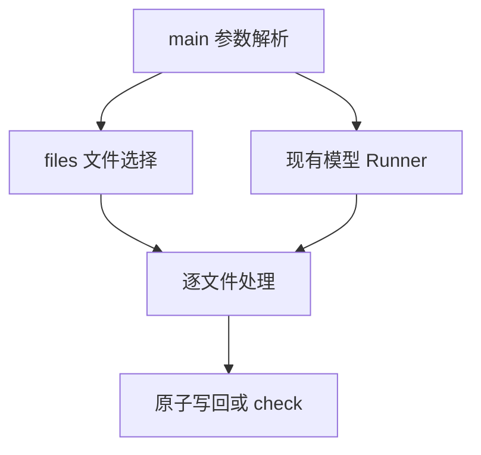

# gcs 命令行执行计划

## Intent：最终目标

提供 `gcs -p <目录> [-r]` 和 `gcs -f <文件或 glob>...`，原地美化选定代码文件，复用现有留白模型。

## Data：可用证据

- 项目使用 Zig 0.16；现有入口支持 stdin、单文件、check 和原子写回。
- 当前默认配置是特征 v5，源码要求 v6；已有可显式指定的 v6 候选。
- 工作区开始时无未提交修改。

## Edges：边界与限制

- 不改变模型算法，不生成测试用例，不调用浏览器。
- 目录模式按常见代码扩展名筛选；显式文件和 glob 接受任意扩展名。
- 目录扫描跳过隐藏目录和常见依赖、构建目录；不跟随目录符号链接。
- glob 支持 `*`、`?`、`[]` 和独立路径段 `**`；不增加 brace/extglob 语法。
- 保留原来的 stdin、位置文件、check、write、confidence、stats、model-info。
- 用户已指定任务 01a0a2cb-e903-7842-936a-234474474f85 的 100% 回归模型：v6-2026-standard、置信度 0；同步其权重、配置和记录。

## Answer：交付与成功标准

- 可执行文件命名为 gcs；更新 README 使用说明。
- 分离文件选择与模型处理；重复路径仅处理一次。
- 完成编译、帮助和参数检查；按用户要求不新增测试用例。
- 记录已完成验证及默认模型限制。

## 架构图

## 数据流图

