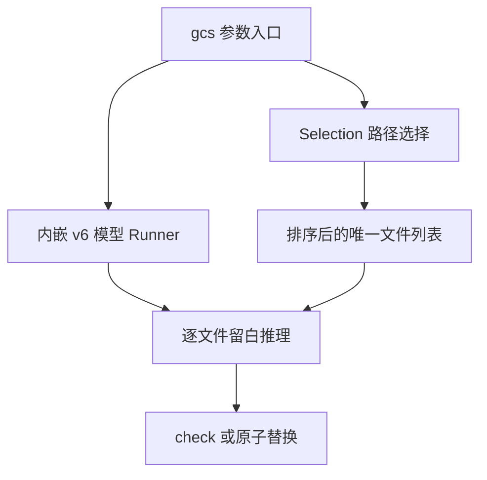

# gcs 命令行执行记录

本文使用 IDEA 框架。

## Intent：最终目标

交付 `gcs -p <目录> [-r]`、`gcs -f <文件或 glob>...`，默认原地写回，并内嵌用户明确指定的 100% 回归模型。

## Data：实现与证据

### 实现

- `build.zig`：应用产物改名为 `gcs`。
- `src/main.zig`：解析目录、递归、多个文件参数；复用一次模型初始化，逐文件分配和释放内存，保留原子写回与旧管道接口。
- `src/files.zig`：目录筛选、分段 glob、路径规范化与去重。普通段用系统 POSIX fnmatch，独立 `**` 段递归遍历。
- README：构建与 PATH 用法、原地修改语义、glob 和扫描边界。
- `models`：同步指定权重、校准配置、训练报告与可追溯元数据。

### 模型确认

用户指定任务「调整模型处理并提升评估结果」（01a0a2cb-e903-7842-936a-234474474f85）中达到 100% 的版本。

- 来源：`artifacts/v6-2026-standard.weights`。
- 特征版本：6；置信度：0；参数：12,547；权重文件：50,244 字节。
- SHA-256：`2120e1fd52294df6a7b6f41076a46e9964dc980ac2823ededf0773de2334913e`。
- 以任务记录和已有最终报告确认身份，而非按权重文件修改时间猜测。
- 未采用后续 v17 实验权重；没有更改推理核心或重新训练。

### 实际验证

- `zig build -Doptimize=ReleaseSmall` 通过。
- `gcs --help`、`gcs --model-info` 正常；后者确认上述哈希、v6、置信度 0，实际使用 Apple M5 Metal 后端。
- 运行现有 `tools/evaluate_dataset.py`，结果如下。报告位于 `evaluation/artifacts/gcs-cli-20260915/report.json`。

| 集合 | 完整输出一致 | 非空行保持 | 重复执行不变 |
| --- | --- | --- | --- |
| cases | 60/60 | 60/60 | 60/60 |
| validation | 30/30 | 30/30 | 30/30 |

- 用现有 cases 的临时副本验证 CLI，未新增测试用例或修改评估原件：
  - 不递归的案例根目录处理 0 个文件，单个案例目录处理 2 个代码文件。
  - `**/inpu?.[a-z]*` 处理 60 个输入文件，写回结果逐字节等于现有 output。
  - 递归 `--check` 处理 120 个代码文件，返回 0。
  - 同一个文件传两遍只处理一次。
  - 缺少参数、无匹配 glob、冲突目标、无目录的 `-r`、NaN 置信度均返回 2。
- 核查发现并修复：macOS `/var` 为系统别名，显式 glob 前缀需要正常解析它；wildcard 遍历仍只进入目录条目，不跟随扫描发现的符号链接。
- `git diff --check` 通过。

## Edges：边界与限制

- 美化仍仅调整空行，不改变已有非空行内容或缩进，不负责长行折行。
- 100% 是用户指定的、已修订且缩小语法覆盖的 90 个回归案例得分，不能推导任意代码都正确。
- 目录模式按已列出的常见代码扩展名选择；显式文件模式接受任意扩展名。扫描排除项见 README。
- glob 依赖现有 macOS/Linux POSIX libc，不增加 Windows 支持声明；不支持 brace/extglob。
- 批处理每个文件独立原子写回，整个批次不构成事务；后续文件失败不会回滚之前成功写回的文件。
- 未安装到系统目录或改写 shell 配置；构建结果位于 `zig-out/bin/gcs`，README 给出当前终端 PATH 命令。

## Answer：交付与成功标准

所需命令已实现并构建，指定模型已成为默认。目录、递归、glob、去重及现有模型回归均已核查。变更未提交。

## 架构图

## 数据流图

## 自我审查

本次将文件选择与模型能力分开，扩展名只用于目录选择，没有进入模型或用于针对样例改变结果。默认模型曾失配，现已按用户提供的任务证据同步，而非修改版本号绕过校验。编译通过之外，实际复用了既有评估与文件副本验证写回；没有将旧任务的 100% 直接当作新二进制已验证。全量回归运行后只修正 glob 的显式目录前缀解析，并再次验证实际批处理写回，没有修改推理逻辑。
