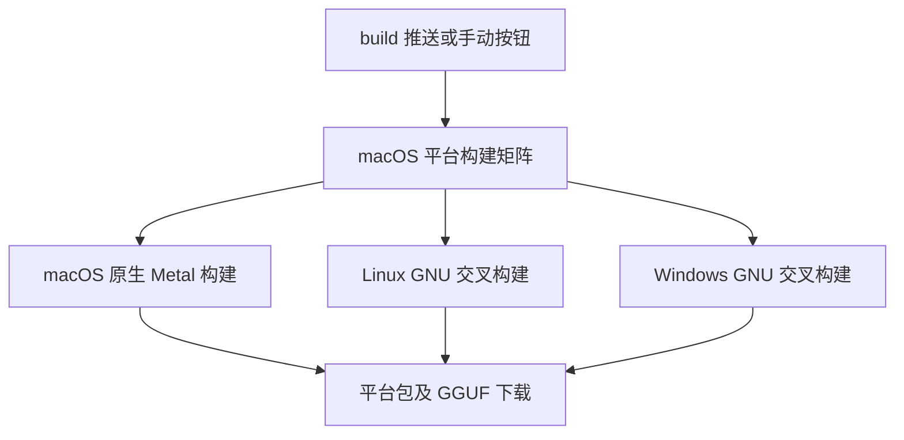
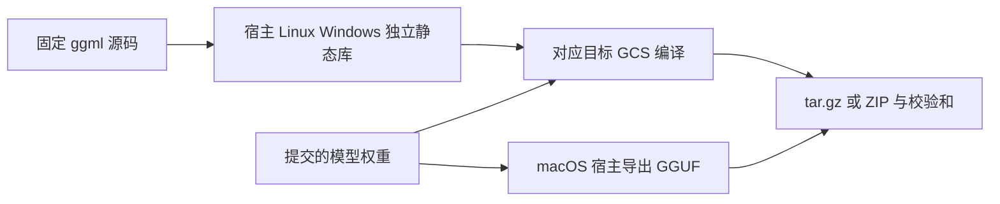

# 统一平台打包

## Intent：最终目标

按用户选择，将 Linux、macOS、Windows 三个构建任务统一到 macOS 平台，并删除 `verify-windows`。

## Data：可用证据

- macOS 原生构建可使用 Apple SDK 和 Metal，现有 Windows 交叉构建已在本机 macOS 编译成功。
- Linux 和 Windows 的 ggml C/C++ 库需要分别编译为目标格式，不能复用宿主静态库。
- 已有 `-Dggml-prefix` 支持独立依赖目录，Zig 归档规则可以用于 COFF 和 ELF 对象。
- 用户明确选择 macOS 统一构建，并明确不需要 Windows 验证任务。

## Edges：边界与限制

- 同一种平台上的三个独立并行任务，不是单台机器同时执行三个编译进程。
- macOS 保留 Metal；Linux x86_64 和 Windows x86_64 使用 CPU。
- 不使用 Linux 或 Windows runner；仅在 CI 中执行 macOS 原生程序。
- 不新增测试用例、不做浏览器 UI 检查；编译通过与目标系统运行通过分别陈述。

## Answer：实现与成功标准

1. 所有矩阵项统一使用 `macos-15`。
2. 增加 `--ggml-linux`，与 Windows 路径共用交叉编译及归档配置。
3. 三个目标依赖目录独立，GGUF 使用宿主工具导出。
4. 删除 `verify-windows`，保留下载产物名称、格式和两种触发入口。
5. actionlint、格式检查和云端三端打包通过；明确交叉产物没有进行本次目标系统运行验证。

## 架构图

## 数据流图

## 执行记录

- 已移除 Windows 验证任务，并更新 README 的当前构建方式和历史验证边界。
- 本机 macOS 完成 Linux ggml 和 GCS 的交叉编译；`file` 确认为 x86-64 ELF，使用 Linux 动态加载器，未误用 macOS Mach-O 格式。
- actionlint、Zig 格式检查及 diff 检查通过。
- [GitHub Actions 运行 34943874484](https://github.com/MatrixAges/gpu-code-spacer/actions/runs/34943874484)成功，验证提交为 `f6809df`。
- macOS 原生、Linux GNU 交叉、Windows GNU 交叉三个任务全部通过，均使用 `macos-15`。
- 三个平台包及独立 GGUF 均已上传；工作流中不存在 Windows 验证任务。
- 仅执行 macOS 原生启动检查；没有运行本次生成的 Linux 或 Windows 二进制。
- 最后仅补充验证结果，提交标记 `[skip ci]`，避免文档更新重复触发打包。

## 自我审查

- 保留当前架构和产物命名，不新增 Release、训练流程或 SDK 分发步骤。
- 矩阵运行在同一种操作系统，独立任务之间不会覆盖依赖或输出。
- 先前 Windows 原生运行成功仅作为历史证据，不替代本次交叉产物的目标系统验证。
