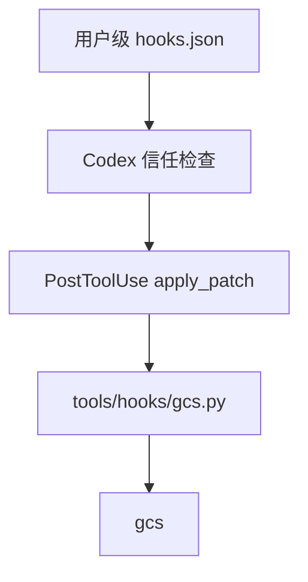

# 编辑钩子接入记录

本文采用 IDEA 框架。

## Intent：最终目标

Codex 每次完成标准补丁编辑后，自动对本次修改的代码文件批量调用 gcs。

## Data：交付与核查

- 本机 CLI：0.153.4；`codex features list` 显示 hooks stable true。
- 官方依据：[Hooks](https://learn.chatgpt.com/docs/hooks)。PostToolUse 可匹配 apply_patch，hook 接收 stdin JSON；用户级 hooks 在首次运行前需要信任。
- 已写入用户级 `/Users/xiewendao/.codex/hooks.json`；此前不存在该文件，没有覆盖已有 hook。
- 适配脚本：`tools/hooks/gcs.py`；通过绝对路径引用，执行器为 `/usr/bin/python3`。
- 格式化程序：`/Users/xiewendao/Documents/Projects/gpu-code-spacer/zig-out/bin/gcs`。
- 匹配规则：`^apply_patch$`；同步执行，hook 超时 120 秒，gcs 子进程超时 110 秒。
- 从成功的补丁事件中提取 Add/Update/Move 路径，筛选代码扩展名并去重，一次调用 gcs。
- 对 glob 元字符转义，确保 Next.js 等项目的 `[id]` 路径按字面文件名处理。
- 成功和失败都会通过 additionalContext 反馈给 Codex；成功后提示继续编辑前按需重读文件。

### 核查结果

- Python 语法编译通过，hooks JSON 可解析，`git diff --check` 通过。
- 使用两个既有 evaluation 输入文件的临时副本，模拟官方事件字段，调用真实适配脚本和 gcs。
- 两个文件均逐字节匹配已有期望 output；同时验证路径空格和方括号处理。
- 未增加测试用例，未修改评估原件，未调用浏览器 UI。
- 尚未宣称 Codex 真实事件已自动触发：这一步需要用户先完成 hook 信任。

## Edges：边界与限制

- 配置为用户级，对加载该用户配置的本地 Codex 任务适用。
- 当前覆盖标准 apply_patch 路径；不解析任意 shell、Python 或第三方文件工具产生的修改。
- 批量指一次补丁涉及的文件；每个补丁完成后同步执行，不延迟到整个任务结束。
- 不扫描仓库全部文件，不依赖 Git；非代码、删除和最终文件符号链接不处理。
- 成功识别依赖 apply_patch 的标准成功输出；未识别到成功标记时不格式化。
- 扩展名列表对应 src/files.zig；未来新增语言后缀需要同步。
- 脚本和二进制使用项目绝对路径；移动或删除项目后需更新 hooks.json。
- 并行任务仍可能编辑同一文件；沿用 gcs 的内容变化检查，批次不提供全局事务。

## Answer：启用和管理

配置与脚本已准备完成。最后由用户在 Codex CLI 的 `/hooks` 中审核并信任这条 PostToolUse hook；如果当前会话未加载新增配置，重新打开会话后再执行 `/hooks`。

这是官方运行时要求，而非额外设定的审批流程：官方原文为 “Before a non-managed hook can run, Codex requires you to review and trust the exact hook definition.” 本次未修改信任数据库，也未使用绕过信任的启动参数。

禁用时可在 `/hooks` 中停用该 hook，或从用户 hooks.json 移除对应条目。其他 hooks 不受影响。

## 架构图

## 数据流图

## 自我审查

配置完成和实际触发是两个不同结论。当前验证覆盖适配器与真实 gcs 的组合，未绕过用户信任流程来伪造端到端成功。将支持范围明确限定到 apply_patch，避免声称任意文件修改都会被捕获。选择同步处理使 Codex 在下一步编辑之前能获知空行已变化，代价是每次补丁都需启动 gcs；当前保持实现简单，不增加后台队列或文件监听器。
