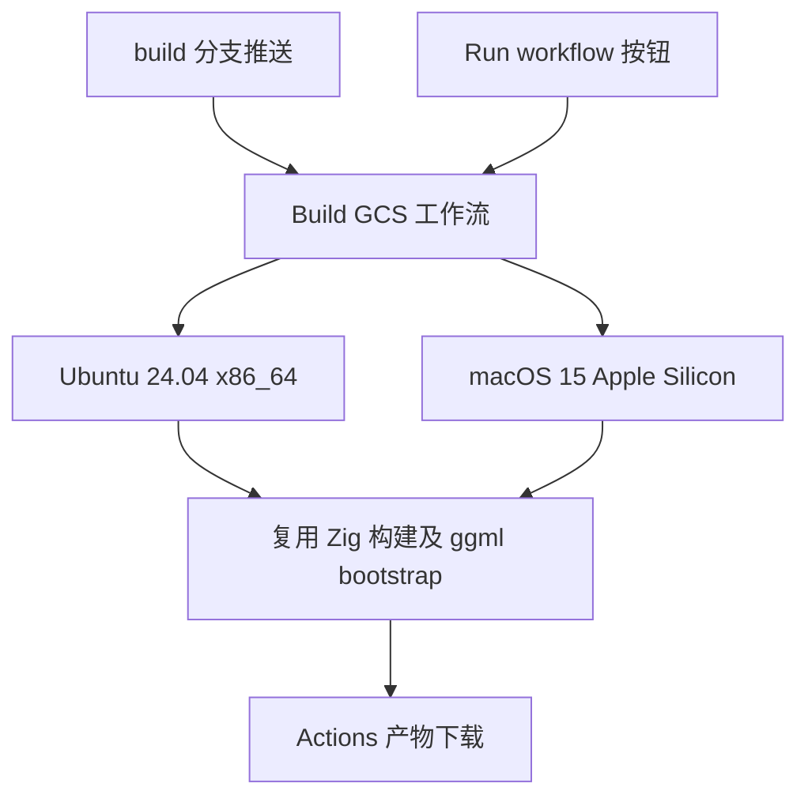
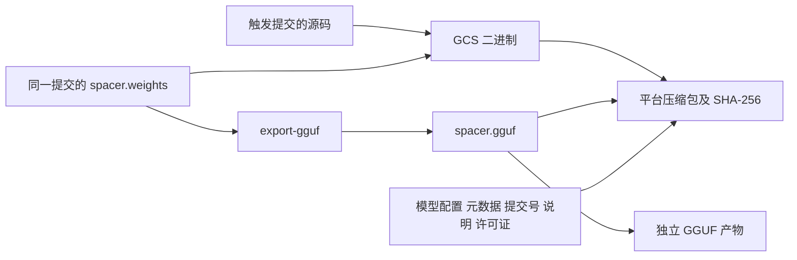

# 自动打包执行计划

## Intent：最终目标

新增远端 `build` 分支，更新时自动运行 GitHub Actions，并支持网页按钮触发，下载 GCS 二进制及当前模型的 GGUF。

## Data：可用证据

- 仓库默认分支为 `master`，开始时工作区干净，本地与远端一致，没有现有工作流或 `build` 分支。
- `build.zig.zon` 指定 Zig 0.16.0；`zig build bootstrap -- --ggml` 构建固定提交的 ggml。
- `zig build` 内嵌 `models/spacer.weights` 和校准配置；`export-gguf` 可以显式指定输入输出。
- 现有后端实现支持 macOS Metal 和 Linux CPU，本地验证环境为 Apple Silicon。
- [GitHub 官方说明](https://docs.github.com/en/actions/how-tos/manage-workflow-runs/manually-run-a-workflow)：手动按钮要求工作流位于默认分支。

## Edges：边界与限制

- 仅添加工作流及说明，不修改训练、推理和模型文件，不新增测试用例、不做浏览器 UI 验证。
- 首批产物覆盖 macOS Apple Silicon 和 Linux x86_64；不扩展 Windows 或 Linux GPU 工具链。
- 使用 Actions artifacts 保存 30 天，不创建 Release。
- 推送只监听 `build`，手动执行构建界面所选分支。
- 工作流同步到 `master`，不更改默认分支；远端更新不使用强制推送。

## Answer：交付格式与成功标准

1. 新增 `.github/workflows/build.yml`，支持两种触发方式。
2. 使用固定 Zig 版本、已有 ggml bootstrap 和 GGUF 导出命令。
3. 每个平台上传保留执行权限的压缩包与校验和，并单独上传 GGUF。
4. 本地实际构建和导出，检查工作流语法，再推送并检查云端执行情况。
5. README 说明下载及手动触发方式，执行记录明确验证结果和限制。

## 架构图

## 数据流图

