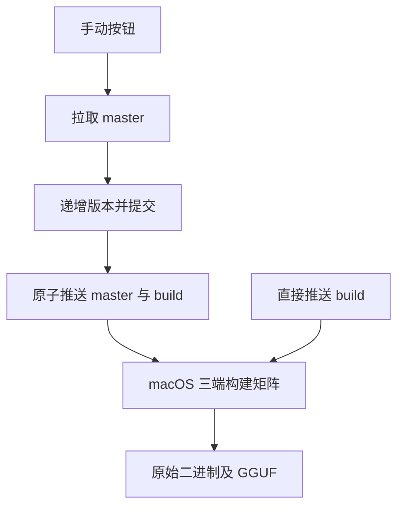
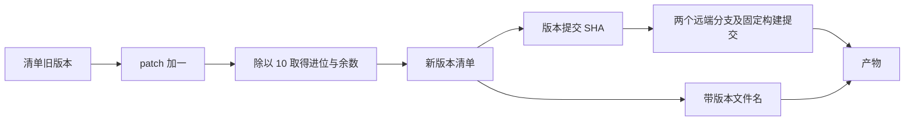

# 自动递增版本发布

## Intent：最终目标

用户点击现有 GitHub Actions 手动按钮后，自动递增版本、提交到 `master` 和 `build`，再生成三端可执行文件及 GGUF。

## Data：可用证据

- 版本源为 `build.zig.zon` 的 `.version`，当前值为 `0.1.0`。
- 现有准备任务能够读取最新主分支、推送 `build` 并将源码 SHA 传给三个构建任务。
- 用户指定低位超过 9 向高位进位，因此采用自定义十进位递增规则，而非无限增加 patch。
- 已有 `GITHUB_TOKEN` 写权限可推送；机器人推送不会再次触发 push 工作流，避免重复构建或递增。

## Edges：边界与限制

- 仅手动运行的准备阶段递增版本；直接推送 `build` 时不递增。
- patch、minor 范围为 0–9，major 不限制位数；版本清单必须是三个数字组成的版本。
- 使用整数除法和余数计算进位，不硬编码特殊版本。
- 对 `master`、`build` 使用非强制原子推送；任何一端拒绝快进，则两个分支都不更新。
- 版本提交先于构建。后续构建失败不回滚版本；仅重跑失败构建任务可复用该版本，重新运行全部准备阶段则再次递增。
- 保留 macOS 统一构建、原始文件下载及无哈希后缀；不引入 Release、标签或新的验证任务。
- 本地开发保持 `master`；远端自动提交版本后需要快进拉取。

## Answer：实现与成功标准

1. 手动准备任务从最新 `master` 读取版本并加一。
2. 示例：`0.0.8 → 0.0.9 → 0.1.0`，`0.9.9 → 1.0.0`，`9.9.9 → 10.0.0`。
3. 只提交版本清单，将同一个新提交原子推送到两个分支。
4. 三端 checkout 新版本提交，产物命名使用新版本。
5. 实际执行一次手动流程，核对远端引用、版本清单及上传产物名称；不新增测试用例。

## 架构图

## 数据流图

## 执行记录

- 工作流已接入版本提交和原子推送，actionlint 与 diff 检查通过。
- 未新增测试用例。[手动运行 34948412737](https://github.com/MatrixAges/gpu-code-spacer/actions/runs/34948412737)的准备阶段及三端构建全部成功。
- 版本由 `0.1.0` 自动递增为 `0.1.1`，机器人提交为 `c8379ccd7f6256347b494ee73193e724f9315824`，仅修改版本清单。
- GitHub API 确认自动推送后 `master` 与 `build` 均指向该版本提交。
- 已上传 `gcs-v0.1.1-linux-x86_64`、`gcs-v0.1.1-macos-aarch64`、`gcs-v0.1.1-windows-x86_64.exe` 和 `spacer-v0.1.1.gguf`，仍为无压缩、无哈希后缀的原始文件。
- 本地保持 `master`，已快进拉取机器人版本提交；后续仅在主分支补充本记录。

## 自我审查

- 三个平台共用一个准备任务，避免各自递增出三个版本。
- 推送两个引用与后续构建有明确依赖，任一分支推送失败就停止构建。
- 保留清单版本为唯一版本源，构建版本从新提交读取，不使用旧事件 SHA。
