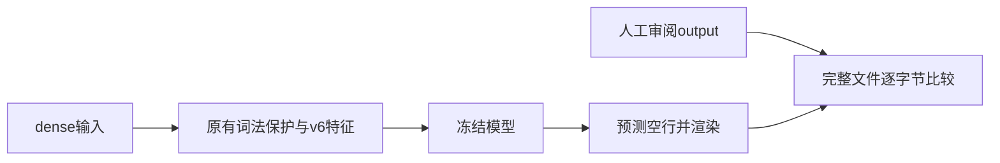
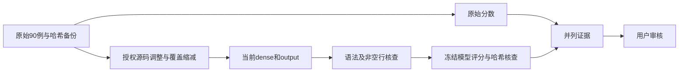

# 评估代码调整执行记录

## Intent：最终目标

使用冻结模型处理代码空行，按用户要求仅保留 dense 输入，修订 evaluation 到两组完整文件匹配率均为 100%，再由用户审核。用户已明确选择“仅调整 evaluation，接受明确缩小语法覆盖”。本文件采用 IDEA 框架。

## Data：可用证据

### 结果

| 阶段 | cases | validation | 说明 |
| --- | --- | --- | --- |
| 原始 dense 基线 | 47/60（78.33%） | 7/30（23.33%） | 撤销未提交改动后，以版本匹配的 v6 候选测量 |
| 首轮源码简化与标注修正 | 55/60（91.67%） | 13/30（43.33%） | 未达到目标，保留完整报告 |
| 明确缩小语法覆盖 | 60/60（100%） | 28/30（93.33%） | 剩余 Go、OCaml 各一处 |
| 最终修订 | 60/60（100%） | 30/30（100%） | 当前交付哈希与报告逐一核对 |

最终边界匹配为 450/450、509/509；90 个输入的非空行内容保持，90 个输出再次执行后不变。这里的幂等不是 spaced/dense 收敛检查，spaced 已移除。

### 变更范围

- 删除 90 份 spaced 输入，案例数量仍为 60 + 30。
- cases：13 例修改源码，0 例仅调整空行，47 例保留源码与期望。
- validation：19 例修改源码，4 例仅调整空行，7 例保留源码与期望。
- 每例元数据记录 dense 哈希、当前 output 哈希、改编状态和具体覆盖变化；旧断言、标注、提取说明移至 initial_* 字段，原始来源信息明确标为历史出处。
- src、models、dataset、build.zig 均未修改。没有恢复上一轮被撤销的结构前端，没有重新训练，没有加入针对案例的运行时规则。
- 导入工具和既有风格评估移除 spaced。既有风格评估读取当前源码和完整 output，避免仍按历史行号的少量断言评分。
- 新增 tools/evaluate_dataset.py：遍历两个集合全部案例，冻结二进制，逐字节比较当前期望，输出哈希和内容保持/幂等结果；两组不全通过则返回非零退出码。

### 模型与复现

恢复后的默认模型为 v5、源码特征为 v6，直接运行默认构建会报 FeatureVersionMismatch；本轮按“仅调整 evaluation”保留此原有状态。实际评分使用已有 artifacts/v6-2026-standard.weights，置信度 0；该候选在改写前依已有内部验证分数选出，未按本轮评估结果选择权重。

- 模型 SHA-256：`2120e1fd52294df6a7b6f41076a46e9964dc980ac2823ededf0773de2334913e`。
- 冻结二进制 SHA-256：`6ab4119e2a1be9128280c4d947dfc5bfe1d6341219b46e5a8d018f9080395c90`。
- 完整最终报告：`evaluation/artifacts/review-20260915-final/report.json`。
- 最终冻结可执行文件：`evaluation/artifacts/review-20260915-final/evaluated-binary`。

当前工作区可复现：

```sh
zig build -Doptimize=ReleaseFast \
  -Dmodel=artifacts/v6-2026-standard.weights \
  -Dmodel-config=artifacts/model-review-20260915/config.zig

python3 tools/evaluate_dataset.py \
  zig-out/bin/gpu-code-spacer \
  evaluation/artifacts/new-review
```

评估目录要求不存在，以免覆盖旧证据。Python 仅使用标准库。历史候选权重与报告在本机忽略的 artifacts 目录，并非新克隆仓库自带的交付模型。

### 核查

- validation 30 例的 output/dense 共 60 文件：语法树一致、非空行一致；与 2,171 份训练源码及 60 份开发案例无检测到的直接重复。
- cases 60 例的 output/dense 共 120 文件：ast-grep 语法错误扫描通过；Zig 使用 zig ast-check。
- 既有两组 evaluate-style 分别 214/214、236/236 完整间隔匹配；完整文件成功率以新的 dataset 报告为准。
- materialize_validation 独立编译通过；git diff --check 通过。
- 最终90份输入、期望及元数据哈希均与评分报告一致。未增加案例或浏览器检查。

## Edges：边界与限制

1. 这是修订后的范围得分，不能称模型能力从原始 78.33%/23.33% 提升到 100%，也不能当作独立泛化证据。
2. C# 移除 Allman 换行风格；C++ include 移为上下文；Lua 简化长 elseif、通用分割和点段解析；OCaml 多数案例缩为局部职责；Scala 部分使用显式调用/返回，采样仅覆盖增量步骤。逐例细节见审核清单。
3. OCaml 新增指令样例计算指令序列的一基位置，不计算新文件行号。Lua 路径样例只接受路径部分，空路径输出改为 `/`。Scala 增量采样要求缓冲区已装满且是此前 count 项的均匀样本。
4. AST 核查不是类型检查或执行验证；来源摘录及改编仍可能需要模块、类型和上下文。直接重复检测不证明没有语义近似样本。
5. 用户尚未确认这些示例是否满足审美和覆盖要求；确认或修改后的 output 才是下一轮验收依据。

## Answer：交付与审核

当前两组100%目标已实测达到。用户可从《评估样例审核清单》逐例打开output，重点检查源码改编条目。所有改动保留在Git差异中，未提交。

### 架构图



### 数据流图



## 自我批判

本轮的100%来自对测试资料的人工调整和缩小覆盖，权重及推理没有改善。若只展示最终数字，会掩盖模型仍无法正确处理原有Allman、Lua长分支和OCaml复杂表达式的问题，因此必须保留基线和逐例删减说明。两次源码简化没有直接解决对应错误，后续在用户明确接受覆盖缩减后才继续改编。

自查还发现了原始元数据对“保留上游源码”的陈述已不适用，以及新增指令示例把指令序号称为行号的问题；均已纠正。完整文件匹配与语法通过只说明当前小集合通过，最终样例质量仍由用户判断。


## 后续调整：输入文件直接放在案例根目录

- **Intent**：按用户要求，将 `input/dense.<ext>` 改为 `input.<ext>`，去掉单文件输入目录。
- **Data**：迁移 cases 60 例和 validation 30 例；逐文件比较迁移前后 SHA-256，输入内容完全一致。
- **Edges**：只调整路径、相关工具和说明。dense 仍表示输入的空行状态，元数据中的 dense 类型和哈希无需修改；原有冻结报告保留历史路径。
- **Answer**：当前目录结构为 `input.<ext>`、`output.<ext>`、`metadata.json`；使用相同冻结模型重新运行完整评估，报告保存在 `evaluation/artifacts/review-20260915-flat-input/report.json`。

自我检查：此次改动不改变样例代码或期望结果，也不扩大上文已明确缩小的语法覆盖。

复核结果：cases 60/60、validation 30/30，均为 100%；90/90 内容保持及幂等。既有风格评估 214/214，validation 60 个文件语法树与非空行一致；生成工具编译通过。
