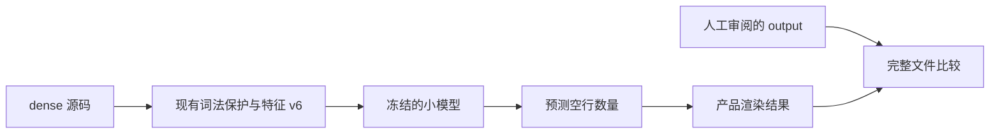
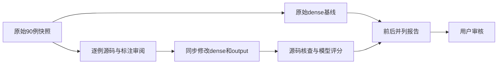

# 评估代码调整计划

## Intent：最终目标

根据用户明确授权调整 evaluation 示例源码，由产品模型处理空行，结果交由用户审核。按用户最新决定移除 spaced，只保留 dense 输入。本文采用 IDEA 框架。

## Data：可用证据

- 工作区从 de326c9 恢复，前一轮未提交的模型和结构改动已撤销。
- 该提交的源码特征 v6、默认权重 v5 不匹配，因此使用已有 v6-2026-standard 候选隔离构建。候选在查看本轮修改前，按已有内部验证分数选定，置信度为零。
- 原始 dense 基线：cases 47/60（78.33%），validation 7/30（23.33%）。对应二进制和完整报告已冻结。
- 原始评估源码及哈希备份在 artifacts/evaluation-review-20260915；原始 90 个案例目录保留。

## Edges：边界与限制

- 用户授权包括非空行源码改写；本轮可用更直接的表达方式调整示例，但需逐例记录理由、行为和覆盖变化。
- 期望布局由逐例阅读和 rules.md 确定，不批量用预测覆盖期望。
- 不将 evaluation 用于梯度训练，不修改模型决策为格式规则，不加入案例名称或路径匹配。
- 删除 spaced 仅改变输入场景，不能宣称模型已具备修复过疏输入的能力。
- 调整后的结果只代表修订评估集，不是原始集或独立泛化分数。validation 已用于开发反馈，说明和元数据同步标记。
- 不新增测试案例，不调用浏览器；复用现有案例进行评分及源码保真、语法核查。

## Answer：交付与成功标准

1. 60 个 cases、30 个 validation，均仅包含 dense 输入和独立期望 output。
2. 用户随后将目标提高为 100%：两组完整文件逐字节匹配必须分别为 60/60、30/30；边界正确率单独报告。此前的 >95% 门槛已不再作为本轮成功标准。
3. 输入与期望的非空行一致，产品输出保留内容，检查幂等和源码语法。
4. 交付具体源码差异、逐例修改理由、原始与修订结果、剩余失败；用户最终确认质量。

### 架构图

### 数据流图

## 自我审查要求

不能将测试资料调整解释成模型能力提高。原始报告和所有未通过项须保留；代码简化若移除某种语法覆盖，应明确说明，不能靠改名、无意义重排或缩减分母掩盖错误。
