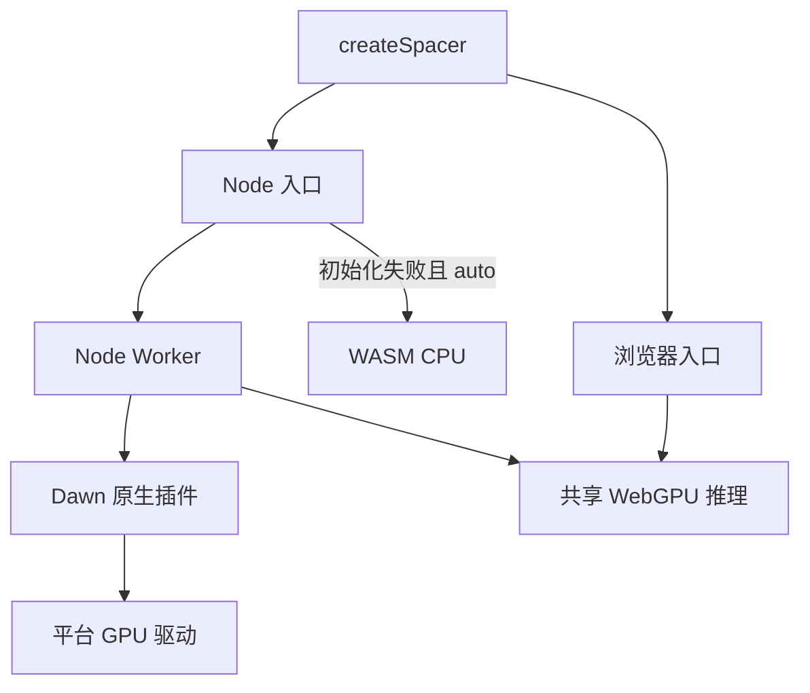

# Node 原生 GPU 与自动发布执行计划

## Intent：最终目标

Node 用户安装 npm 包后自动获得可用 GPU 推理；保留浏览器实现和现有异步 API。
npm 新版本随 Build GCS 的正式发布构建，通过 Trusted Publisher 发布。

## Data：可用证据

- 当前 Node 入口直接调用 WASM 的 CPU forward；浏览器已有完整 WebGPU shader。
- 本机 Node 22 不提供 navigator.gpu，原生 CLI 检测到 Apple M5 Metal。
- Dawn 的 webgpu 0.6.1 提供预编译 dawn.node，入口按 process.platform/arch 加载。
- npm 元数据表明该依赖解压体积约 95 MB；不是零成本依赖。
- 本地 Polywise standalone workflow 使用 OIDC、更新 npm、清理 token 配置后发布。
- 官方资料：[Dawn Node](https://github.com/dawn-gpu/node-webgpu)、[Node-API](https://nodejs.org/api/n-api.html)、[npm Trusted Publisher](https://docs.npmjs.com/trusted-publishers/)。

## Edges：边界与限制

- 自建 Node-API + ggml 可复用原生引擎，但需要额外 ABI 桥接、异步调度及各平台构建；当前 ggml 构建只显式接通 macOS Metal。
- 选择现成 Dawn 原生插件，复用浏览器 shader；不修改原生 CLI，不复制模型实现。
- Dawn 作为可选依赖；不支持的平台或无硬件适配器时，自动模式回退 WASM，并提供原因。
- 显式 GPU 模式初始化失败必须报错；推理中途失败不静默切换计算路径。
- 用 Node Worker 管理 Dawn 生命周期及阻塞工作，不污染主线程全局对象。
- 不新增测试用例文件，不打开浏览器。使用实际代码文件做运行核验、构建检查及打包验证。
- 本地只验证本机 Metal；其他系统硬件能力不能由本机结果推断。
- 用户已将 Trusted Publisher 绑定到 release.generated.yml；保持该文件名，使用 TypeScript 生成 Actions。
- 不触发线上发布。提交生成后的 workflow 后，才能验证远端 OIDC 和其他操作系统。

## Answer：交付格式与成功标准

1. Node 自动 GPU、显式 GPU/CPU 选项、真实后端与回退原因。
2. 共用 WebGPU 推理逻辑及类型、README 使用说明。
3. Build GCS 统一版本并用 OIDC 发布；清理独立 token 发布入口。
4. 实际运行确认硬件 GPU、结果有效、释放后进程退出；打包后仍可使用。
5. 执行记录包含限制、自我审查与未完成的远端验证。

## 架构图

## 数据流图

## 执行顺序

- [x] 核对现有入口、Dawn 和 Polywise 发布配置。
- [x] 接入原生 WebGPU Worker 与透明初始化回退。
- [x] 修改发布流水线并同步版本。
- [x] 构建、实际运行、打包验证与自我审查。
