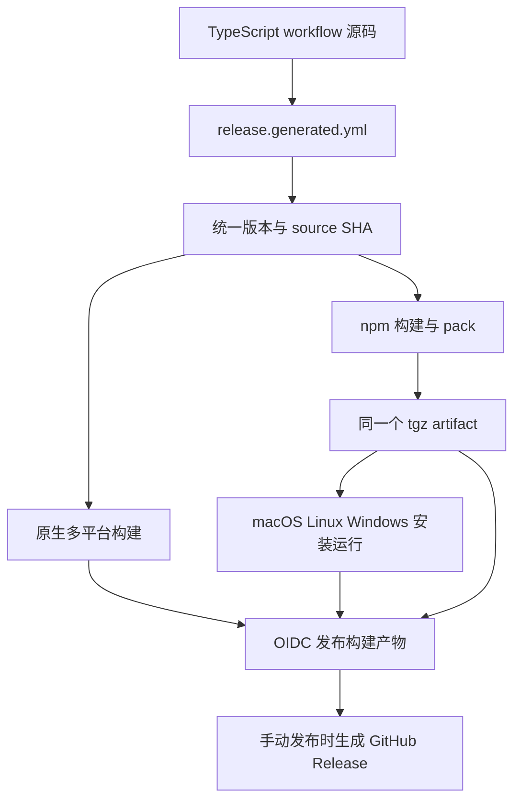

# Node 原生 GPU 与自动发布执行记录

## Intent：最终目标

Node npm 包默认自动使用 GPU，并将版本发布接入用户已经绑定的 release.generated.yml。

## Data：实现与验证证据

### Node GPU

- 可选依赖固定为 webgpu 0.6.1，复用其按平台加载的 dawn.node。
- Node Worker 持有 Dawn 对象、WASM 和 GPU 资源。主线程不设置 navigator.gpu，也不注入 WebGPU 全局常量。
- npm/webgpu.js 同时供浏览器和 Node Worker 使用；两端使用相同 shader 和模型权重。
- backend 默认 auto；webgpu 要求硬件适配器；wasm 显式 CPU。自动初始化回退通过 fallbackReason 可观察。
- Dawn 报告的软件适配器被拒绝；计算失败仍返回错误。
- destroy 等待已排队调用，再销毁 GPU 并终止 Worker；空闲 Worker 不阻止主进程退出。

本机实测：

| 项目 | 结果 |
| --- | --- |
| 平台 | macOS arm64，Node 22.23.1 |
| GPU 适配器 | vendor=apple，architecture=metal-3，device=apple-m5 |
| 软件模拟 | isFallbackAdapter=false |
| GPU 默认选择 | backend=webgpu，无 fallbackReason |
| 真实样例 | web/public/examples 中 25 个 txt 文件，合计 2,273 个候选边界 |
| GPU/CPU 对比 | 25 个文件输出文本一致 |
| 排队与销毁 | 三次并发 format 全部完成，输出一致，destroy 后进程退出 |
| tarball 安装 | 在独立临时目录安装打包产物，GPU 格式化 engine.zig 成功 |
| 无原生依赖 | --omit=optional 安装后 auto 返回 wasm 和具体原因；强制 webgpu 报错 |
| 主线程全局 | navigator.gpu 仍然 undefined |

### Actions 与发布

- 与 Polywise 使用同一个 @jlarky/gha-ts 生成工具。
- 源码位于 .github/tsflows/release.ts 和 web.ts，npm run build:workflows 生成对应 YAML。
- 生成入口为 .github/workflows/release.generated.yml，匹配用户已绑定的 Trusted Publisher。
- 旧 build.yml、npm.yml、web.yml 被生成文件替代，避免重复触发。
- 保留原有 build 分支推送与手动触发；手动触发从 master 取源码并递增版本。
- tools/prepare-release.py 将 Zig、package.json 和 package-lock.json 版本作为同一次提交更新。
- 用临时 Git 仓库执行实际版本准备脚本，确认 0.1.3 同步更新为 0.1.4。本工作区仍是 0.1.3。
- 构建一次 npm tarball，将其作为 artifact 传给三平台安装校验和发布作业。
- npm 包统一在 macOS 构建；打包使用 --ignore-scripts，避免 prepack 再次编译 WASM。三平台验证作业只下载并安装同一 tarball，不安装 Zig、不执行编译命令。
- 发布作业仅有 contents:read / id-token:write，不使用 NPM_TOKEN。
- 发布之前读取 tarball 中的包名和版本；如果 registry 中已有该版本，仅在 SHA-512 完全一致时跳过。
- 直接推送 build 分支需要源码已经包含未发布的统一版本；重复使用 0.1.3 发布新内容会明确失败。手动运行 Build GCS 会自动处理下一版。
- npm publish 指向构建好的 tgz，使用 --ignore-scripts，发布阶段不重新构建。
- GitHub Release 等待 npm 发布成功；现有原生构建矩阵保持不变。

校验通过：TypeScript 应用检查、workflow TypeScript 检查、Vite 生产构建、生成文件一致性、actionlint 1.7.12、npm audit、git diff --check。
生成后再运行 npm run build:workflows -- --check，可检查源码与 YAML 是否同步。

## Edges：边界与限制

- Dawn 自带 macOS universal、Linux x64/arm64、Windows x64/arm64 插件；本机实际验证限于 Apple Metal。
- 三平台 Actions 已配置安装运行检查；GitHub runner 没有硬件 GPU 时允许验证 CPU 回退，不把这种结果当作硬件 GPU 验证。
- 可选依赖包含多平台二进制，解压约 95 MB；主包约 75 KB 不包含这部分体积。浏览器项目也可使用 --omit=optional。
- GPU/CPU 浮点结果可能在决策边界不同。本次样例一致不代表所有输入严格一致，也不构成性能优势证明。
- 没有运行远端 workflow、发布新 npm 版本或创建 Git 提交；远端 Trusted Publisher 权限尚待首次 Actions 验证。
- README 保留用户安装与 API 说明，未恢复构建发布 npm 或网络演示章节。

## Answer：交付与自我审查

### 发布路径修复

首次 v0.1.4 运行的原生构建与三平台 npm 校验均通过，但发布命令使用未加路径前缀的 npm-package/xxx.tgz，被 npm 解析为 GitHub 简写并报 EALLOWGIT。
tools/publish-npm.mjs 改用 node:path.resolve 生成绝对 tarball 路径。本地 npm 12.0.2 对实际打包文件执行 publish --dry-run 已通过。
该错误发生在认证之前，不需要开放 Git 下载权限。修复后启动新 workflow，让它使用新脚本；原有手动版本规则将生成 v0.1.5。

本次交付选择复用现成原生插件和共享 WebGPU 实现，满足 Node GPU 目标，并减少自行维护 ABI 和跨平台 GPU 构建的代码。
复核发现 Dawn 生命周期会持有事件循环，因此用 Worker 终止来保证释放；并检查了 Node --input-type 两种参数形式对子 Worker 的影响。
没有依据操作系统名称直接宣称 GPU 可用，实际后端由原生插件和硬件适配器初始化决定。
没有因为“GPU”命名宣称性能更快；依赖体积与其他平台的实机验证仍是后续评估点。
按用户要求未新增测试用例文件，未用浏览器做 UI 确认。

## 发布数据流

