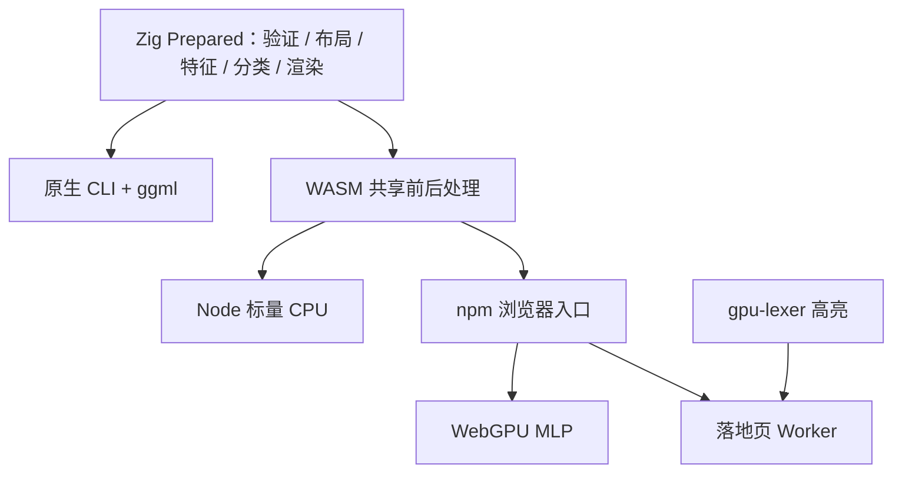
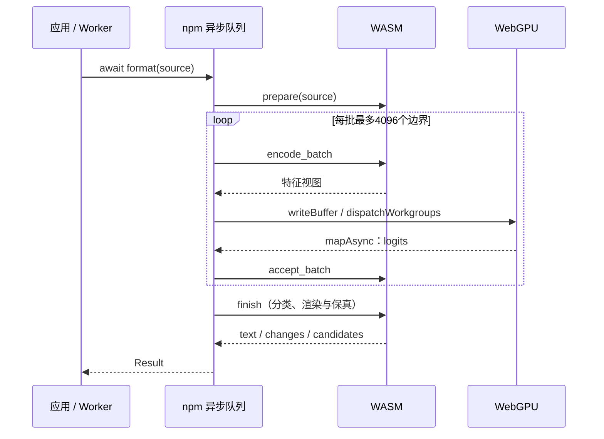

# WebGPU 推理执行计划

## Intent：最终目标

npm 包的浏览器入口使用真正的 WebGPU 模型推理，落地页与 npm 复用同一实现。参考 gpu-lexer 的设备初始化、权重上传、计算管线和异步回读方式。

## Data：可用证据

- 当前浏览器入口调用同步 wasm.format，其 Runner 用 model.forward 标量推理；gpu-lexer 仅承担高亮。
- 本项目模型是 192 → 64（ReLU）→ 3 的 MLP，权重以输入通道优先布局，内嵌在 WASM。
- engine.apply 已提供输入验证、特征编码、模型分类、受保护区域处理与非空行保真检查。
- 参考 gpu-lexer 将 CPU 前处理和 GPU 模型计算分开，复用设备、管线与缓冲区，通过 mapAsync 回读结果。

## Edges：边界与限制

- 不复制分词器或另写 JavaScript 空行规则；不改变模型、权重、阈值或训练流程。
- 浏览器要求安全上下文及 WebGPU，失败明确报错，不自动回退 CPU。
- Node 默认仍使用 WASM CPU；统一 API 为异步 format，更新类型、README、网页。
- 4 MiB 输入需分批提取特征，避免全量特征内存膨胀；GPU 批容量最多 4096。
- 一个实例串行处理请求，提供 destroy 释放资源，错误后释放输入与临时结果。
- 用户指定不新增测试用例、不做浏览器 UI 验收。用已有样本、构建和真实 WebGPU 运行检查验证，不生成测试文件。
- npm 发布仍由用户执行，不提交或推送现有工作区。

## Answer：交付与成功标准

- 新增 WGSL MLP 与 WebGPU 运行时，浏览器 format 实际 dispatchCompute，并读取 GPU logits。
- WASM 导出准备、批量特征、批量接收 logits、完成与释放接口；与原生 CLI 共享分类、渲染和保真检查。
- Node/浏览器异步类型一致，网页显示 WebGPU，示例 await format。
- Zig 原生/WASM、TypeScript、Vite、npm pack 检查通过；以现有样本比较 GPU、WASM CPU 与原生输出。
- 若无法获得本机 GPU 明确记录，不把构建成功当作 GPU 运行成功。

## 架构图

## 数据流图

## 完成状态

已完成共享处理阶段、真实 WebGPU MLP、异步 npm API、页面接入、构建打包、M5 硬件比较及自我复核，详见同目录《WebGPU推理执行记录》。
