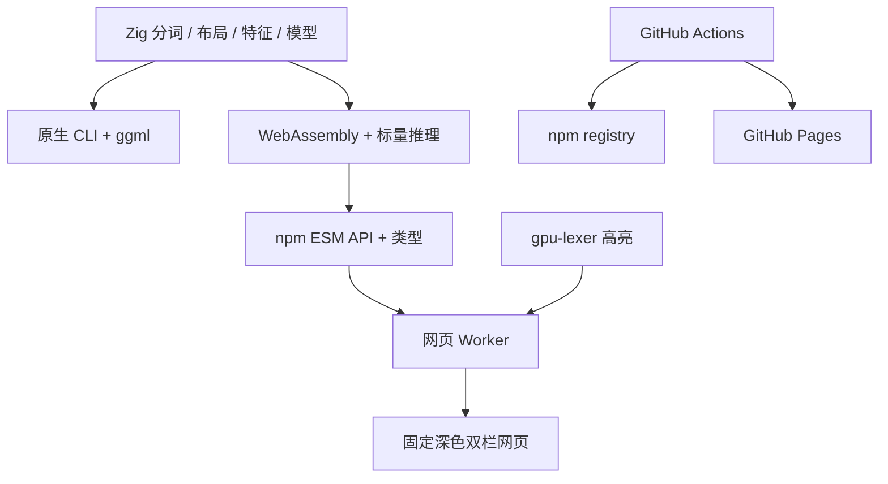

# npm 与网页执行计划

## Intent：最终目标

将现有 Zig 模型空行整理能力作为 npm API 交付，同时提供固定深色、双栏 gpu-lexer 高亮的交互落地页，使用 GitHub Actions 部署 GitHub Pages。

## Data：可用证据

- 当前核心是 Zig 0.16.0；engine 负责输入验证、边界分析、特征计算、推理及非空行字节保真检查。
- model.zig 已有与训练权重共享的标量 MLP forward，可在 WebAssembly 中复用。
- 原生 CLI 的 ggml 依赖不能直接用于 freestanding 浏览器环境。
- 当前版本 0.1.3，默认分支 master，现有原生发布工作流使用 build 分支。
- 参考页使用等宽字体、大留白、虚线边框、克制的强调色；本次转为固定深色。
- 用户已有 README 和 docs/2026-09-16 未提交改动，保留。

## Edges：边界与限制

- 用户后续指定使用 gpu-lexer，已替换原 Shiki 方案；高亮需要 WebGPU 与安全上下文，不支持时明确提示并显示原文，空行整理仍可运行。
- 用户确认由自己发布 npm，本次仅交付发布支持。
- 六个 live demo 均使用至少 100 行的完整真实源码，保留来源及许可证。

- 美化仅调整空行，不替换为通用 formatter，不改变缩进和代码内容。
- WebAssembly 使用 CPU 标量推理；原生 CLI 保留 ggml GPU 路径。
- 不添加测试用例，不调用浏览器做 UI 验证；运行编译、包检查与已有样例。
- 不上传用户输入的代码，整理与高亮在浏览器 Worker 内执行。
- npm 发布需要有效身份；部署依赖 GitHub Pages 设置及工作流进入远端分支。
- 按最小范围原则实现，无前端框架及编辑器框架依赖，使用 textarea 覆盖 gpu-lexer 高亮层。

## Answer：交付格式与成功标准

1. 可编译 wasm，npm ESM API 和 TypeScript 声明；包内携带权重与 wasm。
2. 支持多语言选择、左侧编辑、右侧结果、复制、处理状态及错误提示。
3. npm 和网页构建可执行，npm pack 检查通过，记录已有样例与原生输出对比。
4. GitHub Pages 与 npm 发布工作流、README 使用说明和中文执行记录。

## 架构图

## 数据流图

## 执行步骤

- [x] 编译 WebAssembly 并封装 npm API。
- [x] 实现深色落地页与 Worker 高亮。
- [x] 配置构建发布、验证产物及现有样例。
- [x] 补充使用说明、执行证据及自我批判。
