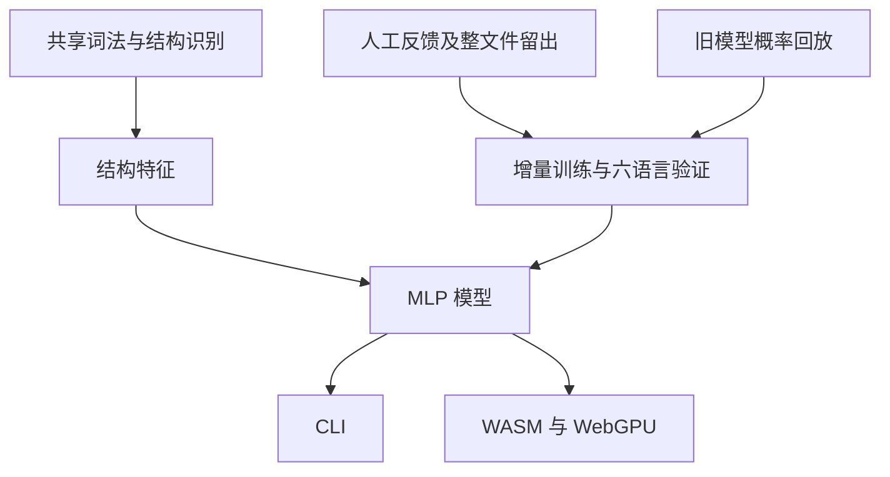

# 模型分组矫正计划

## Intent：最终目标

修正 live demos 暴露的 Python 装饰器、elif、连续累加分组、Zig 声明与赋值边界、Swift defer 留白问题。按用户补充要求，通过训练改善泛化，不添加硬编码识别逻辑。

## Data：可用证据

- 运行时链路为词法扫描、结构单元、192 维特征、MLP 分类、空行渲染；网页和 CLI 共用 Zig 核心。
- `roles.zig` 未将 defer 归为控制结构；`units.zig` 未合并装饰器与被修饰声明。
- 离线 AST 标注将 elif 的分支间隔归为内部间隔，普通与增强赋值没有分组关系。
- 已修订 Python 数据中，装饰器前已有空行，但 elif 前没有；累加初始化与首次追加之间存在与本次要求冲突的空行。
- Zig 已修订数据有声明与赋值间隔，需要检查实际特征及模型概率。
- 旧模型选优指标仅关注 TypeScript 风格验证集；本地已有 1414 份六语言人工修订训练文件，其中按内容哈希留出 138 份，可用于跨语言校准验证。
- 起始工作区仅 README.md 有用户改动，予以保留。

## Edges：边界与限制

- 不按文件、变量名或示例内容硬编码排版，不修改演示输入来伪造输出。
- 不新增测试用例，不调用浏览器；使用现有演示、现有校验及生产构建。
- 保留非空代码内容、缩进、受保护区域与幂等性。
- 保持推理核心、192 维特征和特征版本 6 不变，不添加装饰器、elif、defer 或变量累加识别规则。
- 修订已确认的训练标注，按语言、文件、边界均衡采样，按六语言人工修订验证集宏平均 F1 选优。
- 用旧模型继续训练的校准验证不构成独立泛化证据，因为旧模型可能已看过这些文件；从随机初始化训练的对照需要独立报告。
- 不发布远程网站或 npm 包。
- 用户明确要求：仅与本次调整直接相关的回归可以修订期望；新增的无关空行破坏不允许。所有既有 evaluation 输入和期望保持冻结，直到逐项确认相关性。

## Answer：交付格式与成功标准

交付训练流程改进、验证后可采用的模型产物及中文执行记录。直接检查用户指出的实际演示边界，核对全部十二份演示的内容保真与幂等性，并报告现有回归结果和限制。

## 架构图

## 数据流图

## 方案修正

最初试图通过增加语法和累加结构识别修复。用户指出应改善模型泛化后，已完整撤回核心特征、结构识别和自动标注修改。旧模型自动格式化钩子产生的附带修改也已恢复；当前仅保留用户确认的 Python 留白标注修订。

后续逐处核对另外 11 份 Python 文件中的 elif，将同一项用户规则应用到真实训练材料；共 12 份文件只改空行，不生成合成测试。

直接重训虽修复演示，但破坏若干原有正确边界，不能晋升。后续实验在训练阶段加入词法特征 dropout，以及旧模型在独立开发文件上的预测回放，检查是否能在学习新标注时保留既有能力。回放不包含 evaluation，也不包含本轮人工修订留出的验证文件。

## 完成状态

最终通过人工反馈增量训练与旧模型概率回放完成，未采用 dropout 候选。种子 111 的第 4 轮检查点同时通过全部用户反馈、90/90 固定回归、214/214 风格边界及 WebGPU/WASM 一致性检查；已替换本地默认权重并构建。无推理识别逻辑变更，无 evaluation 改动，详细证据与自我检查见同目录《模型分组矫正执行记录.md》。
