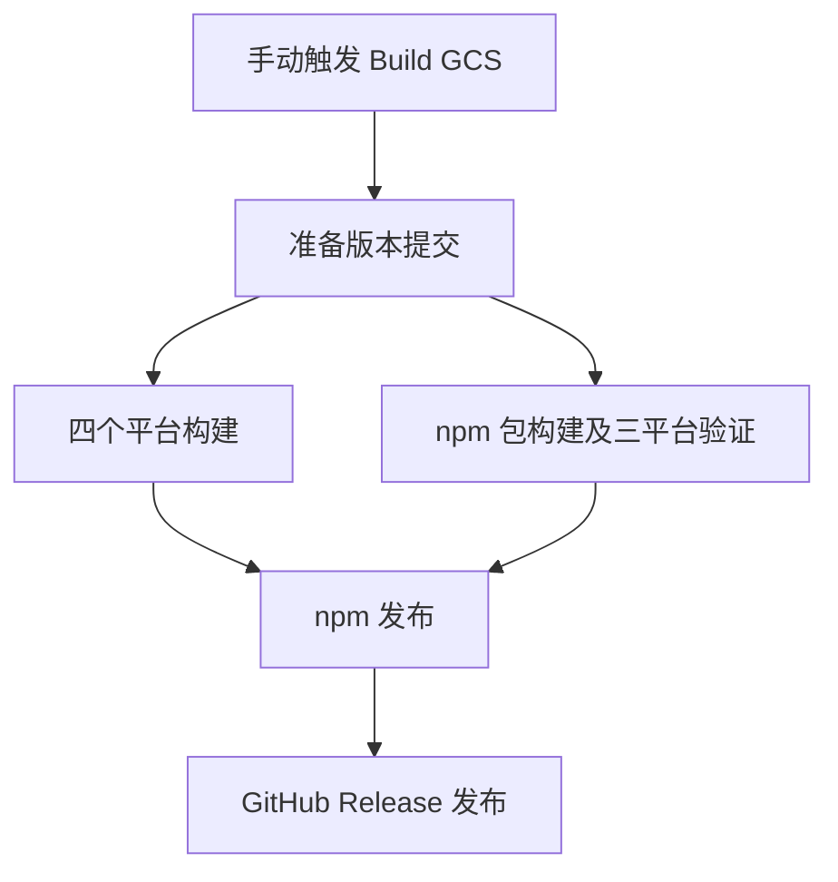
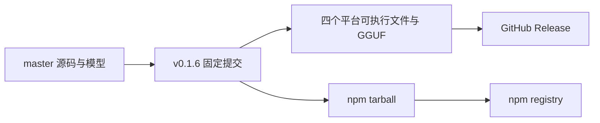

# v0.1.6 版本发布记录

## Intent：最终目标

通过项目现有自动发布流程，将主分支的新改动发布到 npm 和 GitHub Release。

## Data：可用证据

- 发布前本地工作区干净，`master` 与远端一致，提交为 `dd6582af217899d778609d12cd1d8871ac00170a`。
- 上一正式版本为 `v0.1.5`，新提交包含训练反馈与参数调整。
- 现有 `Build GCS` 工作流负责版本递增、四个平台构建、npm 包验证及发布。
- 已触发[本次发布流程](https://github.com/MatrixAges/gpu-code-spacer/actions/runs/35316685270)，准备阶段成功，目标版本为 `v0.1.6`。

## Edges：边界与限制

- 沿用现有发布逻辑，不修改业务代码或工作流，不新增测试用例，不调用浏览器进行 UI 确认。
- 版本由工作流更新；失败时优先重跑失败任务，避免再次触发版本递增。
- npm 与 GitHub Release 均成功且产物完整，才视为发布完成。

## Answer：交付格式与成功标准

交付版本号、GitHub Release 链接、npm 安装命令和实际验证结果；发布后快进同步本地主分支。

## 架构图

## 数据流图

## 执行结果

- 工作流所有 11 个任务成功，包括四个平台构建、npm 包构建及三平台安装运行验证、npm 发布和 GitHub Release 发布。
- [GitHub Release v0.1.6](https://github.com/MatrixAges/gpu-code-spacer/releases/tag/v0.1.6) 为正式版本，五个非空附件均已上传：Linux x86_64、Linux ARM64、macOS ARM64、Windows x86_64 可执行文件，以及独立 GGUF。
- npm 发布日志确认已接受 `gpu-code-spacer@0.1.6` 并生成 provenance；registry 处理期间短暂返回 404，后续重新查询确认版本可见且 `latest` 为 `0.1.6`。
- 本地 `master` 已快进同步，标签 `v0.1.6` 与 HEAD 均指向 `6ee0be1cfd329af5185069852dd30633de7370ee`。
- `git diff --check` 通过。仅新增本地发布记录，未修改产品代码或提交本记录。

## 自我审查

已分别核对工作流结论、GitHub 附件和 npm registry，未仅凭触发成功或上传成功判断完成。验证范围为现有 CI 的构建及安装运行检查，不等同于对所有平台功能的全面回归。
